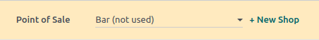
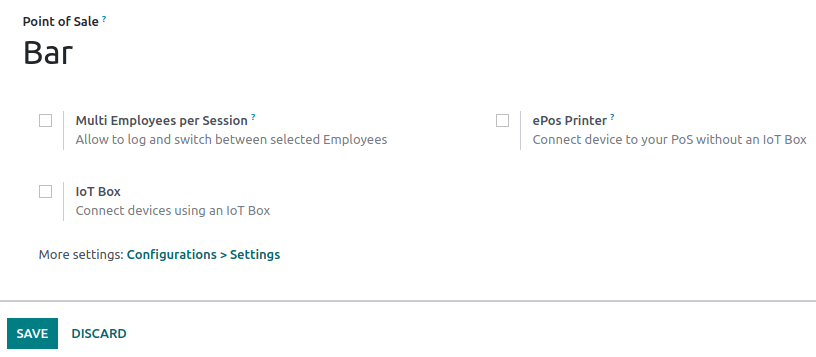
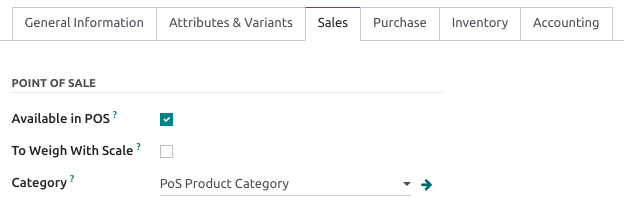

show-content  

show-toc  

# Configuration

## Access POS settings

To access the general POS settings, go to
`Point of Sale --> Configuration -->
Settings`. Then, open the dropdown menu in the `Point of Sale` field and
select the POS to configure.

> [!NOTE]
> These settings are available to users with the
> `access rights </applications/general/users>` `Administration` set as
> `Settings`.

You can also configure some settings from the dashboard by clicking the
vertical ellipsis button (`⋮`) on a POS card. Doing so opens a popup
window, from which you can:

- `Enable multiple employees to log in. <employee_login>`
- `Connect and set up an IoT box. <../../general/iot/config/pos>`
- `Connect and set up an ePOS printer. <configuration/epos_ssc>`

> [!NOTE]
> These settings are available to users with the
> `access rights </applications/general/users>` `Point of Sale` set as
> `Administrator`.

## Make products available

To make products available for sale, go to
`Point of Sale --> Products --> Products`, and select a product to open
the product form. In the `Sales` tab, enable `Available in POS`.

configuration/epos_printers configuration/https configuration/epos_ssc

