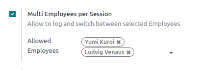
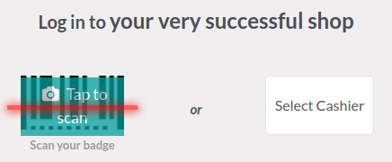

# Multi-employee management

Odoo Point of Sale allows you to manage access to a specific POS by
enabling the **Multi Employees per Session** feature. When activated,
`you can select which users can log into the POS
<employee_login/use>` and
`keep track of the employees involved in each order
<employee_login/analytics>`.

## Configuration

`Access the POS settings <configuration/settings>` and select your POS,
or click the vertical ellipsis button (`⋮`) on a POS card and click
`Edit`. Then, enable `Multi Employees per Session`, and add the allowed
employees in the `Allowed
Employees` field.

## Practical application

Once the feature is activated, cashiers can log in
`by scanning their badge
<employee_login/badge>` or selecting their name from the list of allowed
employees to `open the
session <pos/session-start>`.

To switch to another user `from an open session <pos/session-start>`,
click the employee name at the top-right of the screen and select the
employee to swap with from the list.

You can also require your employees to enter a pin code every time they
log into a POS to prevent them from logging in as someone else. To
define the code, go to the **Employees** app, open the employee form,
and click the `HR settings` tab. Then, enter a pin code of your choice
in the `PIN Code` field of the `Attendance/Point of Sale` category.

### Log in using badges

For your employees to be able to log in by scanning their badge, they
must have a badge ID assigned. To do so, go to the **Employees** app,
open the employee form, and click the `HR settings` tab. Then, enter the
badge ID of your choice in the `Badge ID` field of the
`Attendance/Point of Sale` category or click `Generate`.

To switch to another user, lock the session by clicking the lock-shaped
icon (`🔓`) at the top-right of the screen and scan your badge.

## Analytics

Once you close and post the POS session, access the comprehensive report
to review all session activities, including who initiated the session
and who handled specific orders. To access the session's report, click
the vertical ellipsis button (`⋮`) on the POS card and select `Sessions`
from the `View` section. Then, select a specific session for more
detailed information, and click the `Orders` button to view a list of
all orders placed during that session.

To get an overview of all orders, regardless of the session, click the
vertical ellipsis button (`⋮`) on the POS card and select `Orders` from
the `View` section.
