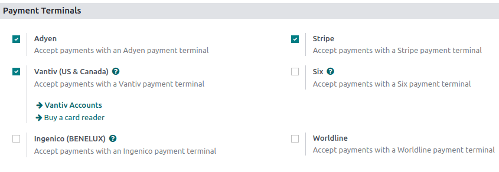

show-content  

# Payment terminals

Connecting and integrating a payment terminal with your POS system
allows you to accept multiple payment options, including credit and
debit cards, making the payment process more efficient.

## Configuration

Go to the `application settings <configuration/settings>`, scroll down
to the `Payment Terminals` section, and tick your terminal's checkbox.

Then, follow the corresponding documentation to configure your device:

- `Adyen configuration <terminals/adyen>`
- `Ingenico configuration <terminals/ingenico>`
- `SIX configuration <terminals/six>`
- `Stripe configuration <terminals/stripe>`
- `Vantiv configuration <terminals/vantiv>`
- `Worldline configuration <terminals/worldline>`

Once the terminal is configured, you can
`create the corresponding payment method and add it to
the POS <../payment_methods>`.

terminals/adyen terminals/ingenico terminals/six terminals/stripe
terminals/vantiv terminals/worldline

