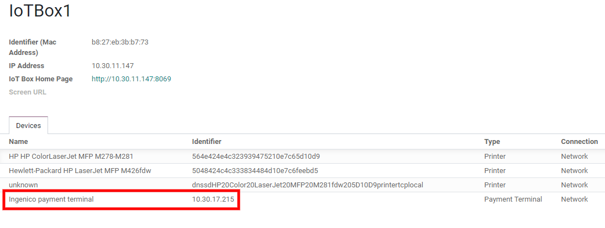

# Ingenico

Connecting a payment terminal allows you to offer a fluid payment flow
to your customers and ease the work of your cashiers.

> [!IMPORTANT]
> - Ingenico payment terminals require an
> `IoT Box </applications/general/iot>`. - Ingenico is currently only
> available in Belgium, the Netherlands and Luxembourg. - Odoo works
> with the Ingenico Lane/, Desk/, and Move/ payment terminals as they
> support the TLV communication protocol through TCP/IP.

## Configuration

### Connect an IoT Box

Connecting an Ingenico payment terminal to Odoo is a feature that
requires an IoT Box. For more information on how to connect an IoT Box
to your database, please refer to the `IoT
documentation </applications/general/iot/config/connect>`.

### Configure the Lane/Desk/Move 5000 terminals for Ingenico BENELUX

1.  Press the function button (`F` on Lane/5000, `⦿` on Desk/5000 and
    Move/5000).
2.  Go to `Kassa menu --> Settings Menu` and enter the settings
    password.
3.  Select `Change Connection` and press `OK` on the next screen.
4.  Select `TCP/IP` and `IP-address`.
5.  On the next screen, enter the IP address of your IoT Box.
6.  Enter 9000 as port number and press
    `OK` on the next screen.

At this point, the terminal restarts and should be displayed in your IoT
Box form in Odoo.

### Configure the payment method

Enable the payment terminal
`in the application settings <configuration/settings>` and
`create the related payment method <../../payment_methods>`. Set the
journal type as `Bank` and select `Ingenico` in the
`Use a Payment Terminal` field. Then, select your terminal device in the
`Payment Terminal Device` field.

Once the payment method is created, you can select it in your POS
settings. To do so, go to the `POS' settings <configuration/settings>`,
click `Edit`, and add the payment method under the `Payments` section.

## Pay with a payment terminal

In your *PoS interface*, when processing a payment, select a *Payment
Method* using a payment terminal. Check that the amount in the tendered
column is the one that has to be sent to the payment terminal and click
on *Send*. When the payment is successful, the status will change to
*Payment Successful*.

If you want to cancel the payment request, click on cancel. You can
still retry to send the payment request.

If there is any issue with the payment terminal, you can still force the
payment using the *Force Done*. This will allow you to validate the
order in Odoo even if the connection between the terminal and Odoo has
issues.

> [!NOTE]
> This option will only be available if you received an error message
> telling you the connection failed.

Once your payment is processed, on the payment record, you’ll find the
type of card that has been used and the transaction ID.

