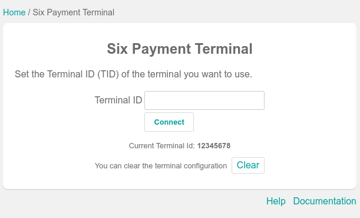
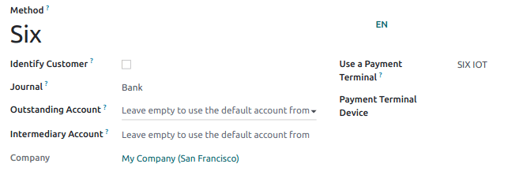

# SIX

Connecting a **SIX payment terminal** allows you to offer a fluid
payment flow to your customers and ease the work of your cashiers.

> [!WARNING]
> Even though Worldline has acquired SIX Payment Services and both
> companies use Yomani payment terminals, the firmware they run is
> different. Terminals received from Worldline are, therefore, not
> compatible with this integration.

## Configuration

### Install the POS IoT Six module

To activate the POS IoT Six module, go to `Apps`, remove the `Apps`
filter, and search for **POS IoT Six**. This module adds the necessary
driver and interface to your database to detect Six terminals.

> [!NOTE]
> This module replaces the **POS Six** module.

### Connect an IoT box

Connecting a Six payment terminal to Odoo is requires
`using a Raspberry Pi or virtual (for
Windows OS only) IoT box </applications/general/iot/config/connect>`.

### Configure the terminal ID

Navigate to your IoT Box homepage, where you can find the
`Six payment terminal` field once your database server is connected to
the IoT box. Click `Configure`, fill in the `Terminal ID` field with the
ID received from Six, and click `Connect`. Your Six terminal ID should
appear in the `Current Terminal Id` section.

Odoo automatically restarts the IoT box when the Six terminal ID is
configured. If your Six terminal is online, it will be automatically
detected and connected to the database. Check the IoT box homepage under
the `Payments` section to confirm the connection.

### Configure the payment method

Enable the payment terminal
`in the application settings <configuration/settings>` and
`create the related payment method <../../payment_methods>`. Set the
journal type as `Bank` and select `SIX IOT` in the
`Use a Payment Terminal` field. Then, select your terminal device in the
`Payment Terminal Device` field.

Once the payment method is created, you can select it in your POS
settings. To do so, go to the `POS' settings <configuration/settings>`,
click `Edit`, and add the payment method under the `Payments` section.

## Pay with a payment terminal

When processing a payment, select
`your Six payment method <six/configure>` in the `Payment Method`
section and click `Send`. To cancel the payment request, click `Cancel`.
Once the payment is successful, the status switches to `Payment
Successful`.

> [!NOTE]
> - Once your payment is processed, the type of card used and the
> transaction ID appear on the payment record. - The language used for
> error messages is the same as the Six terminal. Configure the terminal
> to change the language or contact Six. - By default, the port used by
> the Six terminal is 7784.

> [!TIP]
> If there are connection issues between the payment terminal and Odoo,
> you can still force the payment validation in Odoo using the
> `Force Done` button.
