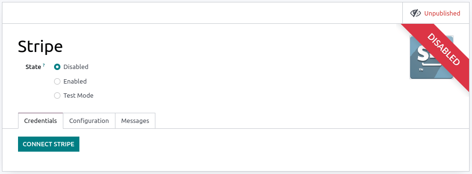

# Stripe

Connecting a payment terminal allows you to offer a fluid payment flow
to your customers and ease the work of your cashiers.

> [!IMPORTANT]
> - Stripe payment terminals do not require an
> `IoT Box </applications/general/iot>` - Stripe terminals can be used
> in many countries, but not worldwide. Check the [global availability
> for Stripe
> Terminal](https://support.stripe.com/questions/global-availability-for-stripe-terminal). -
> Stripe's integration works with [Stripe Terminal smart
> readers](https://docs.stripe.com/terminal/smart-readers)

\-
`Stripe as payment provider <../../../../finance/payment_providers/stripe>` -
[List of payment methods supported by
Stripe](https://stripe.com/payments/payment-methods)

## Configuration

### Configure the payment method

Activate **Stripe** in the settings by going to
`Point of Sale --> Configuration -->
Settings --> Payment Terminals` and enabling `Stripe`.

Then, create the payment method:

- Go to `Point of Sale --> Configuration --> Payment Methods`, click
  `Create`, and complete the `Method` field with your payment method's
  name;
- Set the `Journal` field as `Bank` and the `Use a Payment Terminal`
  field as `Stripe`;
- Enter your payment terminal serial number in the
  `Stripe Serial Number` field;
- Click
  `Don't forget to complete Stripe connect before using this payment method.`

> [!NOTE]
> - Click `Identify Customer` to allow this payment method
> **exclusively** for identified customers. For any unidentified
> customers to be able to pay with Stripe, leave the `Identify Customer`
> field unchecked. - The `Outstanding Account` and the
> `Intermediary Account` can stay empty to use the default accounts. -
> Find your payment terminal serial number under the device or on
> [Stripe's dashboard](https://dashboard.stripe.com).

### Connect Stripe to Odoo

Click `Connect Stripe`. Doing so redirects you automatically to a
configuration page. Fill in all the information to create your Stripe
account and link it with Odoo. Once the forms are completed, the API
keys (`Publishable Key` and `Secret Key`) can be retrieved on
**Stripe's** website. To do so, click
`Get your Secret and Publishable keys`, click the keys to copy them, and
paste them into the corresponding fields in Odoo. Your terminal is ready
to be configured in a POS.

> [!NOTE]
> - When you use **Stripe** exclusively in Point of Sale, you only need
> the **Secret Key** to use your terminal. - When you use Stripe as
> **payment provider**, the `State` can stay set as `Disabled`. - For
> databases hosted **On-Premise**, the `Connect Stripe` button does not
> work. To retrieve the API keys manually, log in to your [Stripe
> dashboard](https://dashboard.stripe.com), type
> API in the search bar, and click
> `Developers > API`.

### Configure the payment terminal

Swipe right on your payment terminal, click `Settings`, enter the admin
PIN code, validate and select your network.

> [!NOTE]
> - The device must be connected to a secured WI-FI network. - Your Odoo
> database and payment terminal must share the same network. - You must
> enter the admin PIN code to access your payment terminal settings. By
> default, this code is 07139.

### Link the payment method to a POS

To add a **payment method** to your point of sale, go to
`Point of Sale -->
Configuration --> Settings`. Select the POS, scroll down to the
`Payments` section, and add your payment method for **Stripe** in the
`Payment Methods` field.

## Pay with a payment terminal

When processing a payment, select `Stripe` as the payment method. Check
the amount and click `Send`. Once the payment is successful, the status
changes to `Payment
Successful`. To cancel the payment request, click `cancel`.

> [!NOTE]
> - \| In case of connection issues between Odoo and the payment
> terminal, force the payment by clicking on `Force Done`, which allows
> you to validate the order. \| This option is only available after
> receiving an error message informing you that the connection failed. -
> The terminal must have at least 10% battery level to use it. - The
> device does not work for payments under €0.50.

## Troubleshooting

### Payment terminal unavailable in your Stripe account

If the payment terminal is unavailable in your Stripe account, you must
add it manually:

1.  Log into your [Stripe's dashboard](https://dashboard.stripe.com) and
    go to `Stripe dashboard --> Payments --> Readers --> Locations`;
2.  Add a location by clicking the `+ New` button or selecting an
    already created location;
3.  Click the `+ New` button in the `Readers` box and fill in the
    required information.

> [!NOTE]
> You must provide a **registration code**. To retrieve that code, swipe
> right on your device, enter the admin PIN code (by default:
> 07139), validate, and click `Generate a
> registration code`.
