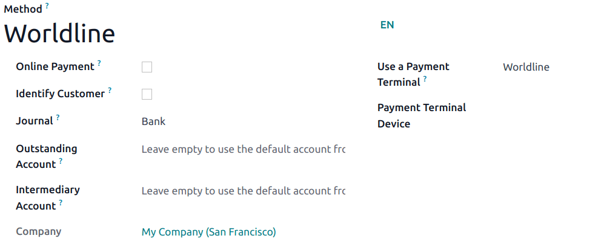

# Worldline

Connecting a payment terminal allows you to offer a fluid payment flow
to your customers and ease the work of your cashiers.

> [!IMPORTANT]
> - Worldline payment terminals require an
> `IoT Box </applications/general/iot>`. - Worldline is currently only
> available in Belgium, the Netherlands and Luxembourg. - Odoo is
> compatible with Worldline terminals that use the CTEP protocol (e.g.,
> the Yomani XR and Yoximo terminals). If you have any doubts, contact
> your payment provider to ensure your terminal's compatibility.

## Configuration

### Connect an IoT Box

Connecting a Worldline Payment Terminal to Odoo is a feature that
requires an IoT Box. For more information on how to connect one to your
database, please refer to the
`IoT documentation </applications/general/iot/config/connect>`.

### Configure the protocol

From your terminal, click on `"." --> 3 --> stop --> 3 --> 0 --> 9`.
Enter the technician password **"1235789"** and click on
`OK --> 4 --> 2`. Then, click on
`Change --> CTEP (as Protocole ECR) --> OK`. Click on **OK** thrice on
the subsequent screens (*CTEP ticket ECR*, *ECR ticket width*, and
*Character set*). Finally, press **Stop** three times; the terminal
automatically restarts.

### Set the IP address

From your terminal, click on `"." --> 3 --> stop --> 3 --> 0 --> 9`.
Enter the technician password **"1235789"** and click on
`OK --> 4 --> 9`. Then, click on `Change --> TCP/IP` (*TCP physical
configuration* screen) `--> OK -->
OK` (*TCP Configuration client* screen).

Finally, set up the hostname and port number.

#### Hostname

To set up the hostname, enter your IoT box's IP address' sequence
numbers and press **OK** at each "." until you reach the colon symbol.  
Then, press **OK** twice.

\| Here's an IP address sequence:
10.30.19.4:8069. \| On the *Hostname
screen*, type `10 --> OK --> 30 --> OK --> 19 --> OK --> 4
--> OK --> OK`.

> [!NOTE]
> Your IoT box's IP address is available in your IoT Box application's
> database.

#### Port number

On the *Port number* screen, enter **9001** (or **9050** for Windows)
and click on `OK` (*ECR protocol SSL no*) `--> OK`. Click on **Stop**
three times; the terminal automatically restarts.

> [!WARNING]
> For **Windows** IoT devices, it is necessary to add a firewall
> exception. Follow the
> `additional instructions in the Windows IoT documentation <iot/windows/wordline>`
> to add the exception to Windows Firewall.

### Configure the payment method

Enable the payment terminal
`in the application settings <configuration/settings>` and
`create the related payment method <../../payment_methods>`. Set the
journal type as `Bank` and select `Worldline` in the
`Use a Payment Terminal` field. Then, select your terminal device in the
`Payment Terminal Device` field.

Once the payment method is created, you can select it in your POS
settings. To do so, go to the `POS' settings <configuration/settings>`,
click `Edit`, and add the payment method under the `Payments` section.

> [!TIP]
> - Technician password: 1235789 - To
> reach Wordline's technical assistance, call 02
> 727 61 11 and choose "merchant". Your call is automatically
> transferred to the desired service. - Configure the cashier terminal
> if you have both a customer and a cashier terminal. - To avoid
> blocking the terminal, check the initial configuration beforehand. -
> Set a fixed IP to your IoT Box’s router to prevent losing the
> connexion.

## Pay with a payment terminal

When processing a payment, select *Worldline* as payment method. Check
the amount and click on *Send*. Once the payment is successful, the
status changes to *Payment Successful*.

Once your payment is processed, the type of card used and the
transaction ID appear on the payment record.

> [!NOTE]
> \* In case of connexion issues between Odoo and the payment terminal,
> force the payment by clicking on *Force Done*, which allows you to
> validate the order. This option is only available after receiving an
> error message informing you that the connection failed. \* To cancel
> the payment request, click on **cancel**.
