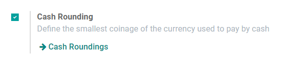
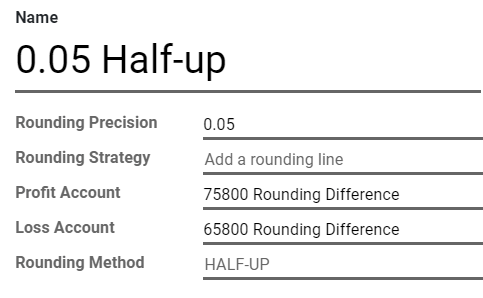
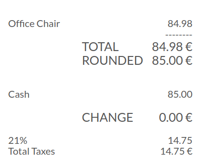

# Cash rounding

**Cash rounding** is required when the lowest physical denomination of
currency, or the smallest coin, is higher than the minimum unit of
account.

For example, some countries require their companies to round up or down
the total amount of an invoice to the nearest five cents, when the
payment is made in cash.

Each point of sale in Konvergo ERP can be configured to apply cash rounding to
the totals of its bills or receipts.

## Configuration

Go to `Point of Sale --> Configuration --> Settings` and enable *Cash
Rounding*, then click on *Save*.

Go to `Point of Sale --> Configuration --> Point of
Sale`, open the point of sale you want to configure, and enable the
*Cash Rounding* option.

To define the **Rounding Method**, open the drop-down list and click on
*Create and Edit...*.

Define here your *Rounding Precision*, *Profit Account*, and *Loss
Account*, then save both the Rounding Method and your Point of Sale
settings.

All total amounts of this point of sale now add a line to apply the
rounding according to your settings.

> [!NOTE]
> Konvergo ERP Point of Sale only supports the `Add a rounding line` rounding
> strategy.
