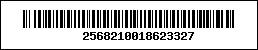
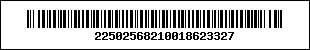
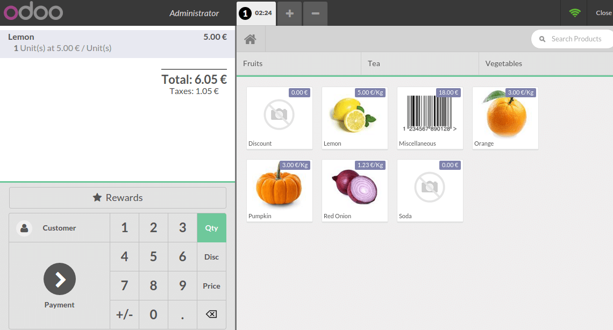

# Discount tags (barcode scanner)

If you want to sell your products with a discount, for a product getting
close to its expiration date for example, you can use discount tags.
They allow you to scan discount barcodes.

> [!NOTE]
> To use discount tags you will need to use a barcode scanner.

## Barcode Nomenclature

To use discounts tags, we need to learn about barcode nomenclature.

Let's say you want to have a discount for the product with the following
barcode:

You can find the *Default Nomenclature* under the settings of your PoS
interface.

Let's say you want 50% discount on a product you have to start your
barcode with 22 (for the discount barcode nomenclature) and then 50 (for
the %) before adding the product barcode. In our example, the barcode
would be:

## Scan the products & tags

You first have to scan the desired product (in our case, a lemon).

And then scan the discount tag. The discount will be applied and you can
finish the transaction.

