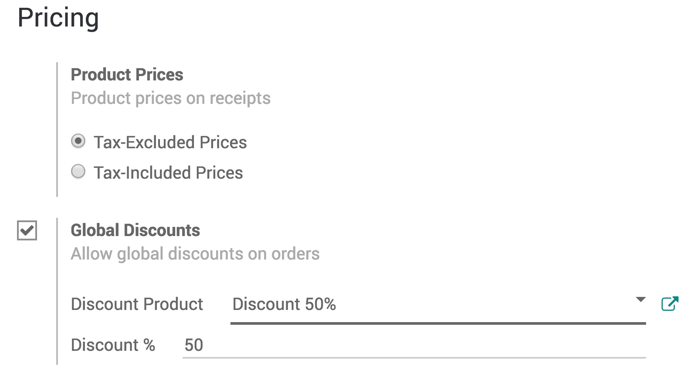
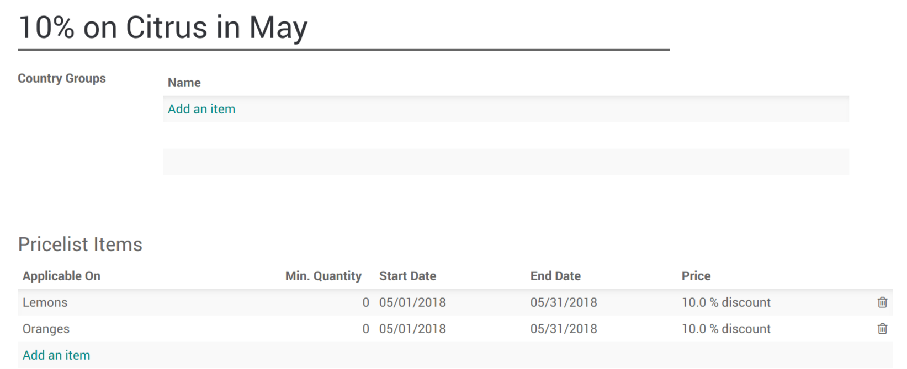

# Discounts

By offering discounts, you can entice your customers and drastically
increase your revenue. It is vital to offer discounts, whether they are
time-limited, seasonal or manually given.

To manage discounts, Odoo has powerful features that help set up a
pricing strategy tailored to every business.

## Apply manual discounts

If you seldom use discounts, applying manual ones might be the easiest
solution for your Point of Sale.

You can either apply a discount on the whole order or on specific
products inside an order.

### Apply a discount on a product

From your PoS session interface, use the *Disc* button.

Then, you can input a discount over the product that is currently
selected.

### Apply a global discount

To apply a discount on the whole order, go to `Point of
Sales --> Configuration --> Point of Sale` and select your PoS.

Once on your PoS form, select *Global Discounts*, under the *Pricing*
category.

Now, you have a new *Discount* button appearing on your PoS interface.

Click on it and enter the wanted discount.

> [!NOTE]
> On this example, there is a global discount of 50% as well as a
> specific 50% discount on oranges.

## Apply time-limited discounts

To activate time-limited discounts, you must activate the *Pricelists*
feature. To do so, go to `Point of Sales -->
Configuration --> Point of Sale` and open your PoS. Then, enable the
pricelist feature.

Once activated, you must choose the pricelists you want to make
available in the PoS and define a default one.

### Create a pricelist

By default, Odoo has a *Public Pricelist* configured. To create more, go
to `Point of Sale --> Products --> Pricelists`. Then click on create.

When creating a pricelist, you can set several criteria to use a
specific price: period, min. quantity, etc. You can also decide to apply
that pricelist on specific products or on the whole range.

### Using a pricelist with the PoS interface

On the PoS interface, a new button appears. Use it to select a
pricelist.

Click on it to instantly update the prices with the selected pricelist.
Then, you can finalize the order.
