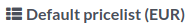

# Pricelists

Pricelists allow you to adjust product prices depending on various
criteria automatically. For example, you can set POS-specific prices,
create temporary discount periods, reward specific customers, or offer
discounts when set quantities are ordered.

## Configuration

Navigate to the `general POS app settings <configuration/settings>` and
ensure `Flexible Pricelists` are enabled under the `Pricing` section.

`Multiple prices per product <pricelists/simple>` is the default
pricelist option for setting simple fixed price rules per product.
Select `Advanced price rules (discounts, formulas)
<pricelists/advanced>` to apply price rules to multiple products at once
and to compute prices dynamically using percentage discounts or more
complex formulas in addition to setting fixed prices.

> [!NOTE]
> The selected pricelist type applies to the entire database, including
> the `Sales
> <../../sales/products_prices/prices/pricing>` and
> `eCommerce <ecommerce/pricelists>` apps.

### Create pricelists

Go to `Point of Sale --> Products --> Pricelists` and click `New` or
select an existing pricelist. The pricelist setup differs depending on
the `selected pricelist
option <pricelists/configuration>`.

#### Multiple prices per product

When pricelists are configured to use the `Multiple prices per product`
option, it is possible to use multiple fixed prices for different
products or their variants depending, if necessary, on one or several
conditions. To add a new price rule to a pricelist:

1.  Click `Add a line`, and select a **product** and its **variant** if
    needed.
2.  Add the condition(s):
    - a product quantity to be reached by using the `Min. Quantity`
      column;
    - a determined period during which the pricelist is applied by using
      the `Start Date` and `End Date` columns.
3.  Add the `Price` to be applied when the conditions are met (if any).

#### Advanced price rules

When pricelists are configured to use the
`Advanced price rules (discounts, formulas)` option, it is possible to
use percentage discounts/mark-ups and formulas in addition to using
fixed prices. To add a new price rule to a pricelist, click
`Add a line`. In the pop-up windows:

1.  Select a `Computation` method:
    - `Fixed Price` to set a new fixed price (similarly to the
      `Multiple prices
      per product` option).
    - `Discount` to compute a percentage discount (e.g.,
      10.00 %) or mark-up (e.g.,
      -10.00 %).
    - `Formula` to compute the price according to a formula. It is
      required to define what the calculation is **based on**
      (`Sales Price`, `Cost`, or `Other
      Pricelist`). You can then:
      - Apply a percentage `Discount` or mark-up.

      - Add an `Extra Fee` (e.g., \$
        5.00) or subtract a fixed amount
        (e.g., \$ -5.00).

      - Define a `Rounding Method <cash_rounding>` by forcing the price
        after `Discount` to be a multiple of the value set. The
        `Extra Fee` is applied afterward.

        

        To have the final price end with
        .99, set the `Rounding Method` to
        1.00 and the `Extra Fee` to
        -0.01.

        

      - Specify the minimum (e.g., \$
        20.00 ) and maximum (e.g., \$
        50.00 ) profit `Margins` for
        computations based on `Cost`.
2.  Select on which product(s) the price rule should be **applied**:
    - `All Products`
    - a `Product Category`
    - a `Product`
    - a `Product Variant`
3.  Add conditions, such as a specific quantity to reach for the price
    to change by using the `Min. Quantity` field or a specific period
    during which the pricelist should be applied by using the `Validity`
    fields.

### Select pricelists

Go to the `specific POS settings <configuration/settings>` and add all
the available pricelists in the `Available` field. Then, set its
**default pricelist** in the `Default` field.

When you `open a POS session <pos/session-start>`, click the
**pricelists** button, and select the desired pricelist from the list.

> [!NOTE]
> - Multiple pricelists must be selected for the **pricelist button** to
> be displayed. - If a pricelist is selected on a POS order while its
> conditions are **not** met, the price will **not** be adjusted.

> [!TIP]
> You can also set a pricelist to be selected automatically once a
> specific `customer is set
> <pos/customers>`. To do so, go to the customer form and switch to the
> preferred pricelist in the `Pricelist` field of the `Sales & Purchase`
> tab.

\- `../../sales/products_prices/prices/pricing` -
`How to use pricelists in an ecommerce environment <ecommerce/pricelists>`

