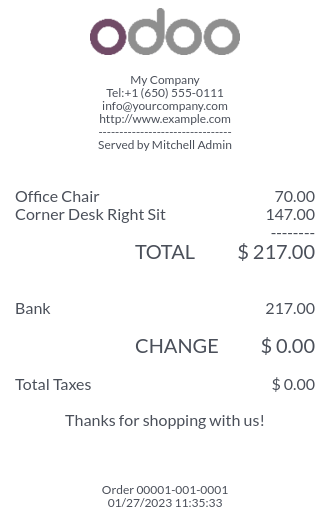

# Receipts and invoices

## Receipts

Set up receipts by going to
`Point of Sale --> Configuration --> Point of Sale`, selecting a POS,
and scrolling down to the `Bills & Receipts` section.

To **customize** the **header** and **footer**, activate
`Header & Footer` and fill in both fields with the information to be
printed on the receipts.

To **print receipts** automatically once the payment is registered,
enable the `Automatic
Receipt Printing` setting.

\- `restaurant/bill_printing` - `configuration/epos_printers`

### Reprint a receipt

From the POS interface, click `Orders`, open the dropdown selection menu
next to the search bar, and change the default `All active orders`
filter to `Paid`. Then, select the corresponding order and click
`Print Receipt`.

> [!NOTE]
> You can filter the list of orders using the search bar. Type in your
> reference and click `Receipt Number`, `Date`, or `Customer`.

## Invoices

Point of Sale allows you to issue and print invoices for
`registered customers <pos/customers>` upon payment and retrieve all
past invoiced orders.

> [!NOTE]
> An invoice created in a POS creates an entry into the corresponding
> `accounting journal
> <cheat_sheet/journals>`, previously
> `set up <receipts_invoices/invoice_configuration>`.

### Configuration

To define what journals will be used for a specific POS, go to the
`POS' settings
<configuration/settings>` and scroll down to the accounting section.
Then, you can determine the accounting journals used by default for
orders and invoices in the `Default Journals` section.

### Invoice a customer

Upon processing a payment, click `Invoice` underneath the customer's
name to issue an invoice for that order.

Select the payment method and click `Validate`. The **invoice** is
automatically issued and ready to be downloaded and/or printed.

> [!NOTE]
> To be able to issue an invoice, a `customer <pos/customers>` must be
> selected.

### Retrieve invoices

To retrieve invoices from the **POS dashboard**,

1.  access all orders made through your POS by going to
    `Point of Sale --> Orders -->
    Orders`;
2.  to access an order's invoice, open the **order form** by selecting
    the order, then click `Invoice`.

> [!NOTE]
> - **Invoiced orders** can be identified by the `Invoiced` status in
> the `Status` column. - You can filter the list of orders to invoiced
> orders by clicking `Filters` and `Invoiced`.

### QR codes to generate invoices

Customers can also request an invoice by scanning the **QR code**
printed on their receipt. Upon scanning, they must fill in a form with
their billing information and click `Get my
invoice`. On the one hand, doing so generates an invoice available for
download. On the other hand, the order status goes from `Paid` or
`Posted` to `Invoiced` in the Konvergo ERP backend.

To use this feature, you have to enable QR codes on receipts by going to
`Point of
Sale --> Configuration --> Settings`. Then, select the POS in the
`Point of Sale` field, scroll down to the `Bills & Receipts` section and
enable `Use QR code on
ticket`.
