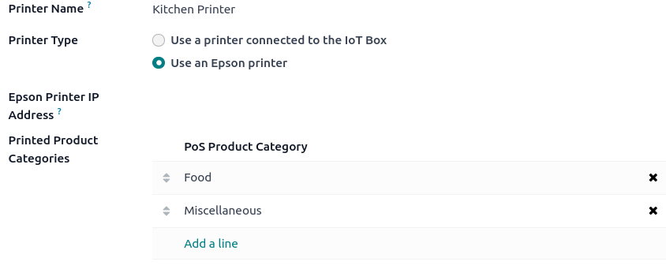

# Orders printing

Integrating printers in a restaurant or bar's workflow can enhance
communication and collaboration between the front-of-house and
back-of-house teams, leading to a more streamlined and efficient
service.

## Configuration

### Enable and create printers

To enable sending orders to a kitchen or bar printer, go to
`Point of Sale -->
Configuration --> Settings`, scroll down to the `Restaurant & Bar`
section, and enable `Kitchen Printers`. Type in a name for the printer
in the `Printers` field and click `Create and edit...` to open a setup
form.

To get a list of all the printers already created or to modify an
already created printer, click `--> Printers` and select the desired
printer to open the setup form.

### Setup form

From the `setup form <kitchen_printing/enable>`, select the
`Printer Type` according to your installation:

- If your printer is connected to an IoT box, select
  `Use a printer connected to the IoT
  Box` and select the device in the `IoT Device` field.
- If you use an Epson printer that does not need an IoT box, select
  `Use an Epson printer` and enter the printer's IP address in the
  `Epson Printer IP Address` field.

\- `/applications/general/iot/config/connect` -
`/applications/general/iot/devices/printer` -
`../configuration/epos_ssc`

Set your printer to print specific products based on their POS category.
To do so, click `Add a line` in the `Printed Product Categories` field.
If you leave this field empty, all products are sent to the printer
regardless of their POS category.

## Print orders

From an open session, start taking an order and click `Order` to send it
to the bar or the kitchen.

> [!NOTE]
> When products can be printed, they appear in green in the cart, and
> the order button turns green.
