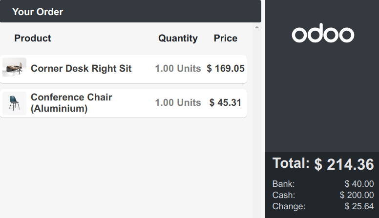
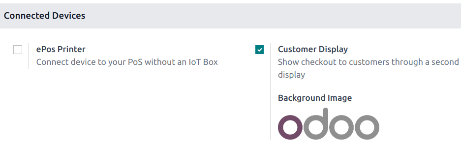
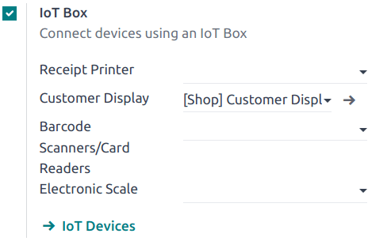

# Customer display

The **customer display** feature provides customers with real-time
checkout updates on a secondary display.

## Configuration

Depending on your POS setup, the feature can be displayed
`locally on a secondary screen
<customer_display/local>` or on `another monitor connected to an IoT Box
<customer_display/iot>`.

To activate the feature, go to the POS settings, scroll down to the
`Connected Devices` section, and tick the `Customer Display` checkbox.

### Local

Connect a second screen to your POS and
`open a POS session <pos/session-start>`. Then, click the screen icon to
open a new window to drag and drop onto the second screen.

### IoT box

Connect an IoT box to your database and the second screen to the IoT
box. Then, go to `Point of Sale --> Configuration --> Settings`, scroll
down to the `Connected Devices` section, tick the `IoT Box` checkbox,
and select the second monitor in the `Customer Display` field.

> [!NOTE]
> Both devices need to be connected to the same local network.

`../../../general/iot/config/pos`

