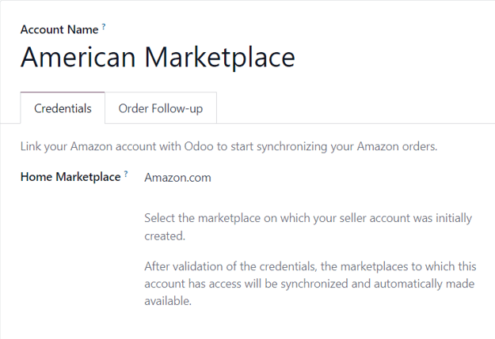
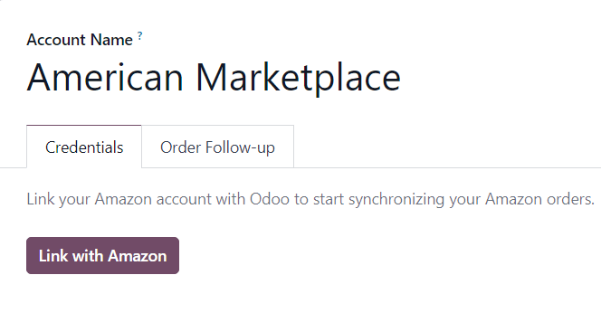

# Amazon Connector configuration

Konvergo ERP allows users to register an Amazon seller account in the database,
but the user **must** have a paid Amazon Seller account prior to
completing the configuration.

Set up a paid Seller account on Amazon by first logging into the Amazon
platform, and navigating to
`Account \& Lists --> Start a Selling Account` from the drop-down menu
located in the header section.

Then on the `Sell with Amazon` page, follow the sign-up process and
finally proceed to follow the instructions below to register and link
that Amazon Seller account in Konvergo ERP.

[Sell with Amazon](https://www.amazon.com/b/?node=12766669011)

## Connect Amazon Seller account to Konvergo ERP

To connect an Amazon Seller account in Konvergo ERP, navigate to `Sales app -->
Configuration --> Settings --> Connectors section`, activate the
`Amazon Sync` feature, and click `Save`.

Then, return to
`Sales app --> Configuration --> Settings --> Connectors section`, and
click on the `Amazon Accounts` link under the `Amazon Sync` setting.

Doing so reveals a separate `Amazon Accounts` page. From here, click
`New` to create and link a new Amazon account.

On the blank `Amazon Account` form page, start by choosing a name for
the account (e.g. American Marketplace).
Then, in the `Credentials` tab, select the marketplace on which the
seller account was initially created from the `Home Marketplace`
drop-down menu.

After saving, the field in the `Credentials` tab is replaced by a
`Link with
Amazon` button.

Clicking that button redirects to either the Amazon login page, or
directly to the required consent page, if the user is already logged in
to Amazon.

On the login page, log in to the desired Amazon seller account.

On the consent page, confirm that Amazon is allowed to give Konvergo ERP access
to the account and related data.

Upon confirmation, Amazon returns the user to Konvergo ERP, and the account has
been registered.

With the Amazon account successfully registered, the marketplaces
available to this specific account are synchronized with Konvergo ERP and listed
under the `Marketplaces` tab.

If desired, remove items from the list of synchronized marketplaces to
disable synchronization.

## Amazon orders in Konvergo ERP

When an Amazon order is synchronized, up to three line items are created
on the sales order in Konvergo ERP. Each one represents a product sold on
Amazon: one for the product that was sold on Amazon Marketplace, one for
the shipping charges (if any), and one for the gift wrapping charges (if
any).

The selection of a database product for a sales order item is done by
matching its `Internal Reference` (a customizable product reference
idenifier in Konvergo ERP, like FURN001) with the
Amazon *SKU* for marketplace items, the Amazon *Shipping Code* for
delivery charges, and the Amazon *Gift Wrapping* code for gift wrapping
charges.

For marketplace products, pairings are saved as *Amazon Offers*, which
are listed under the `Offers` smart button on the account form.

Offers are automatically created when the pairing is established, and
they're used for subsequent orders to lookup SKUs. If no offer with a
matching SKU is found, `the internal reference is
used instead <amazon/matching>`.

> [!TIP]
> It's possible to force the pairing of a marketplace item with a
> specific product, by changing either the product or the SKU of an
> offer to ensure they match. The offer can be manually created if it
> was not automatically done yet.
>
> This is useful if the internal reference is not used as the SKU, or if
> the product sells under different conditions.

If no database product with a matching internal reference is found for a
given Amazon SKU or gift wrapping code, then a default database product,
*Amazon Sale*, is used. The same is done with the default product
*Amazon Shipping* if no database product is found for a given Amazon
shipping code.

> [!NOTE]
> To modify default products, activate the
> `developer mode <developer-mode>`, and navigate to
> `Sales app --> Configuration --> Settings --> Connectors --> Amazon Sync -->
> Default Products`.

## Product tax configuration

To allow for tax reporting of Amazon sales with Konvergo ERP, the taxes applied
to the sales order items are those set on the product, or determined by
the fiscal position.

Make sure to have the correct taxes set on your products in Konvergo ERP, or
have it done by a fiscal position, to avoid discrepancies in the
subtotals between *Amazon Seller Central* and Konvergo ERP.

> [!NOTE]
> As Amazon does not necessarily apply the same taxes as those
> configured in Konvergo ERP, it may happen that order totals differ by a few
> cents between Konvergo ERP and *Amazon Seller Central*. Those differences can
> be resolved with a write-off when reconciling the payments in Konvergo ERP.

## Add a new marketplace

All marketplaces are supported by the Amazon Connector. To add a new
marketplace, proceed as follows:

1.  Activate the `developer mode <developer-mode>`.
2.  Go to
    `Sales app --> Configuration --> Settings --> Connectors --> Amazon Sync -->
    Amazon Marketplaces`.
3.  Click `New` to create a new marketplace record.
4.  Enter the Marketplace ID in the `API Idenifier` field, and select
    the `Amazon
    Region` for your marketplace as described in the [Amazon
    Documentation for marketplace IDs and
    regions](https://developer-docs.amazon.com/sp-api/docs/marketplace-ids),
    and the `Seller Central URL` as described in the [Amazon
    Documentation for seller central
    URLs](https://developer-docs.amazon.com/sp-api/docs/seller-central-urls).
5.  Set the `Name` of the record to
    Amazon.\<country code\> to easily
    retrieve it (e.g. Amazon.se). The
    `API Identifier`, the `Region` and the `Seller
    Central URL` fields should respectively hold the *Marketplace ID*,
    the selected Amazon region, and the *Seller Central URL* values from
    the Amazon Documentation.
6.  Once the marketplace is saved, update the Amazon Account
    configuration by going to
    `Sales app --> Configuration --> Settings --> Connectors --> Amazon Sync -->
    Amazon Accounts`.
7.  Select the account on which to use the new marketplace, go to the
    `Marketplaces` tab, and click on `Update available marketplaces`. An
    animation should confirm the success of the operation. Newly added
    marketplaces are automatically added to the list of synchronized
    marketplaces. If the new marketplace is not added to the list, it
    means that it is either incompatible or unavailable for the seller
    account.

\- `features` - `manage`

