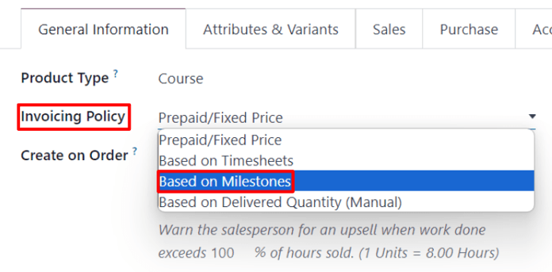
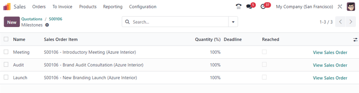
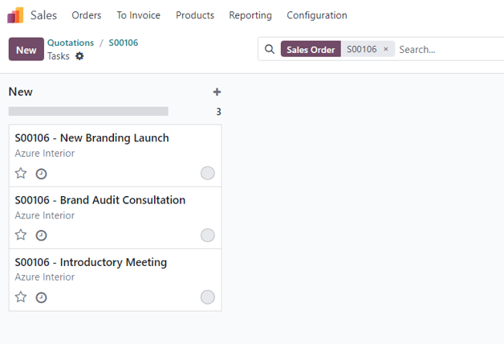
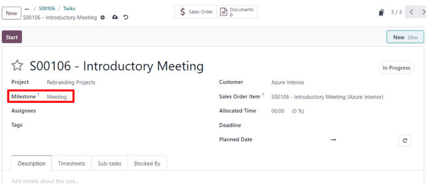
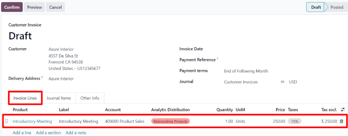

# Invoice project milestones

Invoicing based on project milestones can be used for expensive or
large-scale projects. The series of milestones in a project represent a
clear sequence of work that will inevitably result in the completion of
a project and/or contract.

This method of invoicing ensures the company gets a consistent flow of
money throughout the lifetime of the project. Customers can closely
monitor every phase of the project's development as it happens, in
addition to paying a large bill in several installments, instead of all
at once.

## Create milestone products

In Konvergo ERP, each milestone of a project is considered as an individual
product.

To create and/or configure products to work like this, first navigate to
`Sales app
--> Products --> Products`. Then, click on a product, or create a new
one by clicking `New`.

The option to invoice based on milestones is only available for certain
product types.

On the product form, under the `General Information` tab, the
`Product Type` field *must* be set on any of the following options:
`Service`, `Event Ticket`, `Event Booth`, or `Course`.

With any of those `Product Type` options selected, choose
`Based on Milestones` from the `Invoicing Policy` drop-down menu.

Beneath that is the `Create on Order` field.

To ensure workflows are as seamless as possible, it is recommended that
an option in the `Create on Order` field is selected.

> [!NOTE]
> Leaving it on the default `Nothing` option won't negatively affect the
> desired workflow. However, a project *must* then be created directly
> from a sales order form with that specific product. Once a project is
> created *then* milestones and tasks can be created and configured.

When the `Create on Order` default option of `Nothing` is clicked, a
drop-down menu is revealed with the following options:

- `Task`: Konvergo ERP creates a task related to this milestone product in the
  *Projects* app when this specific product is ordered.
- `Project \& Task`: Konvergo ERP creates a project and task related to this
  milestone product in the *Projects* app when this specific product is
  ordered.
- `Project`: Konvergo ERP creates a project related to this milestone product in
  the *Projects* app when this specific product is ordered.

When `Task` is selected, a `Project` field appears. In this field,
select to which existing project in the *Projects* app this created task
should be connected.

When `Project \& Task` or `Project` is selected, two new fields appear:
`Project Template` and `Workspace Template`.

The `Project Template` field provides template options to use for the
project that will be created when this specific product is ordered.

The `Workspace Template` field provides template options to use for the
workspace (for the *Documents* app, not the *Projects* app) that will be
automatically generated for the project when this specific product is
ordered.

> [!TIP]
> For organizational purposes, click the `Sales` tab on the product
> form, and enter a custom 'Milestone' related descriptor in the
> `Sales Description` field. This information appears in the
> `Description` column on the `Order Lines` tab of the sales order.
>
> Or, directly edit/modify the `Description` field on the `Order Lines`
> tab of the sales order.
>
> This is *not* a requirement.

## Invoice milestones

> [!NOTE]
> The following flow features a trio of milestone products that have
> `Service` set as their `Product Type`, and `Task` set on their
> `Create on Order` field.
>
>  alt="Product with Service &quot;Product Type&quot; and &quot;Task&quot; in the Create on Order field on form." />
>
> Those tasks are then attached to a pre-existing `Project`, which, in
> this case, is titled, `Rebranding Projects`.

To invoice milestones, create a sales order with the milestone
product(s). To do that, go to `Sales app --> New`. Doing so reveals a
blank quotation form.

From this quotation form, add a `Customer`. Then, click `Add a product`
in the `Order Lines` tab. Next, add the milestone product(s) to the
`Order Lines` tab.

Once the corresponding milestone product(s) have been added, click
`Confirm` to confirm the order, which turns the quotation into a sales
order.

When the order is confirmed, new smart buttons appear at the top of the
sales order based on what was selected in the `Create on Order` field on
the product form.

From the sales order, click the `Milestones` smart button. Doing so
reveals a blank `Milestones` page. Click `New` to add milestones.

Enter a `Name` for the milestone. Next, apply it to the corresponding
`Sales
Order Item`. Lastly, assign a `Deadline` to the milestone, if desired.

Repeat that process for all milestone sales order items.

Then, return to the sales order, via the breadcrumbs. From the sales
order, click the `Tasks` smart button. Doing so reveals a `Tasks` page
with a task for each sales order item with that option designated in the
`Create on Order` field.

To manually assign a configured milestone to a task, click the desired
task, which reveals the task form. On the task form, select the
appropriate milestone to which this task should be connected, in the
`Milestone` field.

Repeat this process for all milestone tasks.

With those tasks properly configured, employees log in their progress as
they work on the task, in addition to adding any notes related to the
task.

Then, when that task is complete, that means that milestone has been
reached. At that point, it is time to invoice that milestone.

To invoice a milestone, first return to the sales order — either via the
breadcrumb links, or by navigating to `Sales app --> Orders --> Orders`
and picking the appropriate sales order.

Back on the sales order form, click the `Milestones` smart button, and
check the box in the `Reached` column for that particular task.

Next, return to the sales order — either by clicking `View Sales Order`
on the `Milestones` page, or via the breadcrumb links.

Back on the sales order, the line item for the milestone that's been
reached has its `Delivered` column filled. That's because the milestone
has been reached, and therefore delivered.

Click `Create Invoice` in the upper-left corner. Doing so reveals a
`Create
invoices` pop-up window.

On the `Create invoices` pop-up window, leave the `Create Invoice`
option on the default `Regular Invoice` selection, and click the
`Create Draft Invoice` button.

Upon clicking `Create Draft Invoice`, Konvergo ERP reveals the
`Customer Invoice Draft`, *only* showing that reached milestone in the
`Invoice Lines` tab.

From this invoice page, click the `Confirm` button to confirm the
invoice. Then, when the customer has paid for this milestone, click
`Register Payment`.

When `Register Payment` is clicked, a `Register Payment` pop-up window
appears.

On this pop-up window, confirm the accuracy of the auto-populated
fields, then click `Create Payment`.

When clicked, the pop-up window disappears, and Konvergo ERP returns to the
invoice for that milestone, which now has a green `In Payment` banner in
the upper-right corner. This banner signifies the invoice has been paid.

Then, return to the sales order, via the breadcrumb links. Back on the
sales order, in the `Order Lines` tab, the reached milestone that's been
invoiced and paid for, now has its `Invoiced` column filled.

There is also a new `Invoices` smart button at the top of the sales
order. Clicking that reveals all the invoices that are connected to this
sales order.

Simply repeat the above process for each milestone as it is worked on,
and subsequently, completed.

Continue that process until the entire project has been completed, each
milestone has been invoiced, and the entire order has been paid for in
full.

\- `time_materials` - `proforma` - `invoicing_policy`

