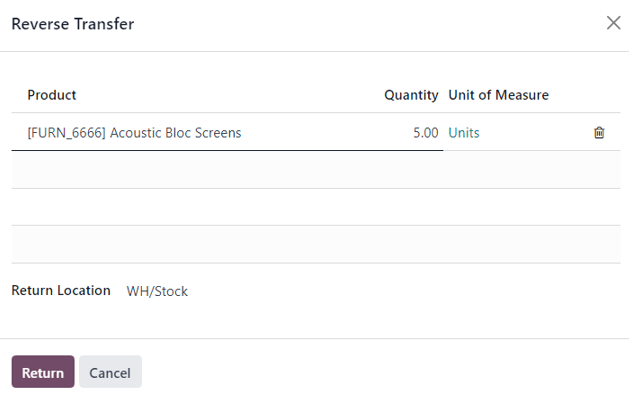

# Returns and refunds

The Konvergo ERP *Sales* app provides two different ways to process returns. The
method used depends on whether or not an invoice has been sent.

## Before invoicing

Returns are completed using *Reverse Transfers* when a customer decides
to return a product **before** an invoice has been sent or validated.

> [!NOTE]
> In order to use *Reverse Transfers*, the *Inventory* app **must** be
> installed.

To start a return before invoicing, navigate to the `Sales` app, select
the desired sales order, and click on the `Delivery` smart button to
open the associated delivery order.

On the validated delivery order, click `Return`.

This opens a `Reverse Transfer` pop-up window.

By default, the `Quantity` matches the validated quantities from the
delivery order. Update the quantities, if necessary. Click on the
`🗑️ (trash)` icon next to a line item to remove it from the return.

Next, click `Return` to confirm the return. This generates a new
warehouse operation for the incoming returned product(s).

Upon receiving the return, the warehouse team validates the warehouse
operation by clicking `Validate`. Then, on the original sales order, the
`Delivered` quantity updates to reflect the difference between the
initial validated quantities and the returned quantities.

When an invoice is created, the customer receives an invoice **only**
for the products they are keeping, if any.

## After invoicing

Sometimes, customers return an item after they receive and/or pay for
their invoice. In these cases, a return using only *Reverse Transfers*
is insufficient since validated, or sent, invoices cannot be changed.

However, *Reverse Transfers* can be used in conjunction with *Credit
Notes* to complete the customer's return.

To start a return after invoicing, navigate to the relevant sales order
in the `Sales` app.

If there is a payment registered on the sales order, the payment details
appear in the chatter, and the invoice (accessible through the
`Invoices` smart button) has a green `In
Payment` banner.

From the sales order, click on the `Delivery` smart button to view the
validated delivery order. Then, click `Return` to open the
`Reverse Transfer` pop-up window.

Next, edit the `Product` and/or `Quantity`, as needed for the return.
Then, click `Return`. This generates a new warehouse operation for the
incoming returned product(s), which is validated by the warehouse team
once the return is received by clicking `Validate`.

Then, on the sales order, the `Delivered` quantity updates to reflect
the difference between the initial validated quantities and the returned
quantities.

To process a refund, navigate to the relevant invoice (from the sales
order, click on the `Invoices` smart button). Then, click the
`Credit Note` button at the top of the validated invoice.

Doing so reveals a `Credit Note` pop-up form.

Start by entering a `Reason displayed on Credit Note` and a specific
`Journal` to process the credit. Then, select a specific
`Reversal Date`.

After the information is filled in, click `Reverse` or
`Reverse and Create
Invoice`. Then, edit the draft, if needed.

Lastly, click `Confirm` to confirm the credit note.

When complete, a blue banner reading:
`You have outstanding credits for this customer. You
can allocate them to mark this invoice as paid.` appears at the top of
the page.

`../../../finance/accounting/customer_invoices/credit_notes`

