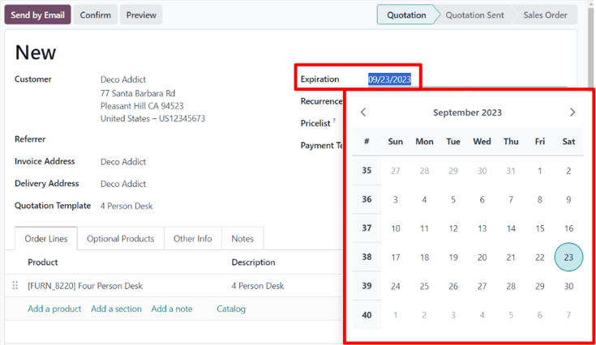
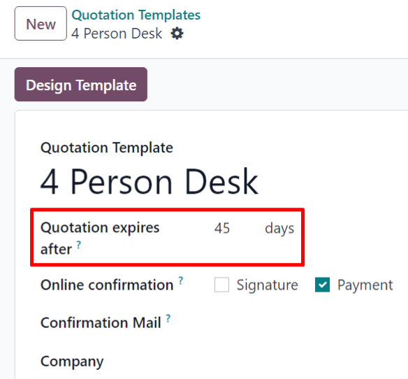

# Quotation deadlines

In the Konvergo ERP *Sales* application, it is possible to set deadlines on
sales quotations. Doing so encourages customers to act quickly during
sales negotiations, for they might fear for missing out on a good deal.
As well, deadlines also can also act as protection for a company in case
an order has to be fulfilled at a price that is no longer profitable for
the business.

## Quotation expiration

In Konvergo ERP *Sales*, there's the option to add an expiration date to a
quotation.

To add an expiration date to a quotation, navigate to `Sales app`, and
select a desired quotation, or create a new one by clicking `New`.

On the quotation form, click the `Expiration` field to reveal a pop-up
calendar. From this pop-up calendar, select the desired month and date
as the expiration date for the quotation.

> [!TIP]
> By clicking the `Preview` button on a quotation, Konvergo ERP clearly displays
> when that specific offer expires.
>
>  alt="How customers will see deadlines on Konvergo ERP Sales." />

## Quotation template expiration

The Konvergo ERP *Sales* application also makes it possible to add a deadline
expiration date to quotation templates.

To add a deadline expiration date to a quotation template, navigate to
`Sales app -->
Configuration --> Quotation Templates`, and either select the desired
quotation template to which a deadline should be added, or click `New`
to build a new quotation template from scratch.

On the quotation template form, add a specific number of days to the
`Quotation expires
after` field, located beneath the quotation template name. The number of
days represents how long the quotation will be valid for, before it
expires.

Then, whenever that specific quotation template is used in a quote, an
expiration date is automatically calculated, based on the number of days
designated above. However, this date can be overwritten before sending
the quotation to the customer.

`/applications/sales/sales/send_quotations/quote_template`

