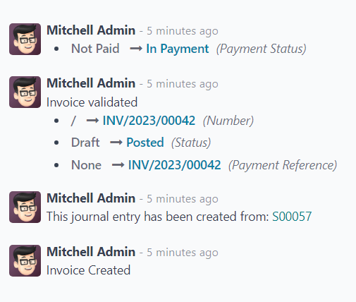

# Online payment order confirmation

The Konvergo ERP *Sales* application provides customers with the ability to
confirm orders, via an online payment, directly on a sales order. Once
the sales order is electronically paid for by the customer, the
salesperson attached to the sales order is instantly notified that the
order is confirmed.

## Activate online payments

In order to have customers confirm orders with an online payment, the
*Online Payment* setting **must** be activated.

To activate the *Online Payment* feature, go to
`Sales app --> Configuration -->
Settings`, scroll to the `Quotations \& Orders` heading, check the box
next to the `Online Payment` feature, and click `Save`.

Beneath the `Online Payment` option on the *Sales* `Settings` page,
there's a `Default Quotation Validity` field. In this field, there's the
option to add a specific number of days for quotations to remain valid
by default.

To enable this feature on a standard quotation, click the checkbox for
the `Payment` feature option, located in the `Online confirmation`
field, on the `Other Info` tab.

To enable this feature on a quotation template, click the checkbox for
the `Payment` feature option, located in the `Online confirmation` field
of the quotation template form.

## Payment providers

After activating the `Online Payment` feature, a link to configure
`Payment
Providers` appears beneath it.

Clicking that link reveals a separate `Payment Providers` page, in which
a large variety of payment providers can be enabled, customized, and
published.

`../../../finance/payment_providers`

## Register a payment

After opening quotations in their customer portal, customers can click
`Accept \& Pay` to confirm their order with an online payment.

After clicking `Accept \& Pay`, customers are presented with
`Validate Order` pop-up window containing different options for them to
make online payments, in the `Pay
with` section.

> [!NOTE]
> Konvergo ERP will **only** offer payment options on the `Validate Order`
> pop-up window that have been published and configured on the
> `Payment Providers` page.

Once the customer selects their desired method of payment, they will
click the `Pay` button on the pop-up window to confirm the order. Konvergo ERP
instantly notifies the assigned salesperson upon order confirmation with
an online payment.

\- `quote_template` - `get_signature_to_validate` -
`../../../finance/payment_providers`

