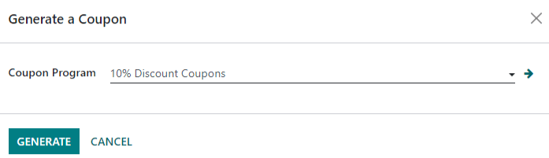
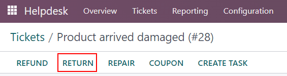
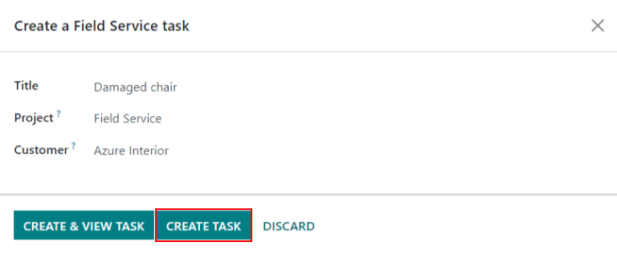

# After-Sales services

*After-Sales* services can be configured in the *Helpdesk* application
for individual *teams*. Once enabled, users can issue refunds, process
returns, generate coupons, and/or schedule repair and field service
interventions directly from a ticket.

## Set up the after-sales services

Start by enabling the after-sales services on specific *Helpdesk*
team(s), by going to `Helpdesk --> Configuration --> Teams` and
selecting which teams(s) these services should be active on. Then,
scroll to the `After-Sales` section on the team's settings page, and
choose which of the following options to enable:

- `Refunds`: issues credit notes to refund a customer, or adjust the
  remaining amount due
- `Coupons`: offers discounts and free products through an existing
  coupon program
- `Returns`: initiates a product return from a customer through a
  reverse transfer
- `Repairs`: creates repair orders for broken or faulty products
- `Field Service`: plans onsite intervention through the *Field Service*
  application

<figure>

<figcaption>The services that are enabled can vary based on the type of
support a team provides.</figcaption>
</figure>

> [!WARNING]
> As all of the after-sales services in Konvergo ERP require integration with
> other applications, enabling any of them may result in the
> installation of additional modules or applications. *Installing a new
> application on a One-App-Free database will trigger a 15-day trial. At
> the end of the trial, if a paid subscription has not been added to the
> database, it will no longer be accessible.*

## Issue a refund with a credit note

A *credit note* is a document issued to a customer informing them that
they have been credited a certain amount of money. They can be used to
provide a full refund to a customer, or to adjust any remaining amount
due. While they are usually created through the *Accounting* or
*Invoicing* applications, they can be created through a *Helpdesk*
ticket, as well.

> [!NOTE]
> Invoices must be posted before a credit note can be generated.

To create a credit note, navigate to a ticket on the `Helpdesk`
application, and click the `Refund` button in the upper-left corner of
the ticket dashboard. Then, select the corresponding invoice from the
`Invoices to Refund` drop-down menu.

Choose a `Credit Method` from one of the following options:

- `Partial Refund`: the credit note is created in draft and can be
  edited before being issued
- `Full Refund`: the credit note is auto-validated and reconciled with
  the invoice. *This is the option to choose if a validated invoice
  needs to be canceled*
- `Full refund and new draft invoice`: the credit note is auto-validated
  and reconciled with the invoice. The original invoice is duplicated as
  a new draft. *This is the option to choose if a validated invoice
  needs to be modified*

> [!IMPORTANT]
> The `Credit Method` options will **not** be available for invoices
> that have already been paid.

Make any necessary changes to the details of the credit note and click
`Reverse.` Then click `Confirm` to post the credit note.

Once the credit note has been posted, a `Credit Notes` smart button will
be added to the *Helpdesk* ticket.

`/applications/finance/accounting/customer_invoices/credit_notes`

## Generate coupons from a ticket

Coupons can be used to alter the price of products or orders. The usage
constraints of a coupon are defined by conditional rules. *Coupon
Programs* are configured in the *Sales* or *Website* applications.

> [!NOTE]
> The *eCommerce* module must be installed in order to create coupon
> codes from the *Website*.

To generate a coupon, open a *Helpdesk* ticket and click on the `Coupon`
button in the upper left corner. Select an option from the
`Coupon Program` drop-down menu, then click `Generate`.

The `Coupon Code` can be copied directly from the pop-up window (by
clicking the `Copy` button), or sent in an email by clicking `Send`.

> [!NOTE]
> When emailing a coupon code, all the followers of the ticket will be
> added as recipients to the email. Additional recipients can be added
> to the email as well, in the `Recipients` field of the `Compose Email`
> pop-up window.
>
>  alt="View of an email draft window with coupon code." />

Once a `Coupon Code` has been generated, a `Coupons` smart button will
be added to the top of the ticket; click the smart button to view the
coupon code, expiration date, and additional information.

[Coupons](https://www.odoo.com/slides/slide/coupon-programs-640?fullscreen=1)

## Facilitate a product return with a reverse transfer

Returns are completed through *reverse transfers*, which generate new
warehouse operations for the returning products. Click the `Return`
button in the top-left corner of a ticket to open the `Reverse Transfer`
pop-up window.

> [!NOTE]
> The `Return` button only appears on a ticket if the customer has a
> recorded delivery in the database.

By default, the quantity will match the validated quantity from the
delivery order. Update the `Quantity` field if necessary.

Click `Return` to confirm the return. This generates a new warehouse
operation for the incoming returned product(s). A `Return` smart button
will then be added to the top of the ticket.

`/applications/sales/sales/products_prices/returns`

## Send products for repair from a ticket

If the ticket is related to an issue with a faulty or broken product, a
repair order can be created from the *Helpdesk* ticket, and managed
through the *Repairs* application.

To create a new repair order, open a `Helpdesk` ticket and click on the
`Repair` button in the upper left corner.

Clicking the `Repair` button opens a blank `Repair Reference` form.

> [!NOTE]
> If a product was specified in the `Product` field on the ticket, it
> will be added to the `Product to Repair` field automatically. If not,
> click into the field to select a product from the drop down.

Fill out the `Repair Description` field with a brief explanation of the
issue. Click the `Sale Order` field and then select the originating
`SO (Sales Order)` from which the product is being repaired from. If a
return has been initiated for the product, select the reference number
from the drop-down in the `Return` field.

Choose an `Invoice Method` from the drop-down. Select `Before Repair` or
`After Repair` to generate an invoice before or after the work is
completed. Selecting `No Invoice` means that an invoice cannot be
generated for this service.

If parts are required for the repair, they can be added in the `Parts`
tab. Services can be added as product lines on the `Operations` tab.
Additional information for the internal repair team can be added to the
`Repair Notes` tab. Information for the customer can be added to the
`Quotation Notes` tab, and will be automatically added to the PDF of the
quotations generated from this `Repair Reference`.

A `Repairs` smart button will be added to the ticket, linking to the
repair order.

> [!NOTE]
> Once a user creates a repair order from a *Helpdesk* ticket, they will
> be able to access it through the ticket's `Repair` smart button, or
> from a link in the `Chatter`, even if they do not have access rights
> to the *Repair* application.

## Create a field service task from a ticket

On-site interventions can be planned from a ticket and managed through
the *Field Service* application. Customers with
`portal access </applications/general/users/portal>` will be able to
track the progress of a `Field Service` task just as they would a
*Helpdesk* ticket.

To create a new task, navigate to a `Helpdesk` ticket. Click
`Create Task` to open the `Create a Field Service task` pop-up. Confirm
or update the task `Title`.

> [!NOTE]
> The `Project` field on the `Create a Field Service task` pop-up will
> default to the same *Field Service* project that was identified on the
> team's settings page. To change the project for this specific task,
> select one from the `Project` field.
>
> To change the default *Field Service* project for the team, go to
> `Helpdesk -->
> Configuration --> Teams` to select a `Team`. Scroll to the
> `After-Sales` section and choose new project under `Field Service`.

Click `Create Task` or `Create & View Task`.

After the task is created, a `Tasks` smart button will be added to the
ticket, linking the `Field Service` task to the ticket.

[Field
Service](https://www.odoo.com/slides/slide/advanced-settings-862?fullscreen=1)

