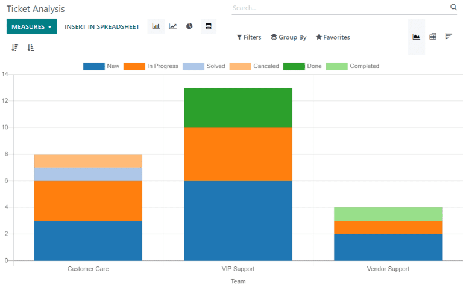
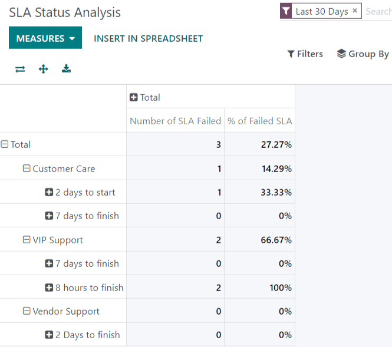
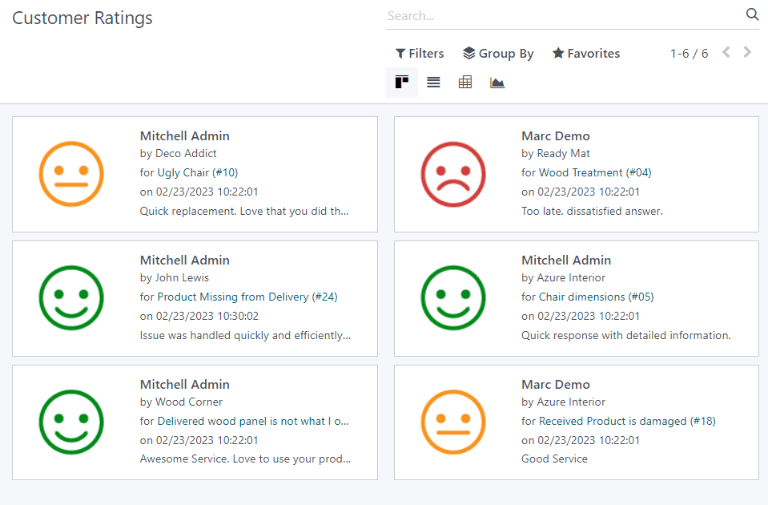

# Reporting

Odoo *Helpdesk* includes several reports that provide the opportunity to
track trends for customer support tickets, identify areas for
improvement, manage employee workloads, and confirm when customer
expectations are met.

## Available reports

Details about the reports available in Odoo *Helpdesk* can be found
below. To view the different reports, go to `Helpdesk --> Reporting`.

### Ticket Analysis

The *Ticket Analysis* report
(`Helpdesk --> Reporting --> Ticket Analysis`) provides an overview of
every customer support ticket in the database. This includes the number
of tickets assigned among teams and individual users.

This report is useful in identifying where teams are spending the most
time, and helps determine if there is an uneven workload distribution
among the support staff. The default report counts the number of tickets
per team and groups them by stage.

Alternative measures can be selected to track where the most time is
spent at different points in the workflow. To change the measures used
for the report that is currently displayed, or to add more, click the
`Measures` button, and select one or more options from the drop-down
menu:

- `Average Hours to Respond`: average number of working hours between a
  message sent from the customer and the response from the support team.
  *This is does not include messages sent when the ticket was in a
  folded stage*
- `Hours Open`: number of hours between the date the ticket was created
  and the closed date. If there is no closed date on the ticket, the
  current date is used. **This measure is not specific to working
  hours**
- `Hours Spent`: number of *Timesheet* hours logged on a ticket. *This
  measure is only available if Timesheets are enabled on a team, and the
  current user has the access rights to view them*
- `Hours to Assign`: number of working hours between the date on which
  the ticket was created and when it was assigned to a team member
- `Hours to Close`: number of working hours between the date on which
  the ticket was created and the date it was closed
- `Hours to First Response`: number of working hours between the date on
  which the ticket was received and the date one which the first message
  was sent. *This does not include email sent automatically when a
  ticket reaches a stage*
- `Hours to SLA Deadline`: number of working hours remaining to reach
  the last `SLA
  (Service Level Agreement)` deadline on a ticket
- `Rating /5`: number valued assigned to the rating received from a
  customer (Dissatisfied = 1, Okay/Neutral = 3, Satisfied = 5)
- `Count`: number of tickets in total

> [!NOTE]
> *Working hours* are calculated based on the default working calendar.
> To view or change the working calendar, go to the `Settings`
> application and select `Employees --> Company Working Hours`.

### SLA Status Analysis

The *SLA Status Analysis* report
(`Helpdesk --> Reporting --> SLA Status Analysis`) tracks how quickly an
SLA (Service Level Agreement) is fulfilled, as well as the success rate
of individual policies.

By default, this report is filtered to show the number of
`SLAs (Service Level Agreements)` failed, as well as the failure rate
over the last 30 days, grouped by team.

To change the measures used for the report that is currently displayed,
or to add more, click the `Measures` button, and select one or more
options from the drop-down menu:

- `% of Failed SLA`: percentage of tickets that have failed at least one
  `SLA
  (Service Level Agreement)`
- `% of SLA in Progress`: percentage of tickets that have at least one
  `SLA (Service
  Level Agreement)` still in progress, and have not failed any
  `SLAs (Service Level
  Agreements)`
- `% of Successful SLA`: percentage of tickets where all
  `SLAs (Service Level
  Agreements)` have been successful
- `Number of SLA Failed`: number of tickets that have failed at least
  one `SLA
  (Service Level Agreement)`
- `Number of SLA Successful`: number of tickets where all
  `SLAs (Service Level
  Agreements)` have been successful
- `Number of SLA in Progress`: number of tickets that have at least one
  `SLA
  (Service Level Agreement)` still in progress, and have not failed any
  `SLAs (Service Level
  Agreements)`
- `Working Hours to Assign`: number of working hours between the date on
  which the ticket was created and when it was assigned to a team member
- `Working Hours to Close`: number of working hours between the date on
  which the ticket was created and the date it was closed
- `Working Hours to Reach SLA`: number of working hours between the date
  on which the ticket was created and the date the
  `SLA (Service Level Agreement)` was satisfied
- `Count`: number of tickets in total

To see the number of tickets that were able to achieve the stated
`SLA (Service Level
Agreement)` objectives, and track the amount of time it took to achieve
those objectives, click `Measures --> Number of SLA Successful` and
`Measures --> Working
Hours to Reach SLA`.

To sort these results by the team members assigned to the tickets,
select `Total
--> Assigned to`.

`Service Level Agreements (SLA) </applications/services/helpdesk/overview/sla>`

### Customer Ratings

The *Customer Ratings* report
(`Helpdesk --> Reporting -- Customer Ratings`) displays an overview of
the ratings received on individual support tickets, as well as any
additional comments submitted with the rating.

Click on an individual rating to see additional details about the rating
submitted by the customer, including a link to the original ticket.

> [!TIP]
> On the rating's details page, select the `Visible Internally Only`
> option to hide the rating from the customer portal.

The *Customer Ratings* report is displayed in a kanban view by default,
but can also be displayed in graph, list, or pivot view.

`Ratings </applications/services/helpdesk/overview/ratings>`

## View and filter options

On any Odoo report, the view and filter options vary, depending on what
data is being analyzed, measured, and grouped. See below for additional
information on the available views for the *Helpdesk* reports.

> [!NOTE]
> Only one measure may be selected at a time for graphs, but pivot
> tables can include multiple measures.

### Pivot view

The *pivot* view presents data in an interactive manner. All three
*Helpdesk* reports are available in pivot view.

The pivot view can be accessed on any report by selecting the
`grid icon` at the top right of the screen.

To add a group to a row or column to the pivot view, click the
`➕ (plus sign)` next to `Total`, and then select one of the groups. To
remove one, click the `➖ (minus
sign)` and de-select the appropriate option.

### Graph view

The *graph* view presents data in either a *bar*, *line*, or *pie*
chart.

Switch to the graph view by selecting the `line chart icon` at the top
right of the screen. To switch between the different charts, select the
*related icon* at the top left of the chart, while in graph view.

Bar chart

Line chart

Pie chart

> [!TIP]
> Both the *bar chart* and *line chart* can utilize the *stacked* view
> option. This presents two (or more) groups of data on top of each
> other, instead of next to each other, making it easier to compare
> data.

### Save and share a favorite search

The *Favorites* feature found on *Helpdesk* reports allows users to save
their most commonly used filters without having to reconstruct them
every time they are needed.

To create and save new *Favorites* on a report, follow the steps below:

1.  Set the necessary parameters using the `Filters`, `Group By` and
    `Measures` options.
2.  Click `Favorites --> Save current search`.
3.  Rename the search.
4.  Select `Use by default` to have these filter settings automatically
    displayed when the report is opened. Otherwise, leave it blank.
5.  Select `Share with all users` to make this filter available to all
    other database users. If this box is not checked, it will only be
    available to the user who creates it.
6.  Click `Save` to preserve the configuration for future use.

\-
`Start receiving tickets </applications/services/helpdesk/overview/receiving_tickets>` -
`Odoo reporting </applications/essentials/reporting>`

