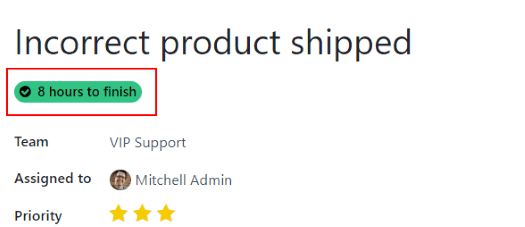
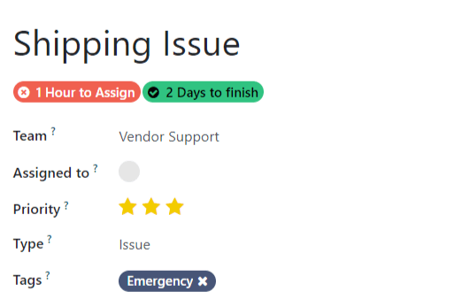
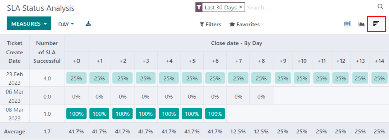

# Service Level Agreements (SLA)

A Service Level Agreement (SLA) defines the level of service a customer
can expect from a supplier. SLAs provide a timeline that tells customers
when they can expect results, and keeps the support team on target.

## Create a new SLA policy

To create a new `SLA (Service Level Agreement)` Policy, navigate to the
team's page under `Helpdesk --> Configuration --> Teams`. Select a team,
scroll to the `Performance` section, and then check the selection box
next to `SLA Policies` to enable it for that specific team.

> [!NOTE]
> The value indicated next to the `Working Hours` field is used to
> determine the deadline for `SLA (Service Level Agreement)` policies.
> By default, this is determined by the value set in the
> `Company Working Hours` field under `Settings app
> --> Employees --> Work Organization`.

To create a new policy, click the smart button on the team\`s settings
page or go to `Helpdesk -->  Configuration --> SLA Policies`, and click
`New`. Start by entering a `Title` and a `Description` for the new
policy, and proceed to fill out the form using the steps below.

### Define the criteria for an SLA policy

The `Criteria` section is used to identify what tickets this policy will
be applied to. Fill out the following fields to adjust the selection
criteria:

- `Team`: a policy can only be applied to one team. *This field is
  required.*
- `Priority`: the priority level for a ticket is identified by selecting
  the number of stars representing the priority level on the kanban card
  or the ticket itself. The `SLA
  (Service Level Agreement)` will only be applied once the priority
  level has been updated on the ticket to match the
  `SLA (Service Level Agreement)` criteria. If no selection is made in
  this field, this policy will only apply to tickets marked as
  Low Priority (zero stars).
- `Types`: ticket types can be helpful when indicating when a ticket is
  a customer question, that can be solved with a quick response, or an
  issue, that may require additional investigation. Multiple ticket
  types can be selected for this field. If no selection is made, this
  policy will apply to all ticket types.
- `Tags`: tags are applied to briefly indicate what the ticket is about.
  Multiple tags can be applied to a single ticket.
- `Customers`: individual contacts or companies may be selected in this
  field.
- `Sales Order Items`: this field is available only if a team has the
  *Timesheets* app enabled. This allows the ticket to tie directly to a
  specific line on a sales order, which must be indicated on the ticket
  in the `Sales Order Item` field.

> [!NOTE]
> Unless otherwise indicated, multiple selections can be made for each
> field. (i.e. multiple `Tags` can be included in a policy, but only one
> `Priority` level)

### Establish a target for an SLA policy

The `Target` is the stage a ticket needs to reach, and the time alloted
to reach that stage, in order to satisfy the
`SLA (Service Level Agreement)` policy. Any stage assigned to a team may
be selected for the `Reach Stage` field. Time spent in stages selected
in `Excluding Stages` will not be included in the calculation of the
`SLA (Service
Level Agreement)` deadline.

An `SLA (Service Level Agreement)` titled 8
Hours to Close tracks the working time before a ticket is
completed, and would have Solved as the
`Reach Stage`. However, if the `SLA (Service Level Agreement)` was
titled 2 Days to Start, it tracks the
working time before work on a ticket has begun, and would have
In Progress as the `Reach Stage`.

## Meeting SLA deadlines

Once it is determined that a ticket fits the criteria of an
`SLA (Service Level Agreement)` policy, a deadline is calculated. The
deadline is based on the creation date of the ticket, and the targeted
working hours. The deadline is then added to the ticket, as well as a
white tag indicating the name of the `SLA (Service Level Agreement)`
applied.

> [!IMPORTANT]
> If a ticket fits the criteria for more than one
> `SLA (Service Level Agreement)`, the earliest occurring deadline will
> be displayed on the ticket. Once that deadline has passed, the next
> deadline will be displayed.

Once a ticket satisfies an `SLA (Service Level Agreement)` policy, the
`SLA (Service
Level Agreement)` tag turns green, and the `Deadline` field disappears
from view on the.

If the `SLA (Service Level Agreement)` deadline passes and the ticket
has not moved to the `Reach Stage`, the `SLA (Service Level Agreement)`
tag will turn red. Once the `SLA (Service Level Agreement)` has failed,
the red tag will stay on the ticket, even after the ticket is moved to
the `Reach Stage`.

## Analyzing SLA performance

The `SLA Status Analysis` report tracks how quickly an
`SLA (Service Level
Agreement)` is fulfilled, as well as the success rate of individual
policies. Navigate to the report and corresponding pivot table by going
to `Helpdesk --> Reporting --> SLA Status
Analysis`.

### Using the Pivot view

By default, the report is displayed in a `Pivot` view, and is filtered
to show the number of SLAs failed and the failure rate over the last 30
days, grouped by team.

To add the number of SLAs passed or in progress, click the `Measures`
button to reveal a drop-down menu of reporting criteria, and choose from
the options available based on the measurements preferred. Whenever a
measurement is picked, a check mark will appear in the drop-down menu to
indicate that that measurement is included, and a corresponding new
column will emerge in the pivot table to show the relevant calculations.

To add a group to a row or column, click the plus ` + ` button next to
`Total`, and then select one of the groups. To remove one, click the
minus ` - ` button and deselect.

### Using the Graph view

The `Status Analysis` report can also be viewed as a `Bar`, `Line`, or
`Pie` Chart. Toggle between these views by selecting the appropriate
icon at the top of the chart.

Bar Chart

Line Chart

Pie Chart

> [!TIP]
> Both the `Bar Chart` and `Line Chart` can be viewed `Stacked`. This
> presents two or more groups to appear on top of each other instead of
> next to each other, making it easier to compare data.

### Using the Cohort view

The `Cohort` view is used to track the changes in data over a period of
time. To display the `Status Analysis` report in a `Cohort` view, click
the icon in the top right corner above the chart.

\- `Reporting views <reporting/views>` -
`Allow customers to close their tickets
</applications/services/helpdesk/advanced/close_tickets>`

