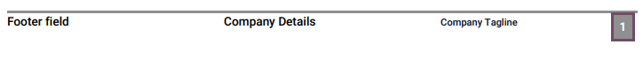
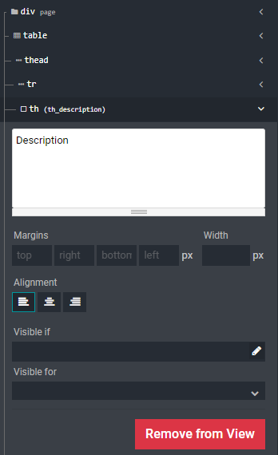

# PDF reports

With Studio, you can edit existing PDF reports (e.g., orders and
quotations) or create new ones.

> [!IMPORTANT]
> To edit a standard PDF report, it is strongly recommended to
> **duplicate** it and make changes to the duplicated version, as
> changes made to standard reports will be overwritten after an Odoo
> upgrade. To duplicate a report, go to `Studio --> Reports`. Hover the
> mouse pointer on the top right corner of the report, click the
> vertical ellipsis icon (`⋮`), and then select `Duplicate`.
>
> 

## Default layout

The default layout of reports is managed outside Studio. Go to
`Settings -->
Companies: Document Layout --> Configure Document Layout`. Layout
settings apply to all reports but only to the current company.

> [!TIP]
> Use `Download PDF Preview` to view how the different settings affect
> the layout of a sample invoice.

### Layout

Four layouts are available.

Light

Boxed

Bold

Striped

### Font

Seven fonts are available. Click on the links below to preview them on
[Google Fonts](https://fonts.google.com/).

- [Lato](https://fonts.google.com/specimen/Lato#type-tester)

- [Roboto](https://fonts.google.com/specimen/Roboto#type-tester)

- [Open Sans](https://fonts.google.com/specimen/Open+Sans#type-tester)

- [Montserrat](https://fonts.google.com/specimen/Montserrat#type-tester)

- [Oswald](https://fonts.google.com/specimen/Oswald#type-tester)

- [Raleway](https://fonts.google.com/specimen/Raleway#type-tester)

- [Tajawal](https://fonts.google.com/specimen/Tajawal#type-tester)

  > [!NOTE]
  > `Tajawal` supports both Arabic and Latin scripts.

### Company logo

Upload an image file to add a `Company Logo`.

> [!NOTE]
> This adds the logo to the company’s record on the *Company* model,
> which you can access by going to
> `General Settings --> Companies --> Update Info`.

### Colors

Change the primary and secondary colors used throughout reports to
highlight important elements. The default colors are automatically
generated based on the colors of the logo.

### Layout background

Change the `Layout Background` of the report:

- `Blank`: nothing is displayed.
- `Geometric`: an image featuring geometric shapes is displayed in the
  background.
- `Custom`: use a custom background image by uploading one.

### Company tagline

The `Company Tagline` is displayed on the header of `External reports
<studio/pdf-reports/header-footer/external>`. You can add multiple lines
of text.

### Company details

The `Company Details` are displayed on the header of `External reports
<studio/pdf-reports/header-footer/external>`. You can add multiple lines
of text.

### Footer

Use the `Footer` field to put any text in the `External reports'
<studio/pdf-reports/header-footer/external>` footers. You can add
multiple lines of text.

### Paper format

Use the `Paper format` field to change the paper size of reports. You
can either select `A4` (21 cm x 29.7 cm) or `US Letter` (21.59 cm x
27.54 cm).

> [!TIP]
> You can change the `Paper format` on individual reports. Open the app
> containing the report, then go to
> `Studio --> Reports --> Select or Create a report --> Report
> --> Select a Paper format`.

## Header and footer

When creating a new report in Studio, you must choose between one of
three styles of reports first. This is solely used to determine what is
displayed on the header and footer. To do so, go to the app on which you
want to add a new report, then `Studio button --> Reports --> Create`
and select `studio/pdf-reports/header-footer/external`,
`studio/pdf-reports/header-footer/internal`, or
`studio/pdf-reports/header-footer/blank`.

### External

The header displays the company `studio/pdf-reports/default-layout/logo`
and several values set on the *Company* model: the `Company Name`,
`Phone`, `Email`, and `Website`.

> [!TIP]
> To change a company's information, go to
> `Settings --> Companies --> Update Info`.

The footer displays the values set on the
`studio/pdf-reports/default-layout/footer`,
`studio/pdf-reports/default-layout/details`, and
`studio/pdf-reports/default-layout/tagline` fields, as well as the page
number.

### Internal

The header displays the user's current date and time, `Company Name`,
and page number.

There is no footer.

### Blank

There is neither a header nor a footer.

## Add tab

After opening an existing report or creating a new one, go to the `Add`
tab to add or edit elements. The elements are organized into four
categories: `studio/pdf-reports/elements/block`,
`studio/pdf-reports/elements/inline`,
`studio/pdf-reports/elements/table`, and
`studio/pdf-reports/elements/column`.

### Block

Block elements start on a new line and occupy the full width of the
page.

> [!TIP]
> You can set an element's width by selecting it and going to the
> `Options` tab.

- `Text`: add any text using small font size by default.

- `Title Block`: add any text using larger font size by default.

- `Image`: add an image. You can either upload one from your device, add
  one from an URL, or select one already existing on your database.

- `Field`: dynamically add a field's value.

- `Field & Label`: to dynamically add a field's value and label.

- `Address Block`: to dynamically add the values, if any, of a contact's
  (res.partner model): *Name*, *Address*,
  *Phone*, *Mobile*, and *Email*.

  

### Inline

Inline elements are used around other elements. They do not start on a
new line and the width adapts to length of the content.

> [!TIP]
> You can set an element's width and margins by selecting it and going
> to the `Options` tab.

- `Text`: add any text using small font size by default.
- `Field`: dynamically add a field's value.

### Table

Table elements are used together to create a data table.

- `Data table`: create a table and dynamically add a first column
  displaying the *Name* values of a
  `Many2Many <studio/fields/relational-fields/many2many>` or `One2Many
  <studio/fields/relational-fields/one2many>` field on your model.

  

- `Field Column`: add a new column to the table displaying the values of
  a `Related
  Field <studio/fields/relational-fields/related-field>` to the one used
  to create the `Data table`.

- `Text in Cell`: add any text within an existing table cell.

- `Field in Cell`: add, within an existing table cell, the values of a
  `Related
  Field <studio/fields/relational-fields/related-field>` to the one used
  to create the `Data table`.

- `Subtotal & Total`: add an existing `Total` field's value. If a
  `Taxes` field exists, the untaxed and taxes amounts are added before
  the total amount.

### Column

Columns are used to add multiple
`blocks <studio/pdf-reports/elements/block>` elements on the same line.

- `Two Columns`: add any text in two different columns.
- `Three Columns`: add any text in three different columns.

## Report tab

Several configuration options are available under the `Report` tab.

- `Name`: change the report name. The new name is applied everywhere (in
  Studio, under the `Print` button, and for the PDF file name).
- `Paper format`: change the paper size of the report.
- `Add in print`: add the report under the `🖶 Print` button available on
  the record.
- `Limit visibility to groups`: limit the availability of the PDF report
  to specific `user groups </applications/general/users/access_rights>`.

## Options tab

Select an element on the report to access the element's options and edit
it.

> [!NOTE]
> You can select and edit multiple elements at the same time by clicking
> on the different sections or divisions (e.g.,
> div,
> table, etc.).

Below are presented some of the most common options:

- `Margins`: add spacing at the `top`, `right`, `bottom`, and `left` of
  the element.
- `Width`: set the element's maximum width.
- `Visible if`: set under which condition(s) the element should be
  displayed.
- `Visible for`: set for which `users groups
  </applications/general/users/access_rights>` the element should be
  displayed.
- `Remove from View`: remove the element from the report's view.
- `Text decoration`: bold, italicize, and underline the font.
- `Alignment`: align the element to the left, center, or right of the
  report.
- `Font style`: use one of the default font styles.
- `Colors`: change the font's color and the background color.

> [!NOTE]
> You may need to select a section or division above the element you
> want to edit to see some of the options described above.
