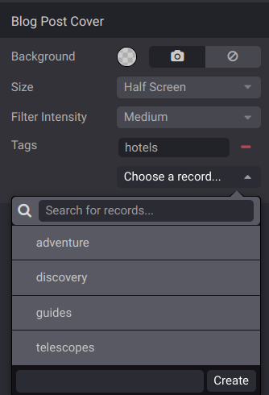

# Blog

**Konvergo ERP Blog** allows you to create and manage blog posts on your website
to engage your audience and build a community.

> [!TIP]
> If the Blog module is not yet installed, click `+New` on the website
> builder, select `Blog Post`, and click `Install`.

## Creating a blog

To create or edit a blog, go to
`Website --> Configuration --> Blogs: Blogs`. Click `New`, and enter the
`Blog Name` and the `Blog Subtitle`.

The `Blog` menu item is added to your website's menu the first time you
create a blog and gathers all your blogs.

## Adding a blog post

Go to your website, click `+New` in the top-right corner, and select
`Blog Post`. In the pop-up, **select the blog** where the post should
appear, write the post's `Title`, and `Save`. You can then write the
post's content and customize the page using the website builder.

> [!TIP]
> - Illustrate your articles with copyright-free images from `Unsplash
> </applications/general/integrations/unsplash>`. - Type
> / in the text editor to format and add
> elements to your text.

> [!IMPORTANT]
> Don't forget to toggle the `Unpublished` switch in the top-right
> corner to publish your post.

## Using tags

Tags let visitors filter all posts sharing the same tag. By default,
they are displayed at the bottom of posts, but can also be displayed on
the blog's main page. To do so, click `Edit --> Customize` and enable
the `Sidebar`. By default, the sidebar's `Tags List` is enabled.

To create a tag, go to `Website --> Configuration --> Blogs: Tags` and
click `New`. Fill in the:

- `Name`
- `Category`: tag categories let you group tags displayed on the sidebar
  by theme.
- `Used in`: to apply the tag to existing blog posts, click
  `Add a line`, select the posts, and click `Select`.

You can add and create tags directly from posts by clicking
`Edit --> Customize` and select the post's cover. Under `Tags`, click
`Choose a record...`, and select or create a tag.

> [!NOTE]
> To manage tag categories, go to
> `Website --> Configuration --> Blogs: Tag
> Categories`.

## Customizing blog homepages

Customize the content of blog homepages by opening a blog homepage and
clicking `Edit
--> Customize`.

> [!NOTE]
> Settings apply to **all** blogs homepages.

`Top Banner`: `Name/Latest Post` displays the title of the latest post
on the top banner, while `Drop Zone for Building Blocks` removes the top
banner and lets you use any building block instead.

`Layout`: organizes posts as a `Grid` or `List`.

- `Cards`: adds a *card* effect.
- `Increase Readability`: improves the text's readability.

`Sidebar`: displays a sidebar containing an `About us` section.

- `Archives`: allows visitors to select a month and filter all posts
  created during that month.
- `Follow Us`: displays links to your social media networks. They can be
  configured using the Social Media building block somewhere on your
  website.
- `Tags List`: displays all tags related to a blog. Visitors can select
  a tag to filter all related posts.

`Posts List`: `Cover` displays the posts' images, and `No Cover` hides
them.

- `Author`: displays the posts' authors.
- `Comments/Views Stats`: displays the posts' number of comments and
  views.
- `Teaser & Tags`: displays the posts' first sentences and tags.

## Customizing blog posts

Customize posts by opening a blog post and clicking
`Edit --> Customize`.

> [!NOTE]
> Settings apply to **all** posts.

`Layout`: `Title Inside Cover` displays the title inside the cover
image, and `Title above Cover` displays it above.

- `Increase Readability`: increases the text's readability.

`Sidebar`: displays the `Sidebar` and additional options:

- `Archive`: allows visitors to select a month and filter all posts
  created during that month.
- `Author`: displays the post's author and creation date.
- `Blog List`: displays links to all your blogs.
- `Share Links`: displays share buttons to several social networks.
- `Tags`: displays the post's tags.

`Breadcrumb`: displays the path to the post.

`Bottom`: `Next Article` displays the next post at the bottom, and
`Comments` enable visitors to comment on the post.

`Select To Tweet`: visitors are offered to tweet the text they select.

> [!TIP]
> Use `Plausible <analytics/plausible>` to keep track of the traffic on
> your blog.
