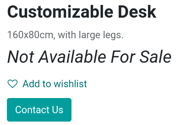
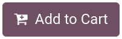
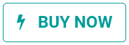
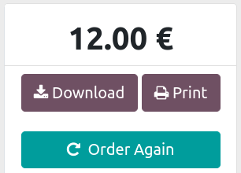

# Add to cart

The `Add to Cart` button can be customized in multiple ways. You can:

- Choose on which page customers go after clicking the 'Add to Cart'
  button;
- Hide the 'Add to Cart' button to prevent sales;
- Add a 'Buy Now' button to skip the cart step and lead customers
  straight to checkout;
- Create additional 'Add to Cart / Buy Now' buttons;
- Add an 'Order Again' button to the customer portal.

`checkout`

## 'Add to Cart' action customization

When customers click on the `Add to Cart` button, the product is added
to their cart, and customers remain **by default** on the product's
page. However, customers can either immediately be **redirected** to
their cart, or given the choice on what to do through a **dialog box**.

To change the default behavior, go to
`Website --> Configuration --> Settings`. Under the
`Shop - Checkout Process` section, look for `Add to Cart` and select one
of the options.

> [!NOTE]
> If a product has
> `optional products <../managing_products/cross_upselling>`, the
> **dialog box** will always appear.

`../managing_products/catalog`

## Replace 'Add to Cart' button by 'Contact Us' button

You can replace the 'Add to Cart' button with a 'Contact Us' button
which redirects users to the URL of your choice.

> [!NOTE]
> Hiding the `Add to Cart` button is often used by B2B eCommerces that
> need to restrict purchases only to
> `customers with an account <checkout-sign>`, but still want to display
> an online product catalog for those without.

To do so, go to
`Website --> Configuration --> Settings --> Shop - Products` and tick
`Prevent Sale of Zero Priced Product`. This creates a new `Button url`
field where you can enter the **redirect URL** to be used. Then, set the
price of the product to 0.00 either from
the **product's template**, or from a
`pricelist <../../../sales/sales/products_prices/prices/pricing>`.

> [!NOTE]
> The 'Contact Us' button and '*Not Available For Sale*' text can both
> be modified using the **website builder** on the product's page
> (`Edit --> Customize`) by clicking on them.

## Customizable 'Add to Cart' button

You can also create a customizable 'Add to Cart' button and link it to a
specific product. The **customized button** can be added on any page of
the website as an **inner content** building block, and is an
*additional* button to the regular `Add to Cart` button.

To add it, go on the `Shop` page of your choice, click `Edit --> Blocks`
and place the building block. Once placed, you have the following
options:

- `Product`: select the product to link the button with. Selecting a
  product renders the `Action` field available;
- `Action`: choose if the button should `Add to Cart` or `Buy Now`
  (instant checkout).

## 'Buy Now' button

You can enable the 'Buy Now' button to instantly take the customer to
**checkout** instead of adding the product to the cart. The `Buy Now`
button is an *additional* button and does not replace the `Add to Cart`
button. To enable it, go to
`Website --> Configuration --> Settings --> Shop - Checkout Process` and
tick `Buy Now`.

## Re-order from portal

Customers have the possibility to **re-order** items from **previous
sales orders** on the customer portal. To do so, go to
`Website --> Configuration --> Settings --> Shop - Checkout
Process` and enable `Re-order From Portal`. Customers can find the
`Order Again` button on their **sales order** from the **customer
portal**.

