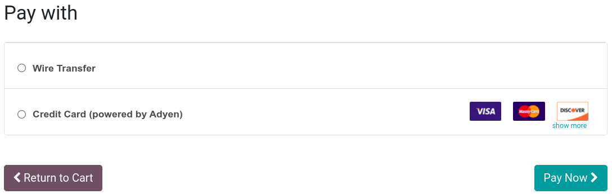
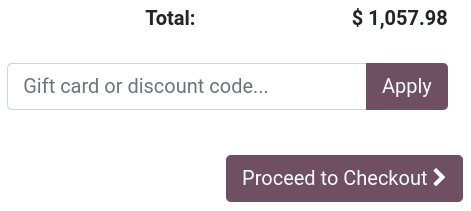

# Payment providers

Odoo supports a multitude of online
`payment providers </applications/finance/payment_providers>` for your
website, allowing your customers to pay with their preferred payment
methods.

\- `/applications/sales/sales/products_prices/ewallets_giftcards` -
`../checkout_payment_shipping/checkout`

## Configuration

To set up payment providers on the eCommerce app, go to
`Website --> Configuration
--> Payment Providers`. From here, `Activate` the payment providers you
wish to have available on your shop, and configure them according to
your needs.

Alternatively, you can access **payment providers** via
`Website --> Configuration
--> Settings`. In the `Shop - Payment` section, you can
`Configure SEPA Direct
Debit` if you wish to use it, as well as `View other providers`. If you
use the `Authorize.net` payment provider, the
`Payment Capture Method <payment_providers/manual_capture>` can be
configured in that same menu.

If you are using `/applications/finance/payment_providers/paypal`, you
can also enable and configure it here.

### Checkout payment options

Once activated, customers can choose the payment provider of their
choice during the **checkout process**, at the `Confirm Order` step.

## eWallets and gift cards

When checking out, customers can pay with an eWallet or gift cards. To
enable these, go to `Website --> Configuration --> Settings`, and in the
`Shop-Products` section, enable `Discounts, Loyalty & Gift Card`.

Once enabled, customers can enter their gift card **code** or pay with
their eWallet at the checkout step.

`/applications/sales/sales/products_prices/ewallets_giftcards`

