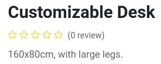
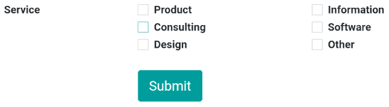
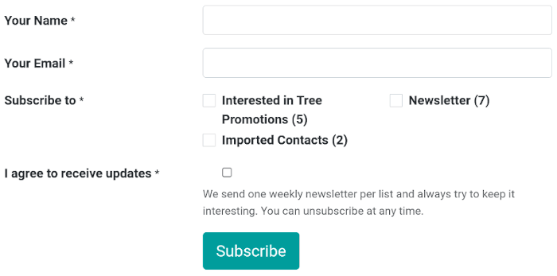

# Customer interaction

Konvergo ERP offers many ways to interact with customers and for customers to
interact with your website.

## Product reviews

Customers can give a rating to your products. This is a great way to
promote your products or services since reviews can influence purchase
processes. To activate the **rating** feature, from your **shop page**,
select a product, go to `Edit --> Customize` and enable `Rating`.

> [!NOTE]
> Only portal users which purchased the product or service can leave
> ratings.

> [!TIP]
> Customer reviews can be hidden by clicking the `Visible` button next
> to a published review.

## Live chat

A chatbot is available and can simulate a human-like conversation with
website visitors via text messages in a chat box.

\- `../../livechat` - `../../livechat/ratings` -
`../../livechat/responses`

## Contact forms

### Helpdesk

Customers may need support after purchasing a product or subscribing to
a service. It is possible to create a **contact form**, which, when
fulfilled, automatically creates a new ticket for your **support team**.

To add a contact form, **create** a new page (`+ New --> Page`) if
necessary, and drag and drop a `Form` block from the `Dynamic Content`
section onto the page. Once placed, click on the form (while in `Edit`
mode), and in the `Action` field, select `Create a Ticket`. You can then
select to which `Helpdesk team` the ticket should be assigned.

### Contact us

A 'Contact Us' page makes it easier for customers and prospects to
contact your company and get in touch.

To have a 'Contact Us' page, create a new page (`+ New --> Page`) if
necessary, and click on `Edit --> Customize`. Then, drag and drop a
`Form` block onto the page. Select the form and define the action to be
performed when submitted in the `Action` field.

When clicking on a field, or when adding a new field (`+ Field`), you
can select its `Type`. This enables different options, such as
`Multiple Checkboxes`, which customers can use to indicate the services
they are interested in, for example.

## Newsletter

Customers can get updates on your eCommerce activities by subscribing to
a newsletter. Visitors subscribing to the newsletter are automatically
added to the mailing list of the **Email Marketing** application. You
can either choose a newsletter **block**, a newsletter **popup**, or
both.

- **Popup**: prompts up a newsletter box when visitors scroll down the
  page;
- **Block**: displays a field on the page where customers can sign up by
  entering their email.

The newsletter **block** can be configured according to different
`Templates`. To do so, click the **block** while in
`Edit --> Customize`, and select a `Template` in the `Newsletter Block`
section. There are **three** templates available:

- `Email Subscription`: visitors can sign up by email to the newsletter,
  without any choice to the content. The content is defined in
  `Edit --> Customize` in the `Newsletter` field;
- `SMS Subscription`: is the same as `Email Subscription`, but by SMS;
- `Form Subscription`: allows adding several fields, as well as a
  checkbox for the visitor to agree to the **GDPR policy** of your
  website.

> [!TIP]
> Alternatively, you can select `Subscribe to Newsletter` as `Action`
> when creating a `contact form <contact-form>`, allowing for the same
> level of customization. Make sure to add a checkbox stating visitors
> agree to be added to the mailing list.
