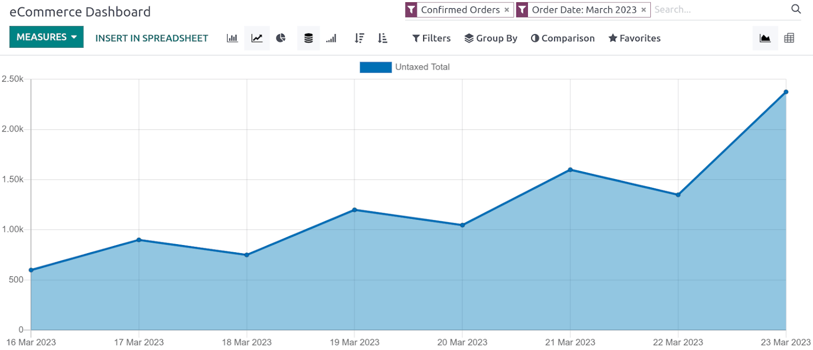

# Performance monitoring

Odoo integrates a variety of tools to analyze and improve the
performance of your eCommerce website.

## Data monitoring

**Website** allows monitoring and analysis of the sales performance of
your eCommerce. To access the **reporting view**, go to
`Website --> Reporting --> eCommerce`. This dashboard helps you monitor
everything related to sales, such as sales performance per product,
category, day, etc.

By clicking `Measures`, you can select the type of measurement used,
such as:

- `Margin`;
- `Qty Invoiced`;
- `Untaxed Total`;
- `Volume`;
- ...

Other options include **multiple views (Pivot, etc.), comparison** by
periods or years, and directly `insert in spreadsheet`, etc.

## Analytics

It is possible to link your Odoo website with `analytics/plausible` and
`analytics/google-analytics`.
