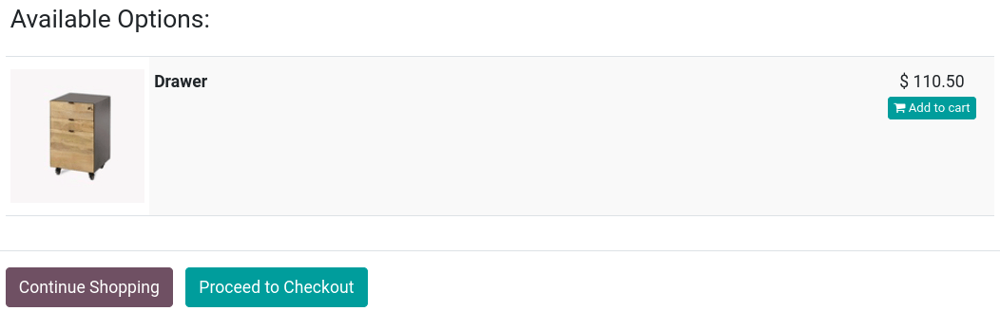
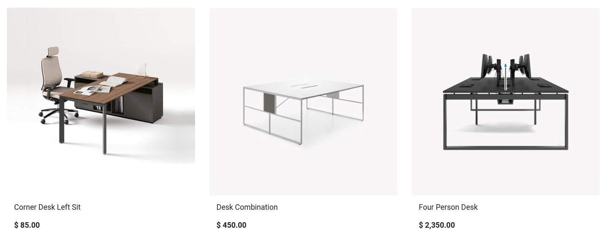

# Cross-selling and upselling

Any sales process is an opportunity to maximize revenues.
**Cross-selling and upselling** are sales techniques consisting in
selling customers additional or more expensive products and services
than what they were originally shopping for. It is a great way to
maximize the value of each one of your customers.

**Cross-selling** can be done via **two** features:

- `Optional products <cross_upselling/optional>` upon **adding to
  cart**;
- `Accessory products <cross_upselling/accessory>` on the **checkout
  page**.

**Upselling** is only done via
`alternative products <cross_upselling/alternative>` on the **product
page**.

`catalog`

## Cross-selling

### Optional products

**Optional products** are suggested when customers click `Add to cart`,
either from the **product page** or **catalog page**. Upon clicking, a
pop-up window opens with the **optional products** displayed in the
`Available Options` section.

To enable **optional products** go to
`Website --> eCommerce --> Products`, select a product, go to the
`Sales` tab, and enter the products you wish to feature in the
`Optional Products` field. Optional products are **linked** to the
product(s) they are set up with on the **product template**. They only
appear when that product is added to the cart.

> [!TIP]
> You can also access the `Sales` tab of the **product template** by
> selecting a product on your **main shop page** and clicking `Product`
> in the top-right corner.

### Accessory products

**Accessory products** are displayed in the `Suggested Accessories`
section before processing to checkout at the `Review Order` step.

To enable **accessory products**, go to
`Website --> eCommerce --> Products`, select a product, go to the
`Sales` tab, and enter the products you wish to feature in the
`Accessory Products` field. Suggested accessory products are **linked**
to the product(s) they are set up with on the **product template**. They
only appear when that product is at the checkout process review.

## Upselling

### Alternative products

**Alternative products** are suggested on the **product page** and
usually incentivize customers to buy a more expensive variant or product
than the one they were initially shopping for.

To enable **alternative products**, go to
`Website --> eCommerce --> Products`, select a product, go to the
`Sales` tab, and enter the products you wish to feature in the
`Alternative Products` field. Then, go to the related **product page**
by clicking `Go To Website`, and click `Edit`. Stay on the `Blocks` tab,
and scroll down to the `Dynamic Content` section. Then, drag and drop
the `Products` building block anywhere on the **product page**.

When placed, in `Edit` mode, click the **block** to access various
settings for that `Products` building block. In the `Filter` field,
select `Alternative
Products`. You can configure several additional settings, such as how
many elements are displayed (`Fetched Elements`), the `Template` used,
etc.
