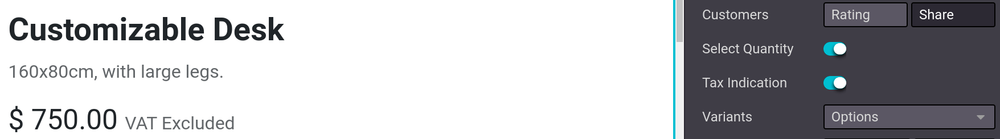
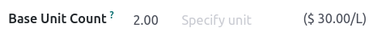
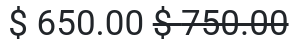

# Price management

Konvergo ERP offers multiple options to select the price displayed on your
website, as well as condition-specific prices based on set criteria.

## Taxes

### Tax configuration

To add a tax on a product, you can either set a tax in the
`Customer Taxes` field of the **product template** or use
`fiscal positions </applications/finance/accounting/taxes/fiscal_positions>`.

\- `/applications/finance/accounting/taxes` -
`/applications/finance/accounting/taxes/avatax` -
`/applications/finance/accounting/taxes/taxcloud` -
`/applications/finance/accounting/taxes/fiscal_positions`

### Tax display

Choosing the displayed price tax usually depends on a country's
regulations or the type of customers **(B2B vs. B2C)**. To select the
type of price displayed, go to `Website -->
Configuration --> Settings`, scroll down to the `Shop - Products`
category, and select `Tax Excluded` or `Tax Included`.

- `Tax Excluded`: the price displayed on the website is
  **tax-excluded**, and the tax is computed at the cart-review step;
- `Tax Included`: the price displayed on the website is
  **tax-included**.

> [!NOTE]
> This setting is **global**, and the tax-display type is the same for
> (all of) your website(s). It is, therefore, not possible to select
> different tax displays for different websites. This may be a
> significant point of consideration when implementing a database with
> multiple ecommerce websites aimed at varying customer types (i.e., B2B
> and B2C).

You can choose to display the type of pricing next to the product price
by going to `Website --> Site --> Homepage --> Shop`, selecting a
product, and then `Edit --> Customize tab` and enabling
`Tax Indication`.

`/applications/finance/accounting/taxes/B2B_B2C`

## Price per unit

It is possible to display a `price per unit
</applications/inventory_and_mrp/inventory/product_management/product_replenishment/uom>`
on the product page. To do that, go to
`Website --> Configuration --> Settings` and enable
`Product Reference Price` under the `Shop - Products` section. When
enabled, ensure an amount is set in the `Base Unit Count` field of the
**product template**, and in the `Sales Price`.

The price per unit of measure can be found above the `Add to Cart`
button on the product page.

> [!NOTE]
> Pay attention that having the price per unit may be **mandatory** in
> some countries.

`/applications/inventory_and_mrp/inventory/product_management/product_replenishment/uom`

### Price configuration: pricelists

Pricelists are the primary tool to manage prices on your eCommerce. They
allow you to define website-specific prices - different from the price
on the product template - based on the **country group**, **currency**,
**minimum quantity**, **period**, or **variant**. You can create as many
pricelists as needed, but it is mandatory to have at least one pricelist
configured per website. If no custom pricelists are added, Konvergo ERP defaults
to the **Public Pricelist** for all websites.

`/applications/sales/sales/products_prices/prices/pricing`

#### Configuration

Pricelists can be found under `Website --> eCommerce --> Pricelists`,
but must first be activated. For that, head to
`Website --> Configuration --> Settings` and scroll down to the
`Shop - Products` section. There, you can find two options:

- `Multiple prices per product`;
- `Advanced price rules (discounts, formulas)`.

The **first** option allows you to set different prices per customer
*segment*, i.e., registered customers, gold customers, regular
customers, etc. The **second** option allows you to set *price change*
rules such as **discounts**, **margins**, **roundings**, etc.

#### Foreign currency

If you are selling in **multiple currencies** and have pricelists in
foreign currencies, customers can select their corresponding pricelist
anywhere on the `Shop` page from the drop-down menu next to the **search
bar**.

\- `/applications/sales/sales/products_prices/prices/pricing` -
`/applications/sales/sales/products_prices/prices/currencies`

### Permanent discount

If you have permanently reduced the price of a product, a popular means
to attract customers is the **strikethrough** strategy. The strategy
consists in displaying the previous price crossed out and the **new
discounted price** next to it.

To display a 'striked' price, enable the `Comparison Price` option under
`Website --> Configuration --> Settings --> Shop - Products category`.
Then, head to the product's template
(`Website --> eCommerce --> Products`), and in the `Compare to Price`
field, enter the **new** price.
