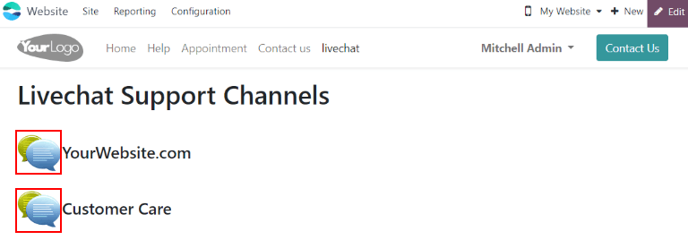
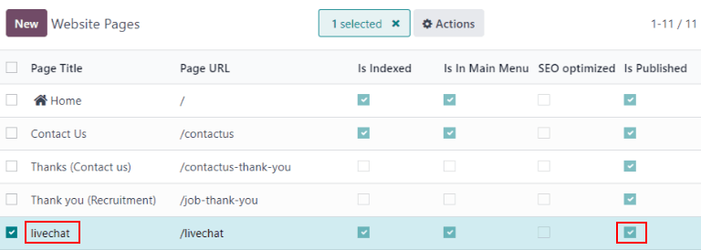

# Ratings

At the end of a *Live Chat* conversation, customers have the opportunity
to rate the quality of support they received from the live chat
*operator*. Customers provide ratings as soon as they close the
conversation. This allows operators to receive immediate feedback on
their performance. It also allows customers the chance to share any
final comments before leaving the chat window.

## Rate live chat conversations

Customers end a *live chat* conversation by clicking the `X` in the
upper right-hand corner of the chat window. They are then prompted to
select an icon that reflects their level of satisfaction. The icons
represent the following ratings:

> - **Satisfied** - *green smiling face*
> - **Okay** - *yellow neutral face*
> - **Dissatisfied** - *red frowning face*

> [!NOTE]
> When customers end a conversation, a field marked
> `Receive a copy of this conversation` appears under the *ratings*
> icons. Customers can enter their email either before or after they
> submit a rating.

If the customer selects `Satisfied (smile)` icon, they are presented
with a thank you message and a `Close Conversation` link.

If the customer selects either `Okay (neutral)` icon or
`Dissatisfied (frown)` icon, a text box will appear. Customers can add
comments in this text box to explain why they chose this rating. This
message will be sent to the live chat operator, along with the rating
icon.

## Publish customer ratings

To publish a channel's ratings on the website, first navigate to a live
chat channel's record by going to the `Live Chat` app and clicking on
the kanban card for that team. Then click on the `Go to Website` smart
button. This will open the `Live Chat Channel
Statistics` page.

In the upper right corner of the page, click the red `Unpublished`
slider. The slider changes from `Unpublished` to `Published`.

> [!NOTE]
> The customer notes that are submitted with the rating will *not* be
> published on the website. These are kept internal. Only a statistical
> overview of the operators' performance for the *channel* appears on
> the website.

### Add ratings page to site

Once the rating page has been published, it has to be manually added to
the website. To do this, go to the main Konvergo ERP dashboard and open the
*Website* application. `Website app--> Site
--> Content --> Pages`, then click `New`.

This will open a `New Page` pop-up window. In the `Page Title` field,
enter livechat. This acts as the URL for
the published webpage.

> [!IMPORTANT]
> The URL *must* be named livechat in
> order for the database to recognize and connect the ratings page.
> After the page has been published, the page title can be changed later
> under the `Menu Editor`.

Click `Create`, and the newly created webpage will open. The
`Webpage Editor` appears in the right panel.

The page lists the names of the `Live Chat Channels` whose ratings pages
have been published. On the left side of the channel name is a speech
bubble icon, which users can click on to go to the ratings' page for the
respective channel.

Make any desired changes or additions to this page, then click `Save` in
the top right of the webpage editor. The website editor side panel
closes, and the webpage remains on the screen.

To publish the livechat webpage, return
to the list of webpages by navigating to `Site --> Content --> Pages`.
Click the checkbox to the left of
livechat in the list of pages to select
the page and highlight the line. Then, click the checkbox under the
column labeled `Is Published`. The field with the checkbox is
highlighted in white. Click the checkbox a second time to activate the
`Is Published` box. The webpage is now published.

Once the page has been added to the site, ratings are set to be
published by default. However, individual ratings can be manually
selected to be hidden from the public. The rating will still be included
in internal reports, and can still be viewed by internal teams. However,
public website visitors and portal users will not have access.

See `Hide individual ratings <livechat/overview/hide-ratings>` for more
information.

## Customer ratings report

The `Customer Ratings` report
(`Live Chat --> Report --> Customer Ratings`) displays an overview of
the ratings received on individual support tickets, as well as any
additional comments submitted with the rating.

The report defaults to a kanban view, with each rating represented by a
different card. To switch to a different view, click on one of the icons
in the upper-right corner of the screen. The report is available in
*list* view, *pivot* view, and *graph* view.

Click on an individual rating to see additional details about the
conversation, and the rating.

### Hide individual ratings

Ratings are set to be published by default. However, individual ratings
can be manually selected to be hidden from the public. The rating will
still be included in internal reports, and can still be viewed by
internal teams. However, public website visitors and portal users will
not have access.

To hide a rating, go to
`Live Chat app --> Reports --> Customer Ratings`. Click on the kanban
card for the rating to be hidden. On the individual rating's detail
page, check the box labeled `Visible Internally Only`.

\- `/applications/websites/livechat` - `responses` -
`/applications/websites/website`

