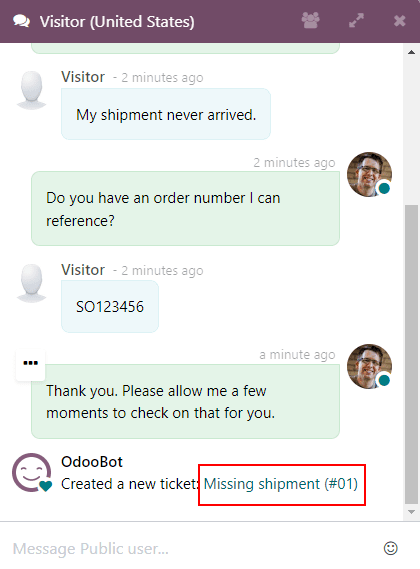

# Commands and canned responses

In the Konvergo ERP *Live Chat* application, *commands* allow the user to
perform specific actions both inside the chat window, and through other
Konvergo ERP applications. The *Live Chat* app also includes *canned responses*.
These are customized, pre-configured substitutions that allow users to
replace shortcut entries in place of longer, well-thought out responses
to some of the most common questions and comments.

Both commands and canned responses save time, and allow users to
maintain a level of consistency throughout their conversations.

## Execute a command

Live chat *commands* are keywords that trigger pre-configured actions.
When a live chat *operator* is participating in a conversation with a
customer or website visitor, they can execute a command by typing
/, followed by the command.

Commands, and the resulting actions, are only visible in the
conversation window for the live chat operator. A customer will not see
any commands that an operator uses in a conversation from their view of
the chat.

More information about each available command can be found below.

### Help

If an operator types /help in the chat
window, an informative message that includes the potential entry types
an operator can make is displayed.

- Type @username to mention a user in the
  conversation. A notification will be sent to that user's inbox or
  email, depending on their notification settings.
- Type \#channel to mention a *Discuss*
  channel.
- Type /command to execute a command.
- Type :shortcut to insert a
  `canned response <live-chat/canned-responses>`.

\- `/applications/productivity/discuss` -
`/applications/productivity/discuss/team_communication`

### Helpdesk & Helpdesk search

The /helpdesk and
/helpdesk_search commands allow operators
to both create helpdesk tickets directly from a conversation, and search
through existing tickets by keyword or ticket number.

> [!IMPORTANT]
> The /helpdesk and
> /helpdesk_search commands can only be
> used if the *Helpdesk* app has been installed, and *Live Chat* has
> been activated on a *Helpdesk* team. To activate `Live
> Chat`, go to `Helpdesk application --> Configuration --> Teams`, and
> select a team. Scroll to the `Channels` section and check the box
> labeled `Live Chat`.

#### Create a ticket from a live chat

If an operator types /helpdesk in the
chat window, the conversation is used to create a *Helpdesk* ticket.

> [!IMPORTANT]
> In version 16.3, the command to create a new ticket is
> /ticket. This only applies to databases
> running version 16.3.

After entering the /helpdesk command,
type a title for the ticket into the chat window, then press
Enter.

The newly created ticket will be added to the *Helpdesk* team that has
live chat enabled. If more than one team has live chat enabled, the
ticket will automatically be assigned based on the team's priority.

The transcript from the conversation will be added to the new ticket,
under the `Description` tab.

To access the new ticket, click on the link in the chat window, or go to
the `Helpdesk app` and click the `Tickets` button on the kanban card for
the appropriate team.

#### Search for a ticket from a live chat

If an operator types /helpdesk_search in
the chat window, they can search through *Helpdesk* tickets by ticket
number or keyword.

> [!IMPORTANT]
> In version 16.3, the command to search through *Helpdesk* tickets is
> /search_tickets. This only applies to
> databases running version 16.3.

After entering the /helpdesk_search
command, type a keyword or ticket number, then press
Enter. If one or more related tickets are
found, a list of links will be generated in the conversation window.

> [!NOTE]
> Results from the search command will only be seen by the operator, not
> the customer.

### History

If an operator types /history in the chat
window, it will generate a list of the most recent pages the visitor has
viewed on the website (up to 15).

### Lead

By typing /lead in the chat window, an
operator can create a *lead* in the *CRM* application.

> [!IMPORTANT]
> The /lead command can only be used if
> the *CRM* app has been installed.

After typing /lead, create a title for
this new lead, then press Enter. A link
with the lead title appears. Click the link, or navigate to the `CRM`
app to view the `Pipeline`.

> [!NOTE]
> The link to the new lead can only be seen and accessed by the
> operator, not the customer.

The transcript of that specific live chat conversation (where the lead
was created) is added to the `Internal Notes` tab of the lead form.

On the `Extra Information` tab of the lead form, the `Source` will be
listed as `Livechat`.

### Leave

If an operator types /leave in the chat
window, they can automatically exit the conversation. This command does
not cause the customer to be removed from the conversation, nor does it
automatically end the conversation.

\- `/applications/sales/crm/acquire_leads` -
`/applications/services/helpdesk/overview/getting_started`

## Canned responses

*Canned responses* are customizable inputs where a *shortcut* stands in
for a longer response. An operator will enter the shortcut, and it will
automatically be replaced by the expanded *substitution* response in the
conversation.

### Create canned responses

To create a new canned response, go to
`Live Chat app --> Configuration --> Canned
Responses --> New`.

From here, type the shortcut command into the `Shortcut` field.

Then, click into the `Substitution` field, and enter the custom message
that will be sent to visitors in place of the shortcut. Click `Save`.

> [!TIP]
> Try to connect the shortcut to the topic of the substitution. The
> easier it is for the operators to remember, the easier it will be to
> use the canned responses in conversations.

### Use canned responses in a live chat conversation

To use a canned response during a live chat conversation, type a colon
(:) into the chat window, followed by the
shortcut.

An operator is chatting with a visitor. As soon as they type
: they would see a list of available
responses. They can manually select one from the list, or continue to
type. If they want to use the canned response 'I
am sorry to hear that.', they would type
:sorry.

> [!TIP]
> Typing : into a chat window on its own
> will generate a list of available canned responses. Responses can be
> manually selected from the list, in addition to the use of shortcuts.
>
>  alt="View of a chat window and the list of available canned responses." />
