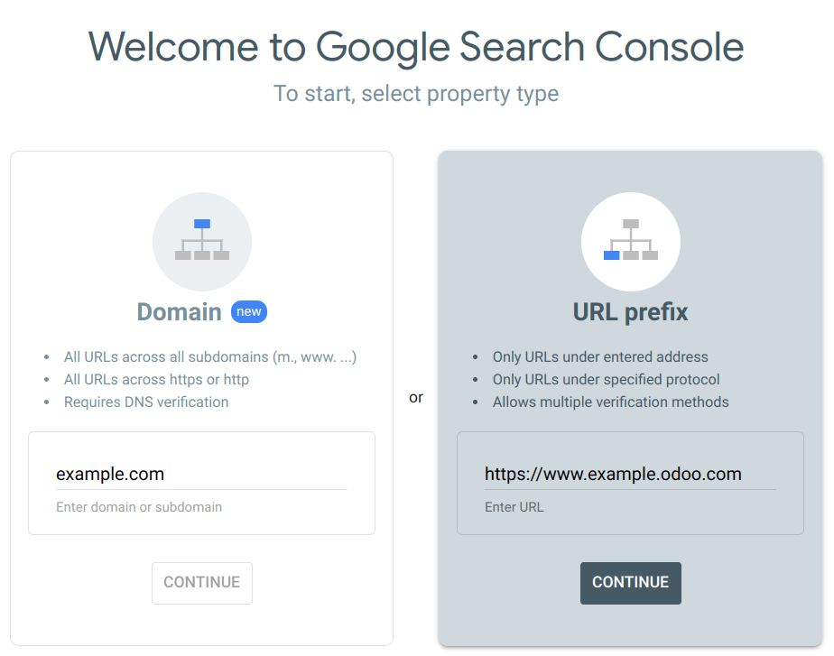
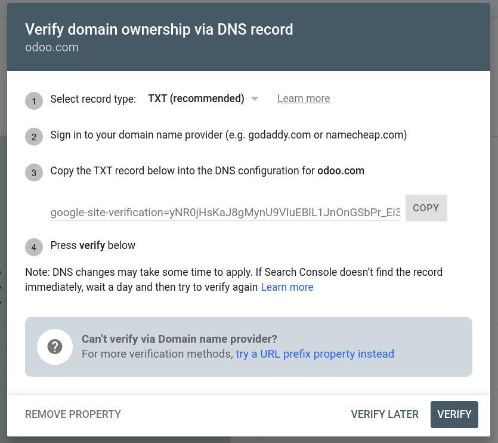
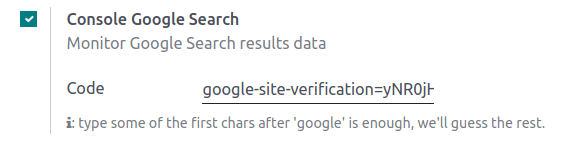

# Google Search Console

Google Search Console is a free web service provided by Google that
allows website owners to monitor, maintain, and troubleshoot their
site's presence in Google Search results. It offers valuable insights
into how Google views and interacts with your site, helping you optimize
its performance.

To enable GSC, go to [Google Search
Console](https://search.google.com/search-console/welcome), enter your
domain or URL prefix, follow the instructions, and copy the code from
Google.

Then, access your Odoo database, go to
`Website --> Configuration --> Settings`, and enable
`Google Search Console` in the `SEO` section. Paste the code in the
dedicated field.

> [!IMPORTANT]
> To prevent Google from indexing both your custom domain name
> www.example.com and your original Odoo
> database URL www.example.odoo.com,
> `map your domain name with your Odoo website
> <domain-name/website-map>`.

`domain_names`

