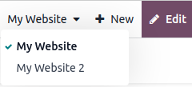

# Multiple websites

Odoo allows you to create multiple websites from the same database. This
can be useful, for example, if you have multiple brands operating under
your organization, or to create separate websites for different
products/services, or different audiences. In these cases, having
different websites can help avoid confusion and make it easier to tailor
your digital outreach strategies and reach your target audience.

Each website can be designed and configured independently with its own
`domain name
<domain_names>`, theme, pages, menus, `languages <translate>`,
`products <../../ecommerce/managing_products/products>`, assigned sales
team, etc. They can also `share content and pages
<multi-website/website_content>`.

> [!TIP]
> Duplicate content (i.e., pages and content shared between multiple
> websites) can have a negative impact on `../pages/seo`.

## Website creation

To create a new website, proceed as follows:

1.  Go to `Website --> Configuration --> Settings`.

2.  Click `+ New Website`.

    

3.  Specify the `Website Name` and `Website domain`. Each website must
    be published under its own `domain <domain_names>`.

4.  Adapt the `Company name`, `Languages` and `Default language` if
    needed.

5.  Click the `Create` button.

You can then start building your new website.

> [!NOTE]
> By default, all website-related apps that you have installed (e.g.
> **eCommerce**, **Forum**, **Blog**, etc.) and their related website
> pages are also available on the new website. You can remove them by
> amending the website's menu.

## Switching websites

To switch from one website to another, click the menu next to the `+New`
button in the top right corner and select the website you want to switch
to.

> [!NOTE]
> When you switch websites, you are redirected to the other website, to
> the same page (URL) as the current one. If the page you are currently
> viewing does not exist on the other website, you are redirected to a
> 404 error page. Once redirected, click `Create page` to create the
> page.
>
> 

## Website-specific configuration

Most website settings are website-specific, which means they can be
enabled/disabled per website. To adapt the settings for a website, go to
`Website --> Configuration --> Settings`. Select the desired website in
the field `Settings of Website` at the top of the `Settings` page, in
the **yellow** banner. Then, adapt the options for that specific
website.

> [!NOTE]
> - Websites are created with the default settings; the settings are not
> copied from one website to the other. - In a
> `multi-company environment </applications/general/companies>`, each
> website can be linked to a specific company in your database so that
> only company-related data (e.g., products, jobs, events, etc.) is
> displayed on the website. To display company-specific data, set the
> desired company in the `Company` field.

### Content availability

By default, pages, products, events, etc. created from the frontend
(using the `+New` button) are only available on the website from which
it was created. Records created from the backend, however, are made
available on all websites by default. The content's availability can be
changed in the backend, in the `Website` field. For example, for
products, go to `eCommerce --> Products`, then select the product and go
to the `Sales` tab. For forums, go to `Configuration --> Forums`, then
select the forum.

Records and features can be made available:

- On all websites: leave the `Website` field empty;
- Only on one website: set the `Website` field accordingly;
- On some websites: in this case, you should duplicate the item and set
  the `Website` field.

#### Website pages

To modify the website on which a page is to be published, proceed as
follows:

1.  Go to `Website --> Site --> Pages`.

2.  Select the website on which the page is currently published.

    

3.  Tick the check box next to the page(s) you want to change.

4.  Click the `Website` field and select the website, or empty it to
    publish the page on all websites.

> [!NOTE]
> Each website must have its own homepage; you may not use the same
> homepage for several websites.

## eCommerce features

eCommerce features such as products, eCommerce categories, pricelists,
discounts, payment providers, etc. can be restricted to
`a specific website <website_field>`.

### Customer accounts

You can `allow your customers to use the same account
<../../ecommerce/ecommerce_management/customer_accounts>` on all of your
websites by enabling the `Shared Customer Accounts` check box in the
website settings.

### Pricing

Products can be priced differently based on the website using
`pricelists
<ecommerce/pricelists>`. The following configuration is required:

1.  Go to `Website --> Configuration --> Settings`.
2.  Scroll down to the `Shop - Products` section and select the
    `Pricelists` option `Multiple prices per product`.
3.  Click `Pricelists` to define new pricelists or edit existing ones.
4.  Select the pricelist or click `New` to create a new one, then select
    the `Configuration` tab and set the `Website` field.

## Reporting

### Analytics

Each website has its own `analytics <analytics/plausible>`. To switch
between websites, click the buttons in the upper right corner.

### Other reporting data

Other reporting data such as eCommerce dashboard data, online sales
analyses and visitors can be grouped by website if necessary. Click
`Group by --> Website`.
