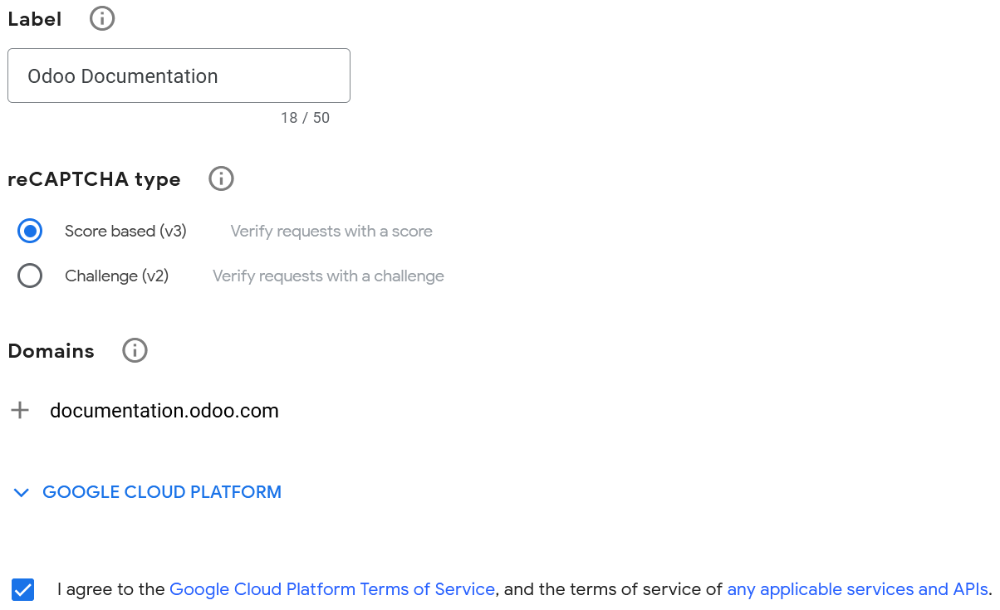

# reCAPTCHA v3 on forms

Google's reCAPTCHA protects website forms against spam and abuse. It
attempts to distinguish between human and bot submissions.

> [!WARNING]
> reCAPTCHA v3 may not be compliant with local data protection
> regulations.

> [!NOTE]
> reCAPTCHA v3 works in the background and does not interrupt visitors.
> However, if the check fails, visitors cannot submit the form.

[Google's reCAPTCHA v3
guide](https://developers.google.com/recaptcha/docs/v3)

## Configuration

### On Google

Open [the reCAPTCHA website registration
page](https://www.google.com/recaptcha/admin/create). Log in or create a
Google account if necessary.

On the website registration page:

- Give the website a `Label`.
- Leave the `reCAPTCHA type` on `Score based (v3)`.
- Enter one or more `Domains` (e.g., *example.com* or
  *subdomain.example.com*).
- Under `Google Cloud Platform`, a project is automatically selected if
  one was already created with the logged-in Google account. If not, one
  is automatically created. Click `Google Cloud Platform` to select a
  project yourself or rename the automatically created project.
- Agree to the terms of service.
- Click `Submit`.

A new page with the generated keys is then displayed. Leave it open for
convenience, as copying the keys to Konvergo ERP is required next.

### On Konvergo ERP

- From the database dashboard, click `Settings`. Under `Integrations`,
  enable `reCAPTCHA` if needed.

  > [!WARNING]
  > Do not disable the `reCAPTCHA` feature or uninstall the
  > `Google reCAPTCHA
  > integration` module, as many other modules would also be removed.

- Open the Google reCAPTCHA page, copy the `Site key`, and paste it into
  the `Site Key` field in Konvergo ERP.

- Open the Google reCAPTCHA page, copy the `Secret key`, and paste it
  into the `Secret Key` field in Konvergo ERP.

- Change the default `Minimum score`
  (0.5) if necessary, using a value
  between 1.0 and
  0.0. The higher the threshold is, the
  more difficult it is to pass the reCAPTCHA, and vice versa.

- Click `Save`.

All pages using the `Form`, `Newsletter Block`, `Newsletter Popup`
snippets, and the eCommerce `Extra Step During Checkout` form are now
protected by reCAPTCHA.

> [!NOTE]
> - If the reCAPTCHA check fails, the following error message is
> displayed:
>
> 
>
> - reCAPTCHA v3 is free for up to [1 million assessments per
>   month](https://developers.google.com/recaptcha/docs/faq#are-there-any-qps-or-daily-limits-on-my-use-of-recaptcha).

> [!TIP]
> - Analytics and additional settings are available on [Google's
> reCAPTCHA administration
> page](https://www.google.com/recaptcha/admin/). For example, you can
> receive email alerts if Google detects suspicious traffic on your
> website or view the percentage of suspicious requests, which could
> help you determine the right minimum score.
>
> - You can notify visitors that reCAPTCHA protects a form. To do so,
>   open the website editor and navigate to the form. Then, click
>   somewhere on the form, and on the right sidebar's `Customize` tab,
>   toggle `Show reCAPTCHA Policy` found under the `Form` section.
>
> 
