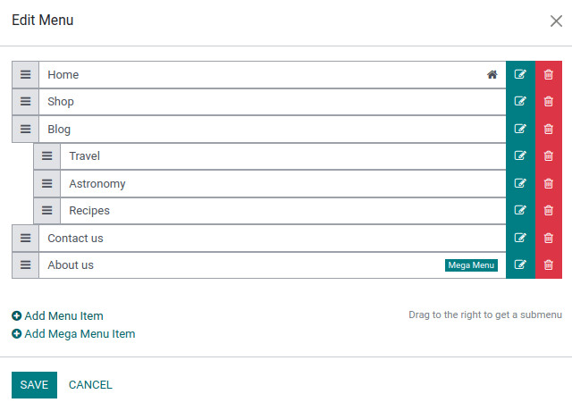

# Menus

Menus are used to organize your website’s content and help visitors
navigate through your web pages effectively. User-friendly and
well-structured website menus also play a crucial role in improving
`search engine rankings <seo>`.

Odoo allows you to customize the content and appearance of your
website's menu to your needs.

## Menu editor

The menu editor allows you to edit your website's menu and add
`regular menu items
<website/regular-menus>` and `mega menus <website/mega-menus>`.

To edit your website's menu, go to `Website --> Site --> Menu Editor`.
From there, you can:

- **rename** a menu item or change its URL using the `Edit Menu Item`
  icon;
- **delete** a menu item using the `Delete Menu Item` icon;
- **move** a menu item by dragging and dropping it to the desired place
  in the menu;
- **create a regular drop-down menu** by dragging and dropping the
  sub-menu items to the right, underneath their parent menu.

> [!NOTE]
> You can also access the menu editor by clicking `Edit`, selecting any
> menu item and clicking the `Edit Menu` icon.
>
> 

### Adding regular menu items

By default, pages are added to the menu as regular menu items when
`they are created
<../pages>`. You can also add regular menu items from the menu editor by
clicking `Add
Menu Item`. Enter the `Name` and URL of the related page in the pop-up
window that appears on the screen and click `OK`.

> [!TIP]
> In the `URL or Email` field, you can type
> / to search for a page on your website
> or \# to search for an existing custom
> anchor.

### Adding mega menus

Mega menus are similar to drop-down menus, but instead of a simple list
of sub-menus, they display a panel divided into groups of navigation
options. This makes them suitable for websites with large amounts of
content, as they can help include all of your web pages in the menu
while still making all menu items visible at once. Mega menus can also
be structured more visually than regular drop-down menus, for example,
through layout, typography, and icons.

To create a mega menu, go to `Website --> Site --> Menu Editor` and
click `Add Mega Menu Item`. Enter the `Name` of the mega menu in the
pop-up, click `OK`, then `Save`.

To adapt the options and layout of the mega menu, click it in the
navigation bar, then click `Edit`. Mega menus are composed of building
blocks, which means you can customize each component individually using
inline formatting, as well as the options available in the `Customize`
tab in the website builder. For example, you can:

- edit the text directly in the building block;

- edit a menu item's URL by selecting the menu item, then clicking the
  `Edit link` button in the small preview pop-up. Type
  / to search for a page on your website,
  or \# to search for an existing custom
  anchor.

  

- move a menu item by dragging and dropping the related block to the
  desired position in the mega menu;

- delete a menu item by deleting the related block.

> [!TIP]
> You can adapt the general layout of the mega menu by selecting the
> desired `Template` and `Size` in the `Mega menu` section in the
> `Customize` tab in the website builder.

## Header and navigation bar appearance

To customize the appearance of your website's menu, click `Edit`, then
select the navigation bar or any menu item. You can then adapt the
fields in the `Header` and `Navbar` sections in the `Customize` tab in
the website builder.
