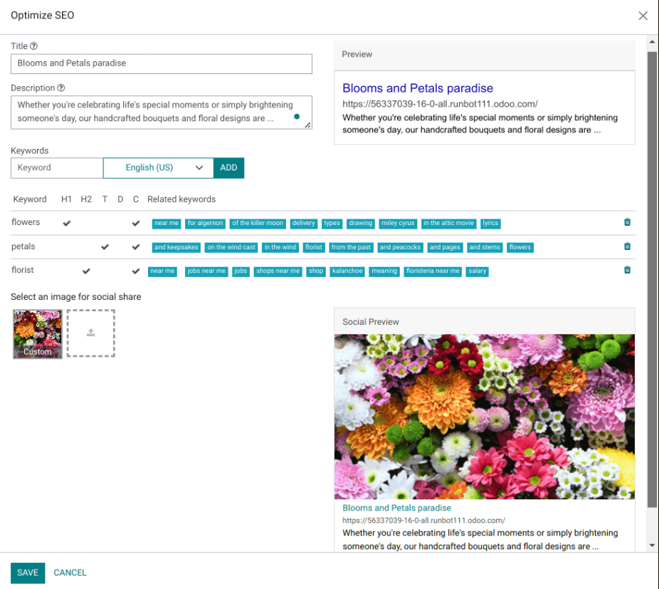
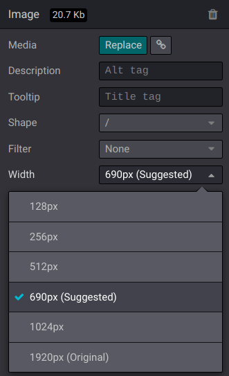
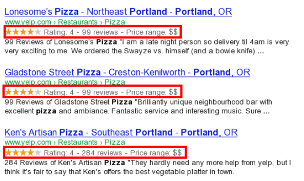

# Search Engine Optimization (SEO)

Search Engine Optimization, often abbreviated as SEO, is a digital
marketing strategy to improve a website's visibility and ranking in
search engine results (e.g., in Google). It involves optimizing various
elements on your website, including its content, social sharing, URLs,
images, and page speed.

> [!NOTE]
> - Konvergo ERP provides several modules to help you build your website
> content, such as `eCommerce <../../ecommerce>`, `Blog <../../blog>`,
> `eLearning
> <../../elearning>`, and `Forum <../../forum>`. - All Konvergo ERP themes rely
> on the CSS Framework [Bootstrap](https://getbootstrap.com/) to render
> efficiently according to the device: desktop, tablet, or mobile, which
> positively impacts ranking in search engines.

## Content optimization

To optimize a webpage's SEO, access the page, then go to
`Website --> Site -->
Optimize SEO`.

### Meta tags

Meta tags are HTML elements that provide information about a webpage to
search engines and website visitors. They play a crucial role in SEO by
helping search engines understand the content and context of a webpage
and attract visitors with appealing content. There are two types of meta
tags in Konvergo ERP:

- `Title` tags specify a webpage's title and are displayed as a
  clickable link in search engine results. They should be concise,
  descriptive, and relevant to the page's content. You can update the
  title tag of your webpage or keep it empty to use the default value
  based on the page’s content.
- `Description` tags summarize the webpage's content, often displayed in
  search engine results below the title. They are used to encourage the
  user to visit the page. You can update the description tag of your
  webpage or keep it empty to use the default value based on the page’s
  content.

> [!NOTE]
> The `Preview` card displays how the title and description tags should
> appear in search results. It also includes the URL of your page.

### Keywords

Keywords are one of the main elements of SEO. A website that is well
optimized for search engines speaks the same language as potential
visitors, with keywords for SEO helping them to connect to your site.

You can enter the keywords you consider essential in the `Keyword` field
and click `ADD` to see how they are used at different levels in your
content (H1, H2, page title, page description, page content) and the
related searches in Google. The tool also suggests relevant keywords to
drive your web traffic. The more keywords are present on your webpage,
the better.

> [!TIP]
> It is strongly recommended to only use one H1 title per page for SEO.

### Image for social share

When you share your page on social media, your logo image is selected,
but you can upload any other image by clicking the upward arrow.

> [!NOTE]
> - The `Social Preview` card displays how the page's information would
> appear when shared. - If you change the title of a blog post or the
> name of a product, the changes apply automatically everywhere on your
> website. The old link still functions when external websites use a
> `301 redirect <website/URL-redirection>`, maintaining the SEO link
> juice.

## Images

The size of images has a significant impact on page speed, which is an
essential criterion for search engines to optimize SEO ranking.

> [!TIP]
> Compare how your website ranks using [Google Page
> Speed](https://pagespeed.web.dev/?utm_source=psi&utm_medium=redirect)
> or [Pingdom Website Speed Test](https://tools.pingdom.com/).

Konvergo ERP automatically compresses uploaded images to reduce their weight and
improve the page loading speed. All images used in Konvergo ERP official themes
are also compressed by default. If you are using a third-party theme, it
may provide images that are not compressed efficiently.

**To modify an image** from your website, select the image, click
`Edit`, then go to the `Customize` tab, and adapt the `width` in the
`Image` section.

> [!IMPORTANT]
> Alt tags are used to provide context to what an image is displaying,
> informing search engine crawlers and allowing them to index an image
> correctly. Adding alt tags keywords in the `Description` field is
> essential from an SEO perspective. This description is added to the
> HTML code of your image, and it is shown when the image cannot be
> displayed.

## Advanced features

### Structured data markup

Structured data markup is used to generate rich snippets in search
engine results. It is a way for websites to send structured data to
search engine robots, helping them understand your content and create
well-presented search results.

By default, Google supports many [rich
snippets](https://developers.google.com/search/blog/2009/05/introducing-rich-snippets)
for content types, including Reviews, People, Products, Businesses,
Events, and Organizations.

Microdata is a set of tags, introduced with HTML5, that help search
engines better understand your content and display it in a relevant way.
Konvergo ERP implements microdata as defined in the schema.org
[specification](https://schema.org/docs/gs.html) for events, eCommerce
products, forum posts, and contact addresses. This allows your product
pages to be displayed in Google using extra information like the price
and rating of a product:

### robots.txt

A robots.txt file tells search engine crawlers which URLs the crawler
can access on your site, to index its content. This is used mainly to
avoid overloading your site with requests.

When indexing your website, search engines take a first look at the
robots.txt file. Konvergo ERP automatically creates one robot.txt file available
on mydatabase.odoo.com/robots.txt.

By editing a robots.txt file, you can control which site pages are
accessible to search engine crawlers. To add custom instructions to the
file, go to `Website --> Configuration
--> Settings`, scroll down to the `SEO` section, and click
`Edit robots.txt`.

If you do not want the robots to crawl the
/about-us page of your site, you can edit
the robots.txt file to add Disallow:
/about-us.

### Sitemap

The sitemap points out website pages and their relation to each other to
search engine robots. Konvergo ERP generates a
/sitemap.xml file, including all URLs.
For performance reasons, this file is cached and updated every 12 hours.

> [!NOTE]
> If your website has a lot of pages, Konvergo ERP automatically creates a
> Sitemap Index file, respecting the [sitemaps.org
> protocol](http://www.sitemaps.org/protocol.html), grouping sitemap
> URLs in 45000 chunks per file.

Every sitemap entry has three attributes that are computed
automatically:

- \`\<loc\>\`: the URL of a page.
- \`\<lastmod\>\`: last modification date of the resource, computed
  automatically based on the related object. For a page related to a
  product, this could be the last modification date of the product or
  the page.
- \`\<priority\>\`: modules may implement their priority algorithm based
  on their content (for example, a forum might assign a priority based
  on the number of votes on a specific post). The priority of a static
  page is defined by its priority field, which is normalized (16 is the
  default).

> [!TIP]
> To prevent pages from appearing in a sitemap, go to
> `Site --> Properties`, click the `Publish` tab, and turn off the
> `Indexed` feature.
>
> 

### Hreflang HTML tags

Konvergo ERP automatically includes hreflang and
x-default tags in the code of your
website's multilingual pages. These HTML attributes are crucial in
informing search engines about a specific page's language and
geographical targeting.

`../configuration/translate`

