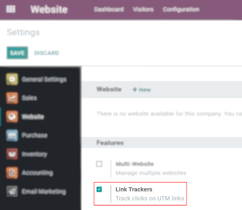
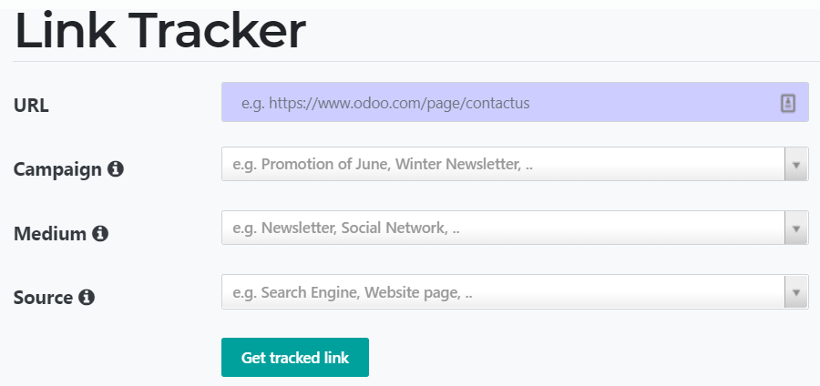
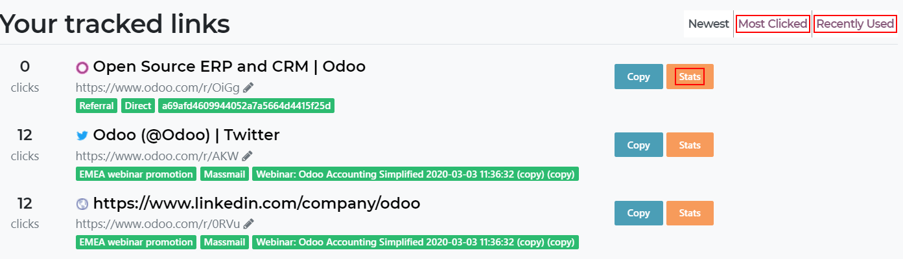

# Link trackers

Link Trackers allow you to track your marketing campaigns (emails,
banner ads, blog posts, social media posts, affiliate links, etc.). This
way, you are able to identify your best traffic sources and make
informed decisions about the distribution of your marketing budget.

## Configuration

Go to `Website --> Configuration --> Settings` and activate *Link
Trackers*.

### Set up traceable URLs

Go to `Website --> Go to website --> Promote --> Track this page`. Here,
you are able to get a specific tracked URL based on the campaign,
medium, and source being used.

- **URL**: url of the page you want to track (e.g. the home page or a
  product's page).
- **Campaign**: context of your link (e.g. a special promotion).
- **Medium**: channel used to share (deliver) your link (e.g. an email
  or a Facebook ad).
- **Source**: platform where the traffic originates (e.g. Google or
  Twitter).

Now, click on *Get tracked link* to generate a URL that you can post or
send by the source you have decided on.

## Follow-up on tracked links

To look at statistics of your links, go to
`Website --> Go to website --> Promote
--> Track this page`. Besides being able to see the *Most Clicked* and
*Recently Used* links, you can also see complete statistics by clicking
on *Stats*, including the number of clicks, and the country of origin
for those clicks.

Tip

1.  You can also access the link tracker on *odoo.com/r* via your
    browser.
2.  Activate the developer mode
    (`Settings --> Activate the developer mode`) and get access to the
    *Link Tracker* module and its back-end functionalities.
3.  Integrated with `analytics/google-analytics`, those trackers allow
    you to see the number of clicks and visitors to keep you on top of
    your marketing campaigns.

