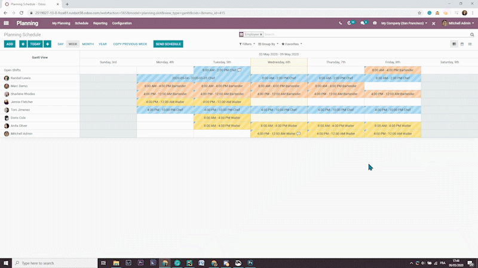

# Content guidelines

To give the community the best documentation possible, we listed here a
few guidelines, tips and tricks that will make your content shine at its
brightest! While we encourage you to adopt your own writing style, some
rules still apply to give the reader more clarity and comprehension.

> [!NOTE]
> We strongly recommend contributors to carefully read the other
> documents related to this section of the documentation. Good knowledge
> of the ins and outs of **RST writing** is required to write and submit
> your contribution. Note that it also affects your writing style
> itself.
>
> - `../documentation`
> - `rst_cheat_sheet`
> - `rst_guidelines`

## Writing style

**Writing for documentation** isn't the same as writing for a blog or
another medium. Readers are more likely to skim read until they've found
the information they are looking for. Keep in mind that the user
documentation is a place to inform and describe, not to convince and
promote.

### Consistency

*Consistency is key to everything.*

Make sure that your writing style remains **consistent**. If you modify
an existing text, try to match the existing tone and presentation, or
rewrite it to match your own style.

### Grammatical tenses

In English, descriptions and instructions require the use of a **Present
Tense**, while a *future tense* is appropriate only when a specific
event is to happen ulteriorly. This logic might be different in other
languages.

- Good example (present):  
  *Screenshots are automatically resized to fit the content block's
  width.*

- Bad example (future):  
  *When you take a screenshot, remember that it will be automatically
  resized to fit the content block's width.*

### Paragraphing

A paragraph comprises several sentences that are linked by a shared
idea. They usually are two to six lines long.

In English, a new idea implies a new paragraph, rather than having a
*line break* as it is common to do in some other languages. *Line
breaks* are useful for layout purposes but shouldn't be used as a
grammatical way of separating ideas.

\-
`RST cheat sheet: Break the line but not the paragraph <contributing/line-break>`

### Titles and headings

To write good titles and headings:

- **Be concise.**
  - **Avoid sentences**, unnecessary verbs, questions, and titles
    starting with "how to."
- **Don't use pronouns** in your titles, especially 2nd person (*your*).
- Use **sentence case**. This means you capitalize only:
  - the first word of the title or heading
  - the first word after a colon
  - proper nouns (brands, product and service names, etc.)

> [!NOTE]
> - Most titles and headings generally refer to a concept and do *not*
> represent the name of a feature or a model. - Do not capitalize the
> words of an acronym if they don't entail a proper noun. - Verbs in
> headings are fine since they often describe an action.

\- **Titles** (H1)

- Quotation templates
- Lead mining
- Resupply from another warehouse
- Synchronize Google Calendar with Odoo
- Batch payments: SEPA Direct Debit (SDD)
- Digitize vendor bills with optical character recognition (OCR)
- **Headings** (H2, H3)
- Project stages
- Email alias
- Confirm the quotation
- Generate SEPA Direct Debit XML files to submit payments

## Document structure

Use different **heading levels** to organize your text by sections and
sub-sections. Your headings are not only displayed in the document but
also on the navigation menu (only the H1) and on the "On this page"
sidebar (all H2 to H6).

<table style="width:99%;">
<colgroup>
<col style="width: 6%" />
<col style="width: 6%" />
<col style="width: 85%" />
</colgroup>
<tbody>
<tr class="odd">
<td colspan="3">
<strong>H1: Page
title</strong> 
Your <em>page title</em> gives your reader a quick and clear
understanding of what your content is about.

The <em>content</em> in this section describes the upcoming content
from a <strong>business point of view</strong>, and shouldn't put the
emphasis on Odoo, as this is documentation and not marketing.

Start first with a <strong>lead paragraph</strong>, which helps the
reader make sure that they've found the right page, then explain the
<strong>business aspects of this topic</strong> in the following
paragraphs.
</td>
</tr>
<tr class="even">
<td></td>
<td colspan="2">
<strong>H2: Section title
(configuration)</strong> 
This first H2 section is about the configuration of the feature, or the
prerequisites to achieve a specific goal. To add a path, make sure you
use the <code>:menuselection:</code> specialized directive (see link
below).

Example: 
To do so, go to
<code>:menuselection:`App name --&gt; Menu --&gt; Sub-menu</code>`, and
enable the XYZ feature.
</td>
</tr>
<tr class="odd">
<td></td>
<td colspan="2">
<strong>H2: Section title (main
sections)</strong> 
Create as many main sections as you have actions or features to
distinguish. The title can start with a verb, but try to avoid using
"Create ...".
</td>
</tr>
<tr class="even">
<td></td>
<td></td>
<td>
<strong>H3: Subsection</strong> 
Subsections are perfect for assessing very specific points. The title
can be in the form of a question, if appropriate.
</td>
</tr>
<tr class="odd">
<td></td>
<td colspan="2"><strong>H2: Next Section</strong></td>
</tr>
</tbody>
</table>

\- `RST cheat sheet: headings <contributing/headings>` -
`RST cheat sheet: markups <contributing/markups>`

## Organizing the documentation

When writing documentation about a given topic, try to keep pages within
the same folder organized.

For most topics, a single page should do the job. Place it in the
appropriate section of the documentation (e.g., content related to the
CRM app go under `Applications
-> Sales -> CRM`) and follow the
`document structure <contributing/document-structure>` guidelines.

For more complex topics, you may need several pages to cover all their
aspects. Usually, you will find yourself adding documentation to a topic
that is already partially covered. In that case, either create a new
page and place it at the same level as other related pages or add new
sections to an existing page. If you are documenting a complex topic
from scratch, organize your content between one parent page (the
`TOC (Tree Of Contents)` page) and several child pages. Whenever
possible, write content on the parent page and not only on the child
pages. Make the parent page accessible from the navigation menu by using
the `show-content
<contributing/document-metadata>` metadata directive.

## Images

Adding a few images to illustrate your text helps the readers to
understand and memorize your content. However, avoid adding too many
images: it isn't necessary to illustrate all steps and features, and it
may overload your page.

> [!IMPORTANT]
> Don't forget to `compress your PNG files with pngquant
> <contributing/documentation/first-contribution>`.

### Screenshots

Screenshots are automatically resized to fit the content block's width.
This implies that screenshots can't be too wide, else they would appear
very small on-screen. Therefore, we recommend to avoid to take
screenshots of a full screen display of the app, unless it is relevant
to do so.

A few tips to improve your screenshots:

1.  **Zoom** in your browser. We recommend a 110% zoom for better
    results.
2.  **Resize** your browser's width, either by *resizing the window*
    itself or by opening the *browser's developer tools* (press the
    `F12` key) and resizing the width.
3.  **Select** the relevant area, rather than keeping the full window.
4.  If necessary, you can **edit** the screenshot to remove unnecessary
    fields and to narrow even more Odoo's display.

> [!NOTE]
> Resizing the window's width is the most important step to do as Odoo's
> responsive design automatically resizes all fields to match the
> window's width.

### Media files

A **media filename**:

- is written in **lower-case letters**
- is **relevant** to the media's content. (E.g., `screenshot-tips.gif`.)
- separates its words with a **hyphen** `-` (E.g.,
  `awesome-filename.png`.)

Each document has its own folder in which the media files are located.
The folder's name must be the same as the document's filename.

For example, the document `doc_filename.rst` refers to two images that
are placed in the folder `doc_filename`.

    ├── section
    │   └── doc_filename
    │   │   └── screenshot-tips.gif
    │   │   └── awesome-filename.png
    │   └── doc_filename.rst

> [!NOTE]
> Previously, image filenames would mostly be named with numbers (e.g.,
> `feature01.png`) and placed in a single `media` folder. While it is
> advised not to name your *new* images in that fashion, it is also
> essential **not to rename unchanged files**, as doing this would
> double the weight of renamed image files on the repository. They will
> eventually all be replaced as the content referencing those images is
> updated.

### ALT tags

An **ALT tag** is a *text alternative* to an image. This text is
displayed if the browser fails to render the image. It is also helpful
for users who are visually impaired. Finally, it helps search engines,
such as Google, to understand what the image is about and index it
correctly, which improves the `SEO (Search Engine Optimization)`
significantly.

Good ALT tags are:

- **Short** (one line maximum)
- **Not a repetition** of a previous sentence or title
- A **good description** of the action happening on the image
- Easily **understandable** if read aloud

\- `RST cheat sheet: image directive <contributing/image>`

