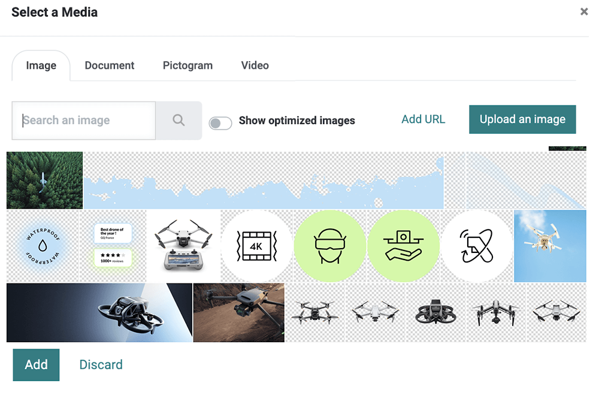

# Pages

In this chapter, you will learn how to declare static pages.

## Default pages

In Konvergo ERP, websites come with a few default static pages (Home, Contact
us, 404, ...). They are built the following way.

``` xml
<template id="website.homepage" name="Homepage">
    <t t-call="website.layout">

        <!-- Variables -->
        <t t-set="additional_title" t-value="'Home'" />

        <div id="wrap" class="oe_structure oe_empty">

            <!-- Content -->

        </div>

    </t>
</template>
```

Define the meta title.

``` xml
<t t-set="additional_title" t-value="'...'"/>
```

Define the meta description.

``` xml
<t t-set="meta_description" t-value="'...'"/>
```

Add a CSS class to the page.

``` xml
<t t-set="pageName" t-value="'...'"/>
```

Hide the header.

``` xml
<t t-set="no_header" t-value="true"/>
```

Hide the footer.

``` xml
<t t-set="no_footer" t-value="true"/>
```

If needed, deactivate default pages.

``` xml
<record id="website.homepage" model="ir.ui.view">
    <field name="active" eval="False"/>
</record>
```

``` xml
<record id="website.contactus" model="ir.ui.view">
    <field name="active" eval="False"/>
</record>
```

Alternatively, replace the default content of these pages using XPath.

``` xml
<template id="404" inherit_id="http_routing.404">
    <xpath expr="//*[@id='wrap']" position="replace">

        <t t-set="additional_title" t-value="'404 - Not found'"/>

        <div id="wrap" class="oe_structure">
            <!-- Content -->
        </div>

    </xpath>
</template>
```

<div class="seealso">

\- [Konvergo ERP eLearning: Search Engine Optimization
(SEO)](https://www.odoo.com/slides/slide/search-engine-optimization-seo-648) -
`Konvergo ERP Documentation on SEO <../../../applications/websites/website/pages/seo>`

</div>

## Theme pages

You can add as many pages as you want to your website. Instead of
defining a <span class="title-ref">\<template\></span>, create a page
object.

**Declaration**

``` xml
<record id="page_about_us" model="website.page">
    <field name="name">About us</field>
    <field name="is_published" eval="True"/>
    <field name="key">website_airproof.page_about_us</field>
    <field name="url">/about-us</field>
    <field name="type">qweb</field>
    <field name="arch" type="xml">
        <t t-name="website_airproof.page_about_us">

            <t t-call="website.layout">
                <div id="wrap" class="oe_structure">

                    <!-- Content -->

                </div>
            </t>

        </t>
    </field>
</record>
```

<div class="todo">

Missing description in table ...

</div>

| Field        | Description                                            |
|--------------|--------------------------------------------------------|
| name         | Page name.                                             |
| is_published | Define if the page is published (visible to visitors). |
| key          | View key (must be unique)                              |
| url          | URL where the page is reachable.                       |
| type         | View type                                              |
| arch         | View architecture                                      |

With <span class="title-ref">\<t t-call="website.layout"\></span> you
use the Konvergo ERP default page layout with your code.

### Header overlay

Make the header background transparent and stand on top of the page
content.

``` xml
<field name="header_overlay" eval="True"/>
```


## Media

### Images

You can record images in the database and use them later in your
design/code. They will also be available for the end user through the
*media dialog*.



The Website Builder supports the following image file formats: JPG, GIF,
PNG, and SVG.

**Declaration**

``` xml
<record id="img_about_01" model="ir.attachment">
    <field name="name">About Image 01</field>
    <field name="datas" type="base64" file="website_airproof/static/src/img/content/img_about_01.jpg"/>
    <field name="res_model">ir.ui.view</field>
    <field name="public" eval="True"/>
</record>
```

<div class="todo">

Missing description in table ...

</div>

| Field     | Description              |
|-----------|--------------------------|
| name      | Image name               |
| datas     | Path to the image file   |
| res_model | Name of the wizard model |

Use it as a background image.

``` xml
<section style="background-image: url('/web/image/website_airproof.img_about_01');">
```

Use it as a regular image.

``` xml

```

Use as a regular image with a color filter.

``` xml

```

> [!TIP]
> The image size greatly influences the user experience, search engine
> optimization, and overall website performance. So, be sure to size
> your images correctly.

### Videos

Add videos as background.

``` xml
<section class="o_background_video" data-bg-video-src="...">
    <!-- Content -->
</section>
```

| Attribute         | Description |
|-------------------|-------------|
| data-bg-video-src | Video URL.  |

Add videos as content.

``` xml
<div class="media_iframe_video" data-oe-expression="...">
    <div class="css_editable_mode_display">&nbsp;</div>
    <div class="media_iframe_video_size" contenteditable="false">&nbsp;</div>
    <iframe src="..."
        frameborder="0"
        contenteditable="false"
        allowfullscreen="allowfullscreen"/>
</div>
```

| Attribute          | Description |
|--------------------|-------------|
| data-oe-expression | Video URL.  |
| src                | Video URL.  |

### Icons

By default, the Font Awesome icons library is included in the Website
Builder. You can place icons anywhere using the CSS Prefix
<span class="title-ref">fa</span> and the icon's name. Font Awesome is
designed to be used with inline elements. You can use
<span class="title-ref">\<i\></span> tag for brevity, but using a
<span class="title-ref">\<span\></span> is more semantically correct.

``` xml
<span class="fa fa-picture-o"/>
```

<div class="seealso">

[Font Awesome v4 icons](https://fontawesome.com/v4/icons/)

</div>

Enable the Website Builder style options.

``` xml
<span class="fa fa-2x fa-picture-o rounded-circle"/>
```

Increase the icon size (fa-2x, fa-3x, fa-4x, or fa-5x classes).

``` xml
<span class="fa fa-2x fa-picture-o"/>
```


