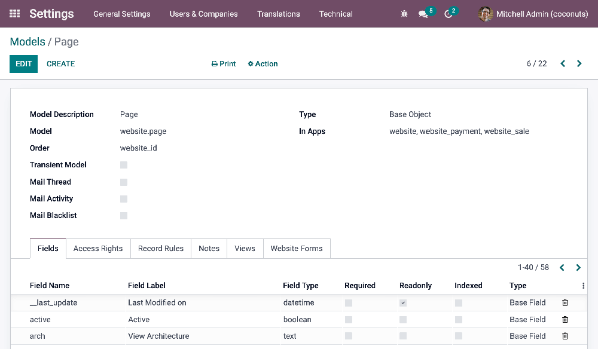

# Setup

In this chapter, you will learn:

- To set up your local development environment.
- The outline of the Odoo database structure.
- To export and import an Odoo database in your local environment.
- To have an Odoo instance up and running.

## Install

There are multiple ways to `install Odoo </administration/on_premise>`,
depending on the intended use case. This documentation assumes you use
the `source install
</administration/on_premise/source>` (running Odoo from the source
code), which is best suited for Odoo designers and developers.

## Databases

### Structure

Every Odoo application works similarly; they are built with the same
logic. A model contains fields and relational fields that link to other
models. Each model has views representing all its fields, with backend
and frontend views.

#### Models

The basis of Odoo is models. Models use fields to record the data.
Records are stored in a database: they are therefore linked to a model.
In Odoo, you can find the different models in the backend by enabling
the `developer mode <developer-mode>` and then going to
`Settings --> Technical --> Database Structure: Models`.



#### Fields

In a model, we will centralize fields (field names we need to target in
our code).

<div class="seealso">

`/applications/studio/fields`

</div>

##### Classic fields

- Date
- Char
- Selection
- …

##### Relational fields

Relational fields call a field from another model. They allow you to
link models together and make them interact easily. In other words, when
you use a relational field, you link a record with another one (located
on another model), enabling you to retrieve the content of the fields
located on this linked record.

- **Many2one** fields are filled in by choosing one record from a list
  of records on another model (from *many* records, you select *one*).
  For example, the *customer* field on a quotation makes you choose one
  customer from a list of several customers on the *contact* model.
- **One2many** fields are reverse searches of existing many2one
  relations. For example, you could list on a contact all their existing
  quotations (from *one* record, you display *many*).
- **Many2many** fields are filled in by choosing one or several records
  from a list of records on another model. For example, you can put
  several tags on one product, and several products can use the same
  tags (from *many* records, you can select *many*).

#### Views

Views define how records should be displayed to end-users. They are
specified in XML, meaning they can be edited independently from the
models they represent. They are flexible and allow deep customization of
the screens they control.

##### Backend vs. Frontend

- **Backend views**: Kanban, List, Form, etc.
- **Frontend view**: QWeb

##### Static vs. Dynamic

- **Static pages** have stable content, such as the homepage. You can
  define their URL and set some properties like published, indexed, etc.
- **Dynamic pages** are dynamically generated, such as the product page.
  Their URL is dynamic and is accessible to all by default (this can be
  changed by configuring access rights).

##### Standard vs. Inherited

- **Standard views** are base views implemented by Odoo. They are
  directly derived from their model. You should never change them as
  they allow updating an Odoo database without overwriting a client's
  modifications.
- **Inherited views** are duplicated views. Modifications always take
  place in an inherited view. If there is a duplicate view, there will
  be two views with the same name in the database, but the duplicated
  view will not have an ID like for standard view.

### Import an existing database

> [!NOTE]
> You can directly go to the `theming` chapter if you do not need to
> import an existing database.

#### Dump

##### Odoo SaaS

Go to <span class="title-ref">\<database_url\>/saas_worker/dump</span>.

##### Odoo.sh

1.  Connect to Odoo.sh.

2.  Select the branch you want to back up.

3.  Choose the `BACKUPS` tab.

4.  Click the `Create Backup` button.

5.  When the process is over, a notification appears. Open it and click
    the `Go to Backup` button.

6.  Click the `Download` icon. Select `Testing` under `Purpose` and
    `With filestore` under `Filestore`.

    

7.  You will receive a notification when the dump is ready to be
    downloaded. Open it and click on `Download` to get your dump.

    

#### Move filestore

Copy all the folders included in the filestore folder and paste them to
the following location on your computer:

- macOS: <span class="title-ref">/Users/\<User\>/Library/Application
  Support/Odoo/filestore/\<database_name\></span>
- Linux:
  <span class="title-ref">/home/\<User\>/.local/share/Odoo/filestore/\<database_name\></span>

> [!NOTE]
> <span class="title-ref">/Library</span> is a hidden folder.

#### Database setup

Create an empty database.

``` xml
createdb <database_name>
```

Import the SQL file in the database that you just created.

``` xml
psql <database_name> < dump.sql
```

Reset the admin user password.

``` xml
psql \c
<database_name>
update res_users set login='admin', password='admin' where id=2;
```

## Getting started

### Running Odoo

Once all dependencies are set up, Odoo can be launched by running
<span class="title-ref">odoo-bin</span>, the command-line interface of
the server. It is located at the root of the Odoo Community directory.

- `Running Odoo <install/source/running_odoo>`
- [Docker](https://hub.docker.com/_/odoo/)

To configure the server, you can specify command-line arguments or a
configuration file. The first method is presented below.

The `CLI <reference/cmdline>` offers several functionalities related to
Odoo. You can use it to `run the server <reference/cmdline/server>`,
scaffold an Odoo theme, populate a database, or count the number of
lines of code.

### Shell script

A typical way to `run the server <reference/cmdline/server>` would be to
add all command line arguments to a <span class="title-ref">.sh</span>
script.

<div class="example">

.. code-block:: xml

./odoo-bin --addons-path=../enterprise,addons --db-filter=\<database\>
-d \<database\> --without-demo=all -i website --dev=xml

</div>

<table>
<colgroup>
<col style="width: 20%" />
<col style="width: 80%" />
</colgroup>
<thead>
<tr class="header">
<th>Folder</th>
<th>Description</th>
</tr>
</thead>
<tbody>
<tr class="odd">
<td><code class="interpreted-text"
role="option">--addons-path &lt;odoo-bin --addons-path&gt;</code></td>
<td>Comma-separated list of directories in which modules are stored.
These directories are scanned for modules.</td>
</tr>
<tr class="even">
<td><p><code class="interpreted-text"
role="option">-d &lt;odoo-bin --database&gt;</code></p>
<p><code class="interpreted-text"
role="option">--database &lt;odoo-bin --database&gt;</code></p></td>
<td><p>database(s) used when installing or updating modules.</p></td>
</tr>
<tr class="odd">
<td><code class="interpreted-text"
role="option">--db-filter &lt;odoo-bin --db-filter&gt;</code></td>
<td>Hides databases that do not match the filter.</td>
</tr>
<tr class="even">
<td><p><code class="interpreted-text"
role="option">-i &lt;odoo-bin --init&gt;</code></p>
<p><code class="interpreted-text"
role="option">--init &lt;odoo-bin --init&gt;</code></p></td>
<td><p>Comma-separated list of modules to install before running the
server. (requires <span class="title-ref">-d</span>)</p></td>
</tr>
<tr class="odd">
<td><p><code class="interpreted-text"
role="option">-u &lt;odoo-bin --update&gt;</code></p>
<p><code class="interpreted-text"
role="option">--update &lt;odoo-bin --update&gt;</code></p></td>
<td><p>Comma-separated list of modules to update before running the
server. (requires <span class="title-ref">-d</span>)</p></td>
</tr>
<tr class="even">
<td><code class="interpreted-text"
role="option">--without-demo &lt;odoo-bin --without-demo&gt;</code></td>
<td>Disables demo data loading for modules installed comma-separated;
use <span class="title-ref">all</span> for all modules. (requires <span
class="title-ref">-d</span> and <span class="title-ref">-i</span>)</td>
</tr>
<tr class="odd">
<td><code class="interpreted-text"
role="option">--dev &lt;odoo-bin --dev&gt;</code></td>
<td>Comma-separated list of features. For development purposes only.
<code class="interpreted-text" role="ref">More info
&lt;reference/cmdline/dev&gt;</code></td>
</tr>
</tbody>
</table>

### Sign in

After the server has started (the INFO log
<span class="title-ref">odoo.modules.loading: Modules loaded.</span> is
printed), open <http://localhost:8069> in your web browser and log in
with the base administrator account.

Type **admin** for the email and **admin** for the password.


> [!TIP]
> Hit *CTRL+C* to stop the server. Do it twice if needed.

### Developer mode

The developer mode, also known as debug mode, is useful for development
as it gives access to additional tools. In the next chapters, it is
assumed that you have enabled the developer mode.

<div class="seealso">

`/applications/general/developer_mode`

</div>
