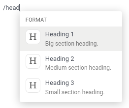

# Konvergo ERP Editor

Konvergo ERP Editor is Konvergo ERP's own rich text editor. Its sources can be found in
the [odoo-editor
directory](%7BGITHUB_PATH%7D/addons/web_editor/static/src/js/editor/odoo-editor).

## Powerbox

The Powerbox is a piece of user interface that contains
`commands <reference/frontend/odoo_editor/powerbox/command>` organized
into `categories <reference/frontend/odoo_editor/powerbox/category>`. It
appears when typing <span class="title-ref">/</span> in the editor. The
commands can be filtered when the user inputs text, and navigated with
the arrow keys.


### Modifying the Powerbox

Only one Powerbox should be instantiated at the time, and that job is
done by the editor itself. Its Powerbox instance can be found in its
<span class="title-ref">powerbox</span> instance variable. To change the
Powerbox's contents and options, change the options passed to the editor
before it gets instantiated.

> [!IMPORTANT]
> Never instantiate the Powerbox yourself. Always use the current
> editor's own instance instead.

<div class="example">

Say we want to add a new command <span class="title-ref">Document</span>
to the Powerbox, just for the
<span class="title-ref">mass_mailing</span> module. We want to add it to
a new category called <span class="title-ref">Documentation</span> and
we want it all the way at the top of the Powerbox.

<span class="title-ref">mass_mailing</span>
[extends](%7BGITHUB_PATH%7D/addons/mass_mailing/static/src/js/wysiwyg.js)
<span class="title-ref">web_editor</span>'s [Wysiwyg
class](%7BGITHUB_PATH%7D/addons/web_editor/static/src/js/wysiwyg/wysiwyg.js),
which instantiates the editor in its
<span class="title-ref">start</span> method. Before doing so, it calls
its own <span class="title-ref">\_getPowerboxOptions</span> method,
which can conveniently be overridden to add our new commands.

Since <span class="title-ref">mass_mailing</span> already overrides
<span class="title-ref">\_getPowerboxOptions</span>, let's just add our
new command to it:

``` javascript
_getPowerboxOptions: function () {
    const options = this._super();
    // (existing code before the return statement)
    options.categories.push({
        name: _t('Documentation'),
        priority: 300,
    });
    options.commands.push({
        name: _t('Document'),
        category: _t('Documentation'),
        description: _t("Add this text to your mailing's documentation"),
        fontawesome: 'fa-book',
        priority: 1, // This is the only command in its category anyway.
    });
    return options;
}
```

> [!IMPORTANT]
> In order to allow the names and descriptions of your commands and
> categories to be translated, make sure to wrap them in the
> <span class="title-ref">\_t</span> function.

> [!TIP]
> To avoid out-of-control escalations, don't use random numbers for your
> priorities: look at which other priorities already exist and choose
> your value accordingly (like you would do for a
> <span class="title-ref">z-index</span>).

</div>

### Opening a custom Powerbox

It is possible to open the Powerbox with a custom set of categories and
commands, bypassing all pre-existing ones. To do that, call the
<span class="title-ref">open</span> method of the Powerbox and pass it
your custom commands and categories.


<div class="example">

We need the current instance of the Powerbox, which can be found in the
current editor. In the [Wysiwyg
class](%7BGITHUB_PATH%7D/addons/web_editor/static/src/js/wysiwyg/wysiwyg.js),
you will find it as
<span class="title-ref">this.odooEditor.powerbox</span>.

Now to open it with our custom "Document" command in a custom
"Documentation" category:

``` javascript
this.odooEditor.powerbox.open(
    [{
        name: _t('Document'),
        category: _t('Documentation'),
        description: _t("Add this text to your mailing's documentation"),
        fontawesome: 'fa-book',
        priority: 1, // This is the only command in its category anyway.
    }],
    [{
        name: _t('Documentation'),
        priority: 300,
    }]
);
```

</div>

### Filtering commands

There are three ways to filter commands:

1.  Via the <span class="title-ref">powerboxFilters</span>
    `Powerbox option <reference/frontend/odoo_editor/powerbox/options>`.
2.  Via a given
    `command <reference/frontend/odoo_editor/powerbox/command>`'s
    <span class="title-ref">isDisabled</span> entry.
3.  The user can filter commands by simply typing text after opening the
    Powerbox. It will fuzzy-match that text with the names of the
    categories and commands.



### Reference

#### Category

| Name                                    | Type                                  | Description                                                                                                                                                        |
|-----------------------------------------|---------------------------------------|--------------------------------------------------------------------------------------------------------------------------------------------------------------------|
| <span class="title-ref">name</span>     | <span class="title-ref">string</span> | the name of the category                                                                                                                                           |
| <span class="title-ref">priority</span> | <span class="title-ref">number</span> | used to order the category: a category with a higher priority is displayed higher into the Powerbox (categories with the same priority are ordered alphabetically) |

> [!NOTE]
> If several categories exist with the same name, they will be grouped
> into one. Its priority will be that defined in the version of the
> category that was declared last.

#### Command

| Name                                                 | Type                                                                                 | Description                                                                                                                                                    |
|------------------------------------------------------|--------------------------------------------------------------------------------------|----------------------------------------------------------------------------------------------------------------------------------------------------------------|
| <span class="title-ref">name</span>                  | <span class="title-ref">string</span>                                                | the name of the command                                                                                                                                        |
| <span class="title-ref">category</span>              | <span class="title-ref">string</span>                                                | the name of the category the command belongs to                                                                                                                |
| <span class="title-ref">description</span>           | <span class="title-ref">string</span>                                                | a short text to describe the command                                                                                                                           |
| <span class="title-ref">fontawesome</span>           | <span class="title-ref">string</span>                                                | the name of a *Font Awesome* that will serve as the command's icon                                                                                             |
| <span class="title-ref">priority</span>              | <span class="title-ref">number</span>                                                | used to order the command: a command with a higher priority is displayed higher into the Powerbox (commands with the same priority are ordered alphabetically) |
| <span class="title-ref">callback</span>              | <span class="title-ref">function</span> (<span class="title-ref">() =\> void</span>) | the function to execute when the command is picked (can be asynchronous)                                                                                       |
| <span class="title-ref">isDisabled</span> (optional) | <span class="title-ref">function</span> (<span class="title-ref">() =\> void</span>) | a function used to disable the command under certain conditions (when it returns <span class="title-ref">true</span>, the command will be disabled)            |

> [!NOTE]
> If the command points to a category that doesn't exist yet, that
> category will be created and appended at the end of the Powerbox.

#### Options

The following options can be passed to Konvergo ERPEditor, that will then be
passed to the instance of the Powerbox:

| Name                                                    | Type                                                                                                     | Description                                                                                                                                     |
|---------------------------------------------------------|----------------------------------------------------------------------------------------------------------|-------------------------------------------------------------------------------------------------------------------------------------------------|
| <span class="title-ref">commands</span>                 | <span class="title-ref">array of commands</span>                                                         | commands to add to the default defined by the editor                                                                                            |
| <span class="title-ref">categories</span>               | <span class="title-ref">array of categories</span>                                                       | categories to add to the default defined by the editor                                                                                          |
| <span class="title-ref">powerboxFilters</span>          | <span class="title-ref">array of functions</span> (<span class="title-ref">commands =\> commands</span>) | functions used to filter commands displayed in the Powerbox                                                                                     |
| <span class="title-ref">getContextFromParentRect</span> | <span class="title-ref">function</span> (<span class="title-ref">() =\> DOMRect</span>)                  | a function that returns the <span class="title-ref">DOMRect</span> of an ancestor of the editor (can be useful when the editor is in an iframe) |
