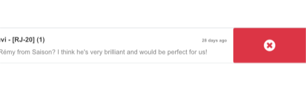

# Owl Components

The Konvergo ERP Javascript framework uses a custom component framework called
Owl. It is a declarative component system, loosely inspired by Vue and
React. Components are defined using `QWeb templates <qweb>`, enriched
with some Owl specific directives. The official [Owl
documentation](https://github.com/odoo/owl/blob/master/doc/readme.md)
contains a complete reference and a tutorial.

> [!IMPORTANT]
> Although the code can be found in the
> <span class="title-ref">web</span> module, it is maintained from a
> separate GitHub repository. Any modification to Owl should therefore
> be made through a pull request on <https://github.com/odoo/owl>.

> [!NOTE]
> Currently, all Konvergo ERP versions (starting in version 14) share the same
> Owl version.

## Using Owl components

The [Owl documentation]() already documents in detail the Owl framework,
so this page will only provide Konvergo ERP specific information. But first, let
us see how we can make a simple component in Konvergo ERP.

``` javascript
const { useState } = owl.hooks;
const { xml } = owl.tags;

class MyComponent extends Component {
    setup() {
        this.state = useState({ value: 1 });
    }

    increment() {
        this.state.value++;
    }
}
MyComponent.template = xml
    `<div t-on-click="increment">
        <t t-esc="state.value">
    </div>`;
```

This example shows that Owl is available as a library in the global
namespace as \`owl\`: it can simply be used like most libraries in Konvergo ERP.
Note that we defined here the template as a static property, but without
using the <span class="title-ref">static</span> keyword, which is not
available in some browsers (Konvergo ERP javascript code should be Ecmascript
2019 compliant).

We define here the template in the javascript code, with the help of the
<span class="title-ref">xml</span> helper. However, it is only useful to
get started. In practice, templates in Konvergo ERP should be defined in an xml
file, so they can be translated. In that case, the component should only
define the template name.

In practice, most components should define 2 or 3 files, located at the
same place: a javascript file
(<span class="title-ref">my_component.js</span>), a template file
(<span class="title-ref">my_component.xml</span>) and optionally a scss
(or css) file (<span class="title-ref">my_component.scss</span>). These
files should then be added to some assets bundle. The web framework will
take care of loading the javascript/css files, and loading the templates
into Owl.

Here is how the component above should be defined:

``` javascript
const { useState } = owl.hooks;

class MyComponent extends Component {
    ...
}
MyComponent.template = 'myaddon.MyComponent';
```

And the template is now located in the corresponding xml file:

``` xml
<?xml version="1.0" encoding="UTF-8" ?>
<templates xml:space="preserve">

<t t-name="myaddon.MyComponent" owl="1">
  <div t-on-click="increment">
    <t t-esc="state.value"/>
  </div>
</t>

</templates>
```

Konvergo ERP code is not yet completely made in Owl, so it needs a way to tell
the difference between Owl templates (new code) and old templates (for
components). To do that in a backward-compatible way, all new templates
should be defined with the <span class="title-ref">owl</span> attribute
set to 1.

> [!NOTE]
> Do not forget to set <span class="title-ref">owl="1"</span> in your
> Owl templates!

> [!NOTE]
> Template names should follow the convention
> <span class="title-ref">addon_name.ComponentName</span>.

<div class="seealso">

\- [Owl Repository](https://github.com/odoo/owl)

</div>

## Best practices

First of all, components are classes, so they have a constructor. But
constructors are special methods in javascript that are not overridable
in any way. Since this is an occasionally useful pattern in Konvergo ERP, we
need to make sure that no component in Konvergo ERP directly uses the
constructor method. Instead, components should use the
<span class="title-ref">setup</span> method:

``` javascript
// correct:
class MyComponent extends Component {
    setup() {
        // initialize component here
    }
}

// incorrect. Do not do that!
class IncorrectComponent extends Component {
    constructor(parent, props) {
        // initialize component here
    }
}
```

Another good practice is to use a consistent convention for template
names: <span class="title-ref">addon_name.ComponentName</span>. This
prevents name collision between odoo addons.

## Reference List

The Konvergo ERP web client is built with [Owl](https://github.com/odoo/owl)
components. To make it easier, the Konvergo ERP javascript framework provides a
suite of generic components that can be reused in some common
situations, such as dropdowns, checkboxes or datepickers. This page
explains how to use these generic components.

| Technical Name                             | Short Description                                    |
|--------------------------------------------|------------------------------------------------------|
| `ActionSwiper <frontend/owl/actionswiper>` | a swiper component to perform actions on touch swipe |
| `CheckBox <frontend/owl/checkbox>`         | a simple checkbox component with a label next to it  |
| `ColorList <frontend/owl/colorlist>`       | a list of colors to choose from                      |
| `Dropdown <frontend/owl/dropdown>`         | full-featured dropdown                               |
| `Notebook <frontend/owl/notebook>`         | a component to navigate between pages using tabs     |
| `Pager <frontend/pager>`                   | a small component to handle pagination               |

### ActionSwiper

#### Location

<span class="title-ref">@web/core/action_swiper/action_swiper</span>

#### Description

This is a component that can perform actions when an element is swiped
horizontally. The swiper is wrapping a target element to add actions to
it. The action is executed once the user has released the swiper passed
a portion of its width.

``` xml
<ActionSwiper onLeftSwipe="Object" onRightSwipe="Object">
  <SomeElement/>
</ActionSwiper>
```

The simplest way to use the component is to use it around your target
element directly in an xml template as shown above. But sometimes, you
may want to extend an existing element and would not want to duplicate
the template. It is possible to do just that.

If you want to extend the behavior of an existing element, you must
place the element inside, by wrapping it directly. Also, you can
conditionnally add props to manage when the element might be swipable,
its animation and the minimum portion to swipe to perform the action.

You can use the component to interact easily with records, messages,
items in lists and much more.



The following example creates a basic ActionSwiper component. Here, the
swipe is enabled in both directions.

``` xml
<ActionSwiper
  onRightSwipe="
    {
      action: '() => Delete item',
      icon: 'fa-delete',
      bgColor: 'bg-danger',
    }"
  onLeftSwipe="
    {
      action: '() => Star item',
      icon: 'fa-star',
      bgColor: 'bg-warning',
    }"
>
  <div>
    Swipable item
  </div>
</ActionSwiper>
```

> [!NOTE]
> Actions are permuted when using right-to-left (RTL) languages.

#### Props

| Name                                              | Type                                   | Description                                                                                                                             |
|---------------------------------------------------|----------------------------------------|-----------------------------------------------------------------------------------------------------------------------------------------|
| <span class="title-ref">animationOnMove</span>    | <span class="title-ref">Boolean</span> | optional boolean to determine if a translate effect is present during the swipe                                                         |
| <span class="title-ref">animationType</span>      | <span class="title-ref">String</span>  | optional animation that is used after the swipe ends (<span class="title-ref">bounce</span> or <span class="title-ref">forwards</span>) |
| <span class="title-ref">onLeftSwipe</span>        | <span class="title-ref">Object</span>  | if present, the actionswiper can be swiped to the left                                                                                  |
| <span class="title-ref">onRightSwipe</span>       | <span class="title-ref">Object</span>  | if present, the actionswiper can be swiped to the right                                                                                 |
| <span class="title-ref">swipeDistanceRatio</span> | <span class="title-ref">Number</span>  | optional minimum width ratio that must be swiped to perform the action                                                                  |

You can use both <span class="title-ref">onLeftSwipe</span> and
<span class="title-ref">onRightSwipe</span> props at the same time.

The <span class="title-ref">Object</span>'s used for the left/right
swipe must contain:

> - <span class="title-ref">action</span>, which is the callable
>   <span class="title-ref">Function</span> serving as a callback. Once
>   the swipe has been completed in the given direction, that action is
>   performed.
> - <span class="title-ref">icon</span> is the icon class to use,
>   usually to represent the action. It must be a
>   <span class="title-ref">string</span>.
> - <span class="title-ref">bgColor</span> is the background color,
>   given to decorate the action. can be one of the following [bootstrap
>   contextual
>   color](https://getbootstrap.com/docs/3.3/components/#available-variations)
>   (<span class="title-ref">danger</span>,
>   <span class="title-ref">info</span>,
>   <span class="title-ref">secondary</span>,
>   <span class="title-ref">success</span> or
>   <span class="title-ref">warning</span>).
>
> Those values must be given to define the behavior and the visual
> aspect of the swiper.

#### Example: Extending existing components

In the following example, you can use
<span class="title-ref">xpath</span>'s to wrap an existing element in
the ActionSwiper component. Here, a swiper has been added to mark a
message as read in mail.

``` xml
<xpath expr="//*[hasclass('o_Message')]" position="after">
  <ActionSwiper
    onRightSwipe="messaging.device.isMobile and messageView.message.isNeedaction ?
      {
        action: () => messageView.message.markAsRead(),
        icon: 'fa-check-circle',
        bgColor: 'bg-success',
      } : undefined"
  />
</xpath>
<xpath expr="//ActionSwiper" position="inside">
  <xpath expr="//*[hasclass('o_Message')]" position="move"/>
</xpath>
```

### CheckBox

#### Location

<span class="title-ref">@web/core/checkbox/checkbox</span>

#### Description

This is a simple checkbox component with a label next to it. The
checkbox is linked to the label: the checkbox is toggled whenever the
label is clicked.

``` xml
<CheckBox value="boolean" disabled="boolean" t-on-change="onValueChange">
  Some Text
</CheckBox>
```

#### Props

| Name                                    | Type                                   | Description                                                 |
|-----------------------------------------|----------------------------------------|-------------------------------------------------------------|
| <span class="title-ref">value</span>    | <span class="title-ref">boolean</span> | if true, the checkbox is checked, otherwise it is unchecked |
| <span class="title-ref">disabled</span> | <span class="title-ref">boolean</span> | if true, the checkbox is disabled, otherwise it is enabled  |

### ColorList

#### Location

<span class="title-ref">@web/core/colorlist/colorlist</span>

#### Description

The ColorList let you choose a color from a predefined list. By default,
the component displays the current selected color, and is not expandable
until the <span class="title-ref">canToggle</span> props is present.
Different props can change its behavior, to always expand the list, or
make it act as a toggler once it is clicked, to display the list of
available colors until a choice is selected.

#### Props

| Name                                           | Type                                    | Description                                                                                           |
|------------------------------------------------|-----------------------------------------|-------------------------------------------------------------------------------------------------------|
| <span class="title-ref">canToggle</span>       | <span class="title-ref">boolean</span>  | optional. Whether the colorlist can expand the list on click                                          |
| <span class="title-ref">colors</span>          | <span class="title-ref">array</span>    | list of colors to display in the component. Each color has a unique <span class="title-ref">id</span> |
| <span class="title-ref">forceExpanded</span>   | <span class="title-ref">boolean</span>  | optional. If true, the list is always expanded                                                        |
| <span class="title-ref">isExpanded</span>      | <span class="title-ref">boolean</span>  | optional. If true, the list is expanded by default                                                    |
| <span class="title-ref">onColorSelected</span> | <span class="title-ref">function</span> | callback executed once a color is selected                                                            |
| <span class="title-ref">selectedColor</span>   | <span class="title-ref">number</span>   | optional. The color <span class="title-ref">id</span> that is selected                                |

Color <span class="title-ref">id</span>'s are the following:

| Id                                | Color                                      |
|-----------------------------------|--------------------------------------------|
| <span class="title-ref">0</span>  | <span class="title-ref">No color</span>    |
| <span class="title-ref">1</span>  | <span class="title-ref">Red</span>         |
| <span class="title-ref">2</span>  | <span class="title-ref">Orange</span>      |
| <span class="title-ref">3</span>  | <span class="title-ref">Yellow</span>      |
| <span class="title-ref">4</span>  | <span class="title-ref">Light blue</span>  |
| <span class="title-ref">5</span>  | <span class="title-ref">Dark purple</span> |
| <span class="title-ref">6</span>  | <span class="title-ref">Salmon pink</span> |
| <span class="title-ref">7</span>  | <span class="title-ref">Medium blue</span> |
| <span class="title-ref">8</span>  | <span class="title-ref">Dark blue</span>   |
| <span class="title-ref">9</span>  | <span class="title-ref">Fuchsia</span>     |
| <span class="title-ref">12</span> | <span class="title-ref">Green</span>       |
| <span class="title-ref">11</span> | <span class="title-ref">Purple</span>      |

### Dropdown

#### Location

<span class="title-ref">@web/core/dropdown/dropdown</span> and
<span class="title-ref">@web/core/dropdown/dropdown_item</span>

#### Description

Dropdowns are surprisingly complicated components. They need to provide
many features such as:

- Toggle the item list on click
- Direct siblings dropdowns: when one is open, toggle others on hover
- Close on outside click
- Optionally close the item list when an item is selected
- Call a function when the item is selected
- Support sub dropdowns, up to any level
- SIY: style it yourself
- Configurable hotkey to open/close a dropdown or select a dropdown item
- Keyboard navigation (arrows, tab, shift+tab, home, end, enter and
  escape)
- Reposition itself whenever the page scrolls or is resized
- Smartly chose the direction it should open (right-to-left direction is
  automatically handled).

To solve these issues once and for all, the Konvergo ERP framework provides a
set of two components: a <span class="title-ref">Dropdown</span>
component (the actual dropdown), and
<span class="title-ref">DropdownItem</span>, for each element in the
item list.

``` xml
<Dropdown>
  <t t-set-slot="toggler">
    <!-- "toggler" slot content is rendered inside a button -->
    Click me to toggle the dropdown menu !
  </t>
  <!-- "default" slot content is rendered inside a div -->
  <DropdownItem onSelected="selectItem1">Menu Item 1</DropdownItem>
  <DropdownItem onSelected="selectItem2">Menu Item 2</DropdownItem>
</Dropdown>
```

#### Props

A <span class="title-ref">\<Dropdown/\></span> component is simply a
<span class="title-ref">\<div class="dropdown"/\></span> having a
<span class="title-ref">\<button class="dropdown-toggle"/\></span> next
to menu div (<span class="title-ref">\<div
class="dropdown-menu"/\></span>). The button is responsible for the menu
being present in the DOM or not.

| Dropdown                                    | Type                                                                                | Description                                                                                                                                                                                                                                                                                                                                       |
|---------------------------------------------|-------------------------------------------------------------------------------------|---------------------------------------------------------------------------------------------------------------------------------------------------------------------------------------------------------------------------------------------------------------------------------------------------------------------------------------------------|
| <span class="title-ref">startOpen</span>    | boolean                                                                             | initial dropdown open state (defaults to <span class="title-ref">false</span>)                                                                                                                                                                                                                                                                    |
| <span class="title-ref">menuClass</span>    | string                                                                              | additional css class applied to the dropdown menu <span class="title-ref">\<div class="dropdown-menu"/\></span>                                                                                                                                                                                                                                   |
| <span class="title-ref">togglerClass</span> | string                                                                              | additional css class applied to the toggler <span class="title-ref">\<button class="dropdown-toggle"/\></span>                                                                                                                                                                                                                                    |
| <span class="title-ref">hotkey</span>       | string                                                                              | hotkey to toggle the opening through keyboard                                                                                                                                                                                                                                                                                                     |
| <span class="title-ref">tooltip</span>      | string                                                                              | add a tooltip on the toggler                                                                                                                                                                                                                                                                                                                      |
| <span class="title-ref">beforeOpen</span>   | function                                                                            | hook to execute logic just before opening. May be asynchronous.                                                                                                                                                                                                                                                                                   |
| <span class="title-ref">manualOnly</span>   | boolean                                                                             | if true, only toggle the dropdown when the button is clicked on (defaults to <span class="title-ref">false</span>)                                                                                                                                                                                                                                |
| <span class="title-ref">title</span>        | string                                                                              | title attribute content for the <span class="title-ref">\<button class="dropdown-toggle"/\></span> (default: none)                                                                                                                                                                                                                                |
| <span class="title-ref">position</span>     | string                                                                              | defines the desired menu opening position. RTL direction is automatically applied. Should be a valid `usePosition <frontend/hooks/useposition>` hook position. (default: <span class="title-ref">bottom-start</span>)                                                                                                                             |
| <span class="title-ref">toggler</span>      | <span class="title-ref">"parent"</span> or <span class="title-ref">undefined</span> | when set to <span class="title-ref">"parent"</span> the <span class="title-ref">\<button class="dropdown-toggle"/\></span> is not rendered (thus <span class="title-ref">toggler</span> slot is ignored) and the toggling feature is handled by the parent node (e.g. use case: pivot cells). (default: <span class="title-ref">undefined</span>) |

A <span class="title-ref">\<DropdownItem/\></span> is simply a span
(<span class="title-ref">\<span class="dropdown-item"/\></span>). When a
<span class="title-ref">\<DropdownItem/\></span> is selected, it calls
its <span class="title-ref">onSelected</span> prop. If this prop is a
method, make sure it is bound if the method need to use the
<span class="title-ref">this</span> value.

| DropdownItem                                     | Type                                                                                                                | Description                                                                                                                                                                                                               |
|--------------------------------------------------|---------------------------------------------------------------------------------------------------------------------|---------------------------------------------------------------------------------------------------------------------------------------------------------------------------------------------------------------------------|
| <span class="title-ref">onSelected</span>        | Function                                                                                                            | a function that will be called when the dropdown item is selected.                                                                                                                                                        |
| <span class="title-ref">parentClosingMode</span> | <span class="title-ref">none</span> \| <span class="title-ref">closest</span> \| <span class="title-ref">all</span> | when the item is selected, control which parent dropdown will get closed: none, closest or all (default = <span class="title-ref">all</span>)                                                                             |
| <span class="title-ref">hotkey</span>            | string                                                                                                              | optional hotkey to select the item                                                                                                                                                                                        |
| <span class="title-ref">href</span>              | string                                                                                                              | if provided the DropdownItem will become an <span class="title-ref">\<a href="value" class="dropdown-item"/\></span> instead of a <span class="title-ref">\<span class="dropdown-item"/\></span>. (default: not provided) |
| <span class="title-ref">title</span>             | string                                                                                                              | optional title attribute which will be passed to the root node of the DropdownItem. (default: not provided)                                                                                                               |
| <span class="title-ref">dataset</span>           | Object                                                                                                              | optional object containing values that should be added to the root element's dataset. This can be used so that the element is easier to find programmatically, for example in tests or tours.                             |

#### Technical notes

The rendered DOM is structured like this:

``` html
<div class="dropdown">
    <button class="dropdown-toggle">Click me !</button>
    <!-- following <div/> will or won't appear in the DOM depending on the state controlled by the preceding button -->
    <div class="dropdown-menu">
        <span class="dropdown-item">Menu Item 1</span>
        <span class="dropdown-item">Menu Item 2</span>
    </div>
</div>
```

To properly use a <span class="title-ref">\<Dropdown/\></span>
component, you need to populate two [OWL
slots](https://github.com/odoo/owl/blob/master/doc/reference/slots.md) :

- <span class="title-ref">toggler</span> slot: it contains the *toggler*
  elements of your dropdown and is rendered inside the dropdown
  <span class="title-ref">button</span> (unless the
  <span class="title-ref">toggler</span> prop is set to
  <span class="title-ref">parent</span>),
- <span class="title-ref">default</span> slot: it contains the
  *elements* of the dropdown menu itself and is rendered inside the
  <span class="title-ref">\<div class="dropdown-menu"/\></span>.
  Although it is not mandatory, there is usually at least one
  <span class="title-ref">DropdownItem</span> inside the
  <span class="title-ref">menu</span> slot.

When several dropdowns share the same parent element in the DOM, then
they are considered part of a group, and will notify each other about
their state changes. This means that when one of these dropdowns is
open, the others will automatically open themselves on mouse hover,
without the need for a click.

#### Example: Direct Siblings Dropdown

When one dropdown toggler is clicked (**File** , **Edit** or **About**),
the others will open themselves on hover.

``` xml
<div>
  <Dropdown>
    <t t-set-slot="toggler">File</t>
    <DropdownItem onSelected="() => this.onItemSelected('file-open')">Open</DropdownItem>
    <DropdownItem onSelected="() => this.onItemSelected('file-new-document')">New Document</DropdownItem>
    <DropdownItem onSelected="() => this.onItemSelected('file-new-spreadsheet')">New Spreadsheet</DropdownItem>
  </Dropdown>
  <Dropdown>
    <t t-set-slot="toggler">Edit</t>
    <DropdownItem onSelected="() => this.onItemSelected('edit-undo')">Undo</DropdownItem>
    <DropdownItem onSelected="() => this.onItemSelected('edit-redo')">Redo</DropdownItem>
    <DropdownItem onSelected="() => this.onItemSelected('edit-find')">Search</DropdownItem>
  </Dropdown>
  <Dropdown>
    <t t-set-slot="toggler">About</t>
    <DropdownItem onSelected="() => this.onItemSelected('about-help')">Help</DropdownItem>
    <DropdownItem onSelected="() => this.onItemSelected('about-update')">Check update</DropdownItem>
  </Dropdown>
</div>
```

#### Example: Multi-level Dropdown (with <span class="title-ref">t-call</span>)

This example shows how one could make a
<span class="title-ref">File</span> dropdown menu, with submenus for the
<span class="title-ref">New</span> and <span class="title-ref">Save
as...</span> sub elements.

``` xml
<t t-name="addon.Dropdown.File" owl="1">
  <Dropdown>
    <t t-set-slot="toggler">File</t>
    <DropdownItem onSelected="() => this.onItemSelected('file-open')">Open</DropdownItem>
    <t t-call="addon.Dropdown.File.New"/>
    <DropdownItem onSelected="() => this.onItemSelected('file-save')">Save</DropdownItem>
    <t t-call="addon.Dropdown.File.Save.As"/>
  </Dropdown>
</t>

<t t-name="addon.Dropdown.File.New" owl="1">
  <Dropdown>
    <t t-set-slot="toggler">New</t>
    <DropdownItem onSelected="() => this.onItemSelected('file-new-document')">Document</DropdownItem>
    <DropdownItem onSelected="() => this.onItemSelected('file-new-spreadsheet')">Spreadsheet</DropdownItem>
  </Dropdown>
</t>

<t t-name="addon.Dropdown.File.Save.As" owl="1">
  <Dropdown>
    <t t-set-slot="toggler">Save as...</t>
    <DropdownItem onSelected="() => this.onItemSelected('file-save-as-csv')">CSV</DropdownItem>
    <DropdownItem onSelected="() => this.onItemSelected('file-save-as-pdf')">PDF</DropdownItem>
  </Dropdown>
</t>
```

#### Example: Multi-level Dropdown (nested)

``` xml
<Dropdown>
  <t t-set-slot="toggler">File</t>
  <DropdownItem onSelected="() => this.onItemSelected('file-open')">Open</DropdownItem>
  <Dropdown>
    <t t-set-slot="toggler">New</t>
    <DropdownItem onSelected="() => this.onItemSelected('file-new-document')">Document</DropdownItem>
    <DropdownItem onSelected="() => this.onItemSelected('file-new-spreadsheet')">Spreadsheet</DropdownItem>
  </Dropdown>
  <DropdownItem onSelected="() => this.onItemSelected('file-save')">Save</DropdownItem>
  <Dropdown>
    <t t-set-slot="toggler">Save as...</t>
    <DropdownItem onSelected="() => this.onItemSelected('file-save-as-csv')">CSV</DropdownItem>
    <DropdownItem onSelected="() => this.onItemSelected('file-save-as-pdf')">PDF</DropdownItem>
  </Dropdown>
</Dropdown>
```

#### Example: Recursive Multi-level Dropdown

In this example, we recursively call a template to display a tree-like
structure.

``` xml
<t t-name="addon.MainTemplate" owl="1">
  <div>
    <t t-call="addon.RecursiveDropdown">
      <t t-set="name" t-value="'Main Menu'" />
      <t t-set="items" t-value="state.menuItems" />
    </t>
  </div>
</t>

<t t-name="addon.RecursiveDropdown" owl="1">
  <Dropdown>
    <t t-set-slot="toggler"><t t-esc="name"/></t>
      <t t-foreach="items" t-as="item" t-key="item.id">

        <!-- If this item has no child: make it a <DropdownItem/> -->
        <t t-if="!item.childrenTree.length">
          <DropdownItem onSelected="() => this.onItemSelected(item)" t-esc="item.name"/>
        </t>
        <!-- Else: recursively call the current dropdown template. -->
        <t t-else="" t-call="addon.RecursiveDropdown">
          <t t-set="name" t-value="item.name" />
          <t t-set="items" t-value="item.childrenTree" />
        </t>

      </t>
    </t>
  </Dropdown>
</t>
```

### Notebook

#### Location

<span class="title-ref">@web/core/notebook/notebook</span>

#### Description

The Notebook is made to display multiple pages in a tabbed interface.
Tabs can be located at the top of the element to display horizontally,
or at the left for a vertical layout.

There are two ways to define your Notebook pages to instanciate, either
by using <span class="title-ref">slot</span>'s, or by passing a
dedicated <span class="title-ref">props</span>.

#### Props

| Name                                        | Type                                    | Description                                                                                                               |
|---------------------------------------------|-----------------------------------------|---------------------------------------------------------------------------------------------------------------------------|
| <span class="title-ref">anchors</span>      | <span class="title-ref">object</span>   | optional. Allow anchors navigation to elements inside tabs that are not visible.                                          |
| <span class="title-ref">className</span>    | <span class="title-ref">string</span>   | optional. Classname set on the root of the component.                                                                     |
| <span class="title-ref">defaultPage</span>  | <span class="title-ref">string</span>   | optional. Page <span class="title-ref">id</span> to display by default.                                                   |
| <span class="title-ref">orientation</span>  | <span class="title-ref">string</span>   | optional. Whether tabs direction is <span class="title-ref">horizontal</span> or <span class="title-ref">vertical</span>. |
| <span class="title-ref">onPageUpdate</span> | <span class="title-ref">function</span> | optional. Callback executed once the page has changed.                                                                    |
| <span class="title-ref">pages</span>        | <span class="title-ref">array</span>    | optional. Contain the list of <span class="title-ref">page</span>'s to populate from a template.                          |

<div class="example">

The first approach is to set the pages in the slots of the component.

``` xml
<Notebook orientation="'vertical'">
  <t t-set-slot="page_1" title="'Page 1'" isVisible="true">
    <h1>My First Page</h1>
    <p>It's time to build Owl components. Did you read the documentation?</p>
  </t>
  <t t-set-slot="page_2" title="'2nd page'" isVisible="true">
    <p>Wise owl's silent flight. Through the moonlit forest deep, guides my path to code</p>
  </t>
</Notebook>
```

The other way to define your pages is by passing the props. This can be
useful if some pages share the same structure. Create first a component
for each page template that you may use.

``` javascript
import { Notebook } from "@web/core/notebook/notebook";

class MyTemplateComponent extends owl.Component {
  static template = owl.tags.xml`
    <h1 t-esc="props.title" />
    <p t-esc="props.text" />
  `;
}

class MyComponent extends owl.Component {
  get pages() {
    return [
      {
        Component: MyTemplateComponent,
        title: "Page 1",
        props: {
          title: "My First Page",
          text: "This page is not visible",
        },
      },
      {
        Component: MyTemplateComponent,
        id: "page_2",
        title: "Page 2",
        props: {
          title: "My second page",
          text: "You're at the right place!",
        },
      },
    ]
  }
}
MyComponent.template = owl.tags.xml`
  <Notebook defaultPage="'page_2'" pages="pages" />
`;
```

Both examples are shown here:


</div>

### Pager

#### Location

<span class="title-ref">@web/core/pager/pager</span>

#### Description

The Pager is a small component to handle pagination. A page is defined
by an <span class="title-ref">offset</span> and a
<span class="title-ref">limit</span> (the size of the page). It displays
the current page and the <span class="title-ref">total</span> number of
elements, for instance, "9-12 / 20". In the previous example,
<span class="title-ref">offset</span> is 8,
<span class="title-ref">limit</span> is 4 and
<span class="title-ref">total</span> is 20. It has two buttons
("Previous" and "Next") to navigate between pages.

> [!NOTE]
> The pager can be used anywhere but its main use is in the control
> panel. See the `usePager <frontend/hooks/usepager>` hook in order to
> manipulate the pager of the control panel.

``` xml
<Pager offset="0" limit="80" total="50" onUpdate="doSomething" />
```

#### Props

| Name                                         | Type                                    | Description                                                                                                                                                                               |
|----------------------------------------------|-----------------------------------------|-------------------------------------------------------------------------------------------------------------------------------------------------------------------------------------------|
| <span class="title-ref">offset</span>        | <span class="title-ref">number</span>   | Index of the first element of the page. It starts with 0 but the pager displays <span class="title-ref">offset + 1</span>.                                                                |
| <span class="title-ref">limit</span>         | <span class="title-ref">number</span>   | Size of the page. The sum of <span class="title-ref">offset</span> and <span class="title-ref">limit</span> corresponds to the index of the last element of the page.                     |
| <span class="title-ref">total</span>         | <span class="title-ref">number</span>   | Total number of elements the page can reach.                                                                                                                                              |
| <span class="title-ref">onUpdate</span>      | <span class="title-ref">function</span> | Function that is called when page is modified by the pager. This function can be async, the pager cannot be edited while this function is executing.                                      |
| <span class="title-ref">isEditable</span>    | <span class="title-ref">boolean</span>  | Allows to click on the current page to edit it (<span class="title-ref">true</span> by default).                                                                                          |
| <span class="title-ref">withAccessKey</span> | <span class="title-ref">boolean</span>  | Binds access key <span class="title-ref">p</span> on the previous page button and <span class="title-ref">n</span> on the next page one (<span class="title-ref">true</span> by default). |
