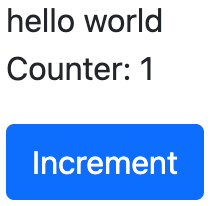
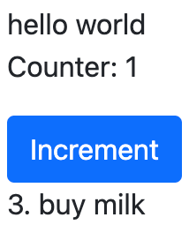
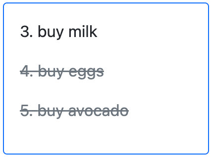
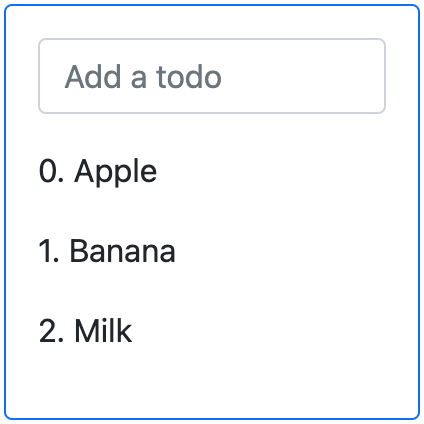
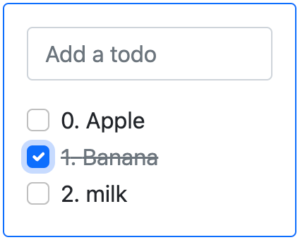
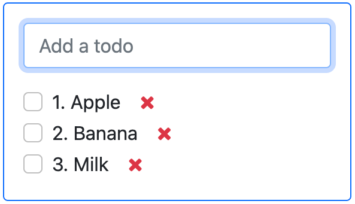
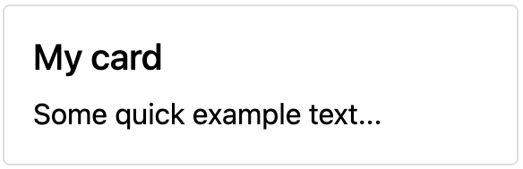

# Chapter 1: Owl Components

This chapter introduces the [Owl
framework](https://github.com/odoo/owl), a tailor-made component system
for Odoo. The main building blocks of OWL are
[components](%7BOWL_PATH%7D/doc/reference/component.md) and
[templates](%7BOWL_PATH%7D/doc/reference/templates.md).

In Owl, every part of user interface is managed by a component: they
hold the logic and define the templates that are used to render the user
interface. In practice, a component is represented by a small JavaScript
class subclassing the <span class="title-ref">Component</span> class.

Before getting into the exercises, make sure you have followed all the
steps described in this
`tutorial introduction <tutorials/discover_js_framework/setup>`.

<div class="spoiler">

Solutions

The solutions for each exercise of the chapter are hosted on the
[official Odoo tutorials
repository](https://github.com/odoo/tutorials/commits/%7BCURRENT_MAJOR_BRANCH%7D-solutions/owl_playground).
It is recommended to try to solve them first without looking at the
solution!

</div>

> [!TIP]
> If you use Chrome as your web browser, you can install the
> <span class="title-ref">Owl Devtools</span> extension. This extension
> provides many features to help you understand and profile any Owl
> application.
>
> [Video: How to use the
> DevTools](https://www.youtube.com/watch?v=IUyQjwnrpzM)

In this chapter, we use the
<span class="title-ref">owl_playground</span> addon, which provides a
simplified environment that only contains Owl and a few other files. The
goal is to learn Owl itself, without relying on Odoo web client code. To
get started, open the
<span class="title-ref">/owl_playground/playground</span> route with
your browser: it should display an Owl component with the text *hello
world*.

## Example: a <span class="title-ref">Counter</span> component

First, let us have a look at a simple example. The
<span class="title-ref">Counter</span> component shown below is a
component that maintains an internal number value, displays it, and
updates it whenever the user clicks on the button.

``` js
import { Component, useState } from "@odoo/owl";

class Counter extends Component {
    static template = "my_module.Counter";

    setup() {
        this.state = useState({ value: 0 });
    }

    increment() {
        this.state.value++;
    }
}
```

The <span class="title-ref">Counter</span> component specifies the name
of the template to render. The template is written in XML and defines a
part of user interface:

``` xml
<templates xml:space="preserve">
   <t t-name="my_module.Counter" owl="1">
      <p>Counter: <t t-esc="state.value"/></p>
      <button class="btn btn-primary" t-on-click="increment">Increment</button>
   </t>
</templates>
```

You maybe noticed the <span class="title-ref">owl="1"</span> temporary
attribute, it allows Odoo to differentiate Owl templates from the old
JavaScript framework templates. Note that Owl templates are not the same
as QWeb templates: they can contain additional directives, such as
<span class="title-ref">t-on-click</span>.

## 1. Displaying a counter

As a first exercise, let us implement a counter in the
<span class="title-ref">Playground</span> component located in
`owl_playground/static/src/`. To see the result, you can go to the
<span class="title-ref">/owl_playground/playground</span> route with
your browser.

<div class="exercise">

1.  Modify `playground.js` so that it acts as a counter like in the
    example above. You will need to use the [useState
    hook](%7BOWL_PATH%7D/doc/reference/hooks.md#usestate) so that the
    component is re-rendered whenever any part of the state object that
    has been read by this component is modified.
2.  In the same component, create an
    <span class="title-ref">increment</span> method.
3.  Modify the template in `playground.xml` so that it displays your
    counter variable. Use
    [t-esc](%7BOWL_PATH%7D/doc/reference/templates.md#outputting-data)
    to output the data.
4.  Add a button in the template and specify a
    [t-on-click](%7BOWL_PATH%7D/doc/reference/event_handling.md#event-handling)
    attribute in the button to trigger the
    <span class="title-ref">increment</span> method whenever the button
    is clicked.

</div>



> [!TIP]
> The Odoo JavaScript files downloaded by the browser are minified. For
> debugging purpose, it's easier when the files are not minified. Switch
> to `debug mode with assets
> <developer-mode/activation>` so that the files are not minified.

## 2. Extract counter in a component

For now we have the logic of a counter in the
<span class="title-ref">Playground</span> component, let us see how to
create a
[sub-component](%7BOWL_PATH%7D/doc/reference/component.md#sub-components)
from it.

<div class="exercise">

1.  Extract the counter code from the
    <span class="title-ref">Playground</span> component into a new
    <span class="title-ref">Counter</span> component.
2.  You can do it in the same file first, but once it's done, update
    your code to move the <span class="title-ref">Counter</span> in its
    own folder and file. Import it relatively from
    <span class="title-ref">./counter/counter</span>. Make sure the
    template is in its own file, with the same name.

</div>

> [!IMPORTANT]
> Don't forget `/** @odoo-module **/` in your JavaScript files. More
> information on this can be found `here <frontend/modules/native_js>`.

## 3. A todo component

We will create new components in `owl_playground/static/src/` to keep
track of a list of todos. This will be done incrementally in multiple
exercises that will introduce various concepts.

<div class="exercise">

1.  Create a <span class="title-ref">Todo</span> component that receive
    a <span class="title-ref">todo</span> object in
    [props](%7BOWL_PATH%7D/doc/reference/props.md), and display it. It
    should show something like **3. buy milk**.

2.  Add the Bootstrap classes <span class="title-ref">text-muted</span>
    and <span class="title-ref">text-decoration-line-through</span> on
    the task if it is done. To do that, you can use [dynamic
    attributes](%7BOWL_PATH%7D/doc/reference/templates.md#dynamic-attributes).

3.  Modify `owl_playground/static/src/playground.js` and
    `owl_playground/static/src/playground.xml` to display your new
    <span class="title-ref">Todo</span> component with some hard-coded
    props to test it first.

    <div class="example">

    ``` javascript
    setup() {
        ...
        this.todo = { id: 3, description: "buy milk", done: false };
    }
    ```

    </div>

</div>



<div class="seealso">

[Owl: Dynamic class
attributes](%7BOWL_PATH%7D/doc/reference/templates.md#dynamic-class-attribute)

</div>

## 4. Props validation

The <span class="title-ref">Todo</span> component has an implicit API.
It expects to receive in its props the description of a todo object in a
specified format: <span class="title-ref">id</span>,
<span class="title-ref">description</span> and
<span class="title-ref">done</span>. Let us make that API more explicit.
We can add a props definition that will let Owl perform a validation
step in [dev mode](%7BOWL_PATH%7D/doc/reference/app.md#dev-mode). You
can activate the dev mode in the [App
configuration](%7BOWL_PATH%7D/doc/reference/app.md#configuration).

> It is a good practice to do props validation for every component.

<div class="exercise">

1.  Add [props
    validation](%7BOWL_PATH%7D/doc/reference/props.md#props-validation)
    to the <span class="title-ref">Todo</span> component.
2.  Open the `Console` tab of your browser's dev tools and make sure the
    props validation passes in dev mode, which is activated by default
    in <span class="title-ref">owl_playground</span>. The dev mode can
    be activated and deactivated by modifying the
    <span class="title-ref">dev</span> attribute in the in the
    <span class="title-ref">config</span> parameter of the
    [mount](%7BOWL_PATH%7D/doc/reference/app.md#mount-helper) function
    in `owl_playground/static/src/main.js`.
3.  Remove <span class="title-ref">done</span> from the props and reload
    the page. The validation should fail.

</div>

## 5. A list of todos

Now, let us display a list of todos instead of just one todo. For now,
we can still hard-code the list.

<div class="exercise">

1.  Change the code to display a list of todos instead of just one.
    Create a new <span class="title-ref">TodoList</span> component to
    hold the <span class="title-ref">Todo</span> components and use
    [t-foreach](%7BOWL_PATH%7D/doc/reference/templates.md#loops) in its
    template.
2.  Think about how it should be keyed with the
    <span class="title-ref">t-key</span> directive.

</div>



## 6. Adding a todo

So far, the todos in our list are hard-coded. Let us make it more useful
by allowing the user to add a todo to the list.

<div class="exercise">

1.  Add an input above the task list with placeholder *Enter a new
    task*.

2.  Add an [event
    handler](%7BOWL_PATH%7D/doc/reference/event_handling.md) on the
    <span class="title-ref">keyup</span> event named
    <span class="title-ref">addTodo</span>.

3.  Implement <span class="title-ref">addTodo</span> to check if enter
    was pressed (`ev.keyCode === 13`), and in that case, create a new
    todo with the current content of the input as the description and
    clear the input of all content.

4.  Make sure the todo has a unique id. It can be just a counter that
    increments at each todo.

5.  Wrap the todo list in a <span class="title-ref">useState</span> hook
    to let Owl know that it should update the UI when the list is
    modified.

6.  Bonus point: don't do anything if the input is empty.

    ``` javascript
    this.todos = useState([]);
    ```

</div>



<div class="seealso">

[Owl: Reactivity](%7BOWL_PATH%7D/doc/reference/reactivity.md)

</div>

## 7. Focusing the input

Let's see how we can access the DOM with
[t-ref](%7BOWL_PATH%7D/doc/reference/refs.md) and
[useRef](%7BOWL_PATH%7D/doc/reference/hooks.md#useref).

<div class="exercise">

1.  Focus the <span class="title-ref">input</span> from the previous
    exercise when the dashboard is
    [mounted](%7BOWL_PATH%7D/doc/reference/component.md#mounted). This
    this should be done from the <span class="title-ref">TodoList</span>
    component.
2.  Bonus point: extract the code into a specialized
    [hook](%7BOWL_PATH%7D/doc/reference/hooks.md)
    <span class="title-ref">useAutofocus</span> in a new
    `owl_playground/utils.js` file.

</div>

<div class="seealso">

[Owl: Component
lifecycle](%7BOWL_PATH%7D/doc/reference/component.md#lifecycle)

</div>

## 8. Toggling todos

Now, let's add a new feature: mark a todo as completed. This is actually
trickier than one might think. The owner of the state is not the same as
the component that displays it. So, the
<span class="title-ref">Todo</span> component needs to communicate to
its parent that the todo state needs to be toggled. One classic way to
do this is by using a [callback
prop](%7BOWL_PATH%7D/doc/reference/props.md#binding-function-props)
<span class="title-ref">toggleState</span>.

<div class="exercise">

1.  Add an input with the attribute `type="checkbox"` before the id of
    the task, which must be checked if the state
    <span class="title-ref">done</span> is true.

    > [!TIP]
    > QWeb does not create attributes computed with the
    > <span class="title-ref">t-att</span> directive if it evaluates to
    > a falsy value.

2.  Add a callback props <span class="title-ref">toggleState</span>.

3.  Add a <span class="title-ref">click</span> event handler on the
    input in the <span class="title-ref">Todo</span> component and make
    sure it calls the <span class="title-ref">toggleState</span>
    function with the todo id.

4.  Make it work!

</div>



## 9. Deleting todos

The final touch is to let the user delete a todo.

<div class="exercise">

1.  Add a new callback prop <span class="title-ref">removeTodo</span>.

2.  Insert `<span class="fa fa-remove"/>` in the template of the
    <span class="title-ref">Todo</span> component.

3.  Whenever the user clicks on it, it should call the
    <span class="title-ref">removeTodo</span> method.

    > [!TIP]
    > If you're using an array to store your todo list, you can use the
    > JavaScript <span class="title-ref">splice</span> function to
    > remove a todo from it.

``` 
// find the index of the element to delete
const index = list.findIndex((elem) => elem.id === elemId);
if (index >= 0) {
    // remove the element at index from list
    list.splice(index, 1);
}
```

</div>



## 10. Generic card with slots

Owl has a powerful [slot](%7BOWL_PATH%7D/doc/reference/slots.md) system
to allow you to write generic components. This is useful to factorize
the common layout between different parts of the interface.

<div class="exercise">

1.  Insert a new <span class="title-ref">Card</span> component between
    the <span class="title-ref">Counter</span> and
    <span class="title-ref">Todolist</span> components. Use the
    following Bootstrap HTML structure for the card:

    ``` html
    <div class="card" style="width: 18rem;">
        
        <div class="card-body">
            <h5 class="card-title">Card title</h5>
            <p class="card-text">
                Some quick example text to build on the card title and make up the bulk
                of the card's content.
            </p>
            <a href="#" class="btn btn-primary">Go somewhere</a>
        </div>
    </div>
    ```

2.  This component should have two slots: one slot for the title, and
    one for the content (the default slot). It should be possible to use
    the <span class="title-ref">Card</span> component as follows:

    ``` html
    <Card>
        <t t-set-slot="title">Card title</t>
        <p class="card-text">Some quick example text...</p>
        <a href="#" class="btn btn-primary">Go somewhere</a>
    </Card>
    ```

3.  Bonus point: if the <span class="title-ref">title</span> slot is not
    given, the <span class="title-ref">h5</span> should not be rendered
    at all.

</div>



<div class="seealso">

[Bootstrap: documentation on
cards](https://getbootstrap.com/docs/5.2/components/card/)

</div>

## 11. Extensive props validation

<div class="exercise">

1.  Add prop validation on the <span class="title-ref">Card</span>
    component.
2.  Try to express in the props validation system that it requires a
    <span class="title-ref">default</span> slot, and an optional
    <span class="title-ref">title</span> slot.

</div>
