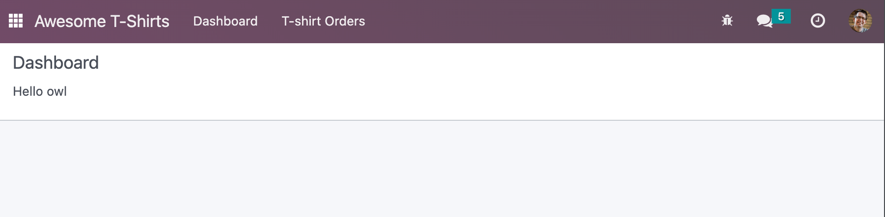
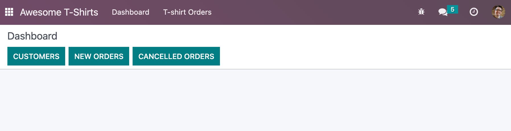
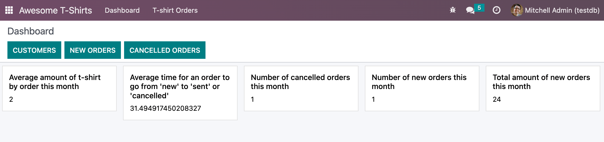
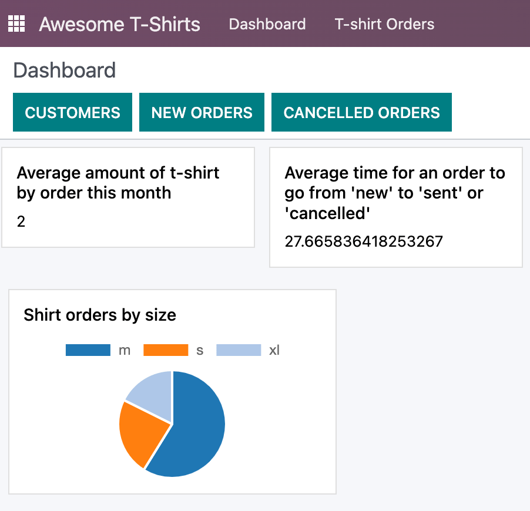

# Chapter 2: Odoo Web Framework

The first part of this tutorial introduced you to most of Owl ideas. It
is now time to learn about the Odoo JavaScript framework in its
entirety, as used by the web client.

<figure>

</figure>

For this chapter, we will start from the empty dashboard provided by the
<span class="title-ref">awesome_tshirt</span> addon. We will
progressively add features to it, using the Odoo JavaScript framework.

<div class="admonition">

Goal


</div>

<div class="spoiler">

Solutions

The solutions for each exercise of the chapter are hosted on the
[official Odoo tutorials
repository](https://github.com/odoo/tutorials/commits/%7BCURRENT_MAJOR_BRANCH%7D-solutions/awesome_tshirt).

</div>

## 1. A new Layout

Most screens in the Odoo web client uses a common layout: a control
panel on top, with some buttons, and a main content zone just below.
This is done using the [Layout
component](%7BGITHUB_PATH%7D/addons/web/static/src/search/layout.js),
available in <span class="title-ref">@web/search/layout</span>.

<div class="exercise">

Update the <span class="title-ref">AwesomeDashboard</span> component
located in `awesome_tshirt/static/src/` to use the
<span class="title-ref">Layout</span> component. You can use
`{controlPanel: { "top-right": false, "bottom-right": false } }` for the
<span class="title-ref">display</span> props of the
<span class="title-ref">Layout</span> component.

Open <http://localhost:8069/web>, then open the `Awesome T-Shirts` app,
and see the result.

</div>



<div class="seealso">

- [Example: use of Layout in client
  action](%7BGITHUB_PATH%7D/addons/web/static/src/webclient/actions/reports/report_action.js)
  and
  [template](%7BGITHUB_PATH%7D/addons/web/static/src/webclient/actions/reports/report_action.xml)
- [Example: use of Layout in kanban
  view](%7BGITHUB_PATH%7D/addons/web/static/src/views/kanban/kanban_controller.xml)

</div>

## 2. Add some buttons for quick navigation

Let us now use the action service for an easy access to the common views
in Odoo.

`Services <frontend/services>` is a notion defined by the Odoo
JavaScript framework; it is a persistent piece of code that exports a
state and/or functions. Each service can depend on other services, and
components can import a service with the
<span class="title-ref">useService()</span> hook.

<div class="example">

This shows how to open the settings view from a component using the
action service.

``` js
import { useService } from "@web/core/utils/hooks";
...
setup() {
    this.action = useService("action");
}
openSettings() {
    this.action.doAction("base_setup.action_general_configuration");
}
...
```

</div>

<div class="exercise">

Let us add three buttons in the control panel bottom left zone.

1.  A button <span class="title-ref">Customers</span>, which opens a
    kanban view with all customers (this action already exists, so you
    should use [its xml id
    \<https://github.com/odoo/odoo/blob/1f4e583ba20a01f4c44b0a4ada42c4d3bb074273/
    odoo/addons/base/views/res_partner_views.xml#L525\>]()).

2.  A button <span class="title-ref">New Orders</span>, which opens a
    list view with all orders created in the last 7 days. Use the
    [Domain
    \<https://github.com/odoo/odoo/blob/1f4e583ba20a01f4c44b0a4ada42c4d3bb074273/
    /addons/web/static/src/core/domain.js#L19\>]() helper class to
    represent the domain.

    > [!TIP]
    > One way to represent the desired domain could be
    > `[('create_date','>=', (context_today() - datetime.timedelta(days=7)).strftime('%Y-%m-%d'))]`

3.  A button <span class="title-ref">Cancelled Order</span>, which opens
    a list of all orders created in the last 7 days, but already
    cancelled. Rather than defining the action twice, factorize it in a
    new <span class="title-ref">openOrders</span> method.

</div>



<div class="seealso">

\- [Example: doAction use
\<{GITHUB_PATH}/addons/account/static/src/components/journal_dashboard_activity
/journal_dashboard_activity.js#L35\>]() - [Code: action
service](%7BGITHUB_PATH%7D/addons/web/static/src/webclient/actions/action_service.js)

</div>

## 3. Call the server, add some statistics

Let's improve the dashboard by adding a few cards (see the
<span class="title-ref">Card</span> component `made in the
previous chapter <tutorials/discover_js_framework/generic_card>`)
containing a few statistics. There is a route
<span class="title-ref">/awesome_tshirt/statistics</span> that performs
some computations and returns an object containing some useful
information.

Whenever we need to call a specific controller, we need to use the
`rpc service
<frontend/services/rpc>`. It only exports a single function that perform
the request: `rpc(route, params, settings)`

Here is a short explanation on the various arguments:

- <span class="title-ref">route</span> is the target route, as a string.
  For example <span class="title-ref">/myroute/</span>.
- <span class="title-ref">params</span> is an object that contains all
  data that will be given to the controller. (optional)
- <span class="title-ref">settings</span> are for advanced controls on
  the request. Make it silent, or using a specific xhr instance.
  (optional)

<div class="example">

A basic request could look like this:

``` js
setup() {
    this.rpc = useService("rpc");
    onWillStart(async () => {
        const result = await this.rpc("/my/controller", {a: 1, b: 2});
        // ...
    });
}
```

</div>

<div class="exercise">

#\. Change <span class="title-ref">Dashboard</span> so that it uses the
<span class="title-ref">rpc</span> service. \#. Call the statistics
route <span class="title-ref">/awesome_tshirt/statistics</span> in the
<span class="title-ref">onWillStart</span> hook. \#. Display a few cards
in the dashboard containing:

- Number of new orders this month
- Total amount of new orders this month
- Average amount of t-shirt by order this month
- Number of cancelled orders this month
- Average time for an order to go from 'new' to 'sent' or 'cancelled'

</div>



<div class="seealso">

- [Code: rpc
  service](%7BGITHUB_PATH%7D/addons/web/static/src/core/network/rpc_service.js)
- [Example: calling a route in onWillStart
  \<https://github.com/odoo/odoo/blob/1f4e583ba20a01f4c44b0a4ada42c4d3bb074273/
  addons/lunch/static/src/views/search_model.js#L21\>]()

</div>

## 4. Cache network calls, create a service

If you open the `Network` tab of your browser's dev tools, you will see
that the call to
<span class="title-ref">/awesome_tshirt/statistics</span> is done every
time the client action is displayed. This is because the
<span class="title-ref">onWillStart</span> hook is called each time the
<span class="title-ref">Dashboard</span> component is mounted. But in
this case, we would prefer to do it only the first time, so we actually
need to maintain some state outside of the
<span class="title-ref">Dashboard</span> component. This is a nice use
case for a service!

<div class="example">

The following example registers a simple service that displays a
notification every 5 seconds.

``` js
import { registry } from "@web/core/registry";
const myService = {
    dependencies: ["notification"],
    start(env, { notification }) {
        let counter = 1;
        setInterval(() => {
            notification.add(`Tick Tock ${counter++}`);
        }, 5000);
    },
};
registry.category("services").add("myService", myService);
```

</div>

<div class="exercise">

1.  Register and import a new
    <span class="title-ref">awesome_tshirt.statistics</span> service.
2.  It should provide a function
    <span class="title-ref">loadStatistics</span> that, once called,
    performs the actual rpc, and always return the same information.
3.  Use the [memoize
    \<https://github.com/odoo/odoo/blob/1f4e583ba20a01f4c44b0a4ada42c4d3bb074273/
    addons/web/static/src/core/utils/functions.js#L11\>]() utility
    function from
    <span class="title-ref">@web/core/utils/functions</span> that will
    allow caching the statistics.
4.  Use this service in the <span class="title-ref">Dashboard</span>
    component.
5.  Check that it works as expected

</div>

<div class="seealso">

\- [Example: simple
service](%7BGITHUB_PATH%7D/addons/web/static/src/core/network/http_service.js) -
[Example: service with a
dependency](%7BGITHUB_PATH%7D/addons/web/static/src/core/user_service.js)

</div>

## 5. Display a pie chart

Everyone likes charts (!), so let us add a pie chart in our dashboard.
It will display the proportions of t-shirts sold for each size:
S/M/L/XL/XXL.

For this exercise, we will use [Chart.js](https://www.chartjs.org/). It
is the chart library used by the graph view. However, it is not loaded
by default, so we will need to either add it to our assets bundle, or
lazy load it. Lazy loading is usually better since our users will not
have to load the chartjs code every time if they don't need it.

<div class="exercise">

#\. Load chartjs, you can use the [loadJs
\<https://github.com/odoo/odoo/blob/1f4e583ba20a01f4c44b0a4ada42c4d3bb074273/
addons/web/static/src/core/assets.js#L23\>]() function to load
`/web/static/lib/Chart/Chart.js`. \#. In a
<span class="title-ref">Card</span> (from previous exercises), display a
[pie chart](https://www.chartjs.org/docs/2.8.0/charts/doughnut.html) in
the dashboard that displays the correct quantity for each sold t-shirts
in each size (that information is available in the statistics route).

</div>



<div class="seealso">

\- [Example: lazy loading a js file
\<https://github.com/odoo/odoo/blob/1f4e583ba20a01f4c44b0a4ada42c4d3bb074273/
addons/web/static/src/views/graph/graph_renderer.js#L57\>]() - [Example:
rendering a chart in a component
\<https://github.com/odoo/odoo/blob/1f4e583ba20a01f4c44b0a4ada42c4d3bb074273/
addons/web/static/src/views/graph/graph_renderer.js#L618\>]()

</div>

## 6. Going further

Here is a list of some small improvements you could try to do if you
have the time:

<div class="exercise">

1.  Make sure your application can be
    `translated <reference/translations>` (with
    <span class="title-ref">env.\_t</span>).
2.  Clicking on a section of the pie chart should open a list view of
    all orders which have the corresponding size.
3.  Add a SCSS file and see if you can change the background color of
    the dashboard action.


</div>

<div class="seealso">

\- [Example: use of env.\_t function
\<https://github.com/odoo/odoo/blob/1f4e583ba20a01f4c44b0a4ada42c4d3bb074273/
addons/account/static/src/components/bills_upload/bills_upload.js#L64\>]() -
[Code: translation code in web/
\<https://github.com/odoo/odoo/blob/1f4e583ba20a01f4c44b0a4ada42c4d3bb074273/
addons/web/static/src/core/l10n/translation.js#L16\>]()

</div>
